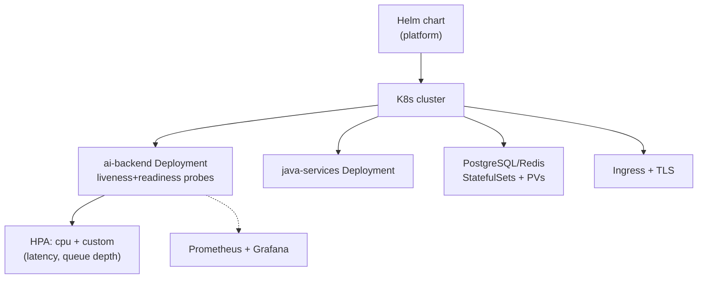

## Why it Matters

Run the entire AI platform on K8s, the deployment that validates CKAD skills and proves operational readiness.

## Diagram



## Code

```yaml

## When to use / NOT

- **Use:** for the platform's own services where you control rollout, probes and scaling — the Phase 05 deliverable.
- **NOT:** for managed serverless endpoints when traffic is bursty and unpredictable; that trade-off is decided on cost, not capability.

## Trade-offs

| Choice | Cost |
|--------|------|
| StatefulSets for PG/Redis | You operate the database's availability, not just the app |
| HPA on CPU only | CPU is a lagging signal for LLM services; latency/queue depth is better |
| Ingress + TLS | Certificate lifecycle to manage |

## Vs

| Aspect | K8s + Helm | Docker Compose | Fully managed (Cloud Run) |
|--------|------------|----------------|---------------------------|
| Control | Full, including DB | Local dev parity only | None over the platform |
| Ops cost | High — CKAD-level skill | Low | Lowest |
| Fit here | Phase 05 target estate | Dev loop | Not chosen |

## Pitfalls

- A liveness probe that kills pods mid long LLM stream; readiness gates traffic, liveness kills processes — do not conflate them.
- Deploying without resource limits; one bad pod takes the node down.
- PVs without a backup and restore story — you are one disk failure from data loss.
- HPA scaling on CPU while the real constraint is provider rate limits or queue depth.

## Interview Q&A

- **Q:** Why StatefulSet for PG? **A:** Stable identity + persistent storage; Deployments don't guarantee that.

## Flashcards (Spaced Repetition)

#flashcard
**Q:** What is the trigger keyword for Kubernetes Deployment? :: **A:** [trigger keywords] #flashcard

#flashcard
**Q:** Key hyperparameter for Kubernetes Deployment? :: **A:** [hyperparameter + typical range] #flashcard

#flashcard
**Q:** When do you NOT use Kubernetes Deployment? :: **A:** [anti-pattern scenarios] #flashcard

#flashcard
**Q:** Cost order of magnitude for Kubernetes Deployment? :: **A:** [GPU hours / $ per 1M tokens] #flashcard

## Practice Tasks (Tasks Plugin)
- [ ] Restate the intent from memory 📅 2026-09-30
- [ ] Code the config without looking 📅 2026-10-02
- [ ] Answer all Interview Q&A aloud 📅 2026-10-06
- [ ] Review flashcards (Spaced Repetition) 📅 2026-09-30

```tasks
not done
path includes 05_Kubernetes-Operations
sort by due
limit 10
```

## Related
- [[README|AI MOC]]
- [[05_Kubernetes-Operations/README|05_Kubernetes-Operations Folder]]

---

*Category: AI/05_Kubernetes-Operations • Part of [[README|AI MOC]]*