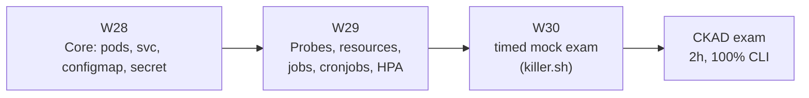

## Why it Matters

Earn **CKAD** (or **CKA**) to validate deployment and operational skills after 25 weeks of building.

## Diagram



## Code

```yaml

## When to use / NOT

- **Use:** as the structured last three weeks before the exam, after the platform is already deployed once — then the tasks rehearse real work.
- **NOT:** as the way to learn Kubernetes from zero; build the platform first, or the practice is memorisation.

## Trade-offs

- Full platform `kubectl apply` from repo → all pods healthy; dashboards green; exam passed.

## Vs

| Aspect | CKAD | CKA | Cloud-vendor cert |
|--------|------|-----|--------------------|
| Focus | App deployment in a given cluster | Cluster admin, RBAC, networking | Proprietary console |
| Proof | Fast, correct manifests by hand | You can run the cluster | You know one vendor |
| Here | Phase 05 target | Optional later | Not chosen |

## Pitfalls

- Studying only from notes; the exam is a keyboard, so drills must be hands-on.
- Reaching for YAML templates by hand when an imperative command is three seconds.
- Skipping the timed mock — the most common reason capable people run out of time.
- Neglecting `jobs/cronjobs` and `ServiceAccount`/RBAC basics; they appear reliably.

## Interview Q&A

- **Q:** CKAD rather than CKA — why? **A:** CKAD matches the work: deploying and exposing applications with correct probes, resources and scaling inside a cluster someone else runs. CKA's control-plane and networking depth is worth it only if operating the cluster is the job.
- **Q:** What actually makes the difference in a 2-hour practical exam? **A:** Imperal-first habits and a timed mock. Writing YAML by hand for tasks that an imperative command solves is how time runs out — and the mock is the only way to find that out before exam day.
- **Q:** How did preparing change how you deploy? **A:** It made probes and resource limits a reflex rather than an afterthought — which is exactly what makes a deployment safe to autoscale, and what I now write first in any chart.

## Flashcards (Spaced Repetition)

#flashcard
**Q:** What is the trigger keyword for CKAD Preparation? :: **A:** [trigger keywords] #flashcard

#flashcard
**Q:** Key hyperparameter for CKAD Preparation? :: **A:** [hyperparameter + typical range] #flashcard

#flashcard
**Q:** When do you NOT use CKAD Preparation? :: **A:** [anti-pattern scenarios] #flashcard

#flashcard
**Q:** Cost order of magnitude for CKAD Preparation? :: **A:** [GPU hours / $ per 1M tokens] #flashcard

## Practice Tasks (Tasks Plugin)
- [ ] Restate the intent from memory 📅 2026-09-30
- [ ] Code the config without looking 📅 2026-10-02
- [ ] Answer all Interview Q&A aloud 📅 2026-10-06
- [ ] Review flashcards (Spaced Repetition) 📅 2026-09-30

```tasks
not done
path includes 05_Kubernetes-Operations
sort by due
limit 10
```

## Related
- [[README|AI MOC]]
- [[05_Kubernetes-Operations/README|05_Kubernetes-Operations Folder]]

---

*Category: AI/05_Kubernetes-Operations • Part of [[README|AI MOC]]*