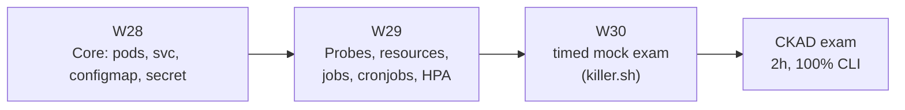

## Why it Matters

Earn **CKAD** (or **CKA**) to validate deployment and operational skills after 25 weeks of building.

## Diagram



## Code

```yaml

## When to use / NOT

- **Use:** as the structured last three weeks before the exam, after the platform is already deployed once — then the tasks rehearse real work.
- **NOT:** as the way to learn Kubernetes from zero; build the platform first, or the practice is memorisation.

## Trade-offs

- Full platform `kubectl apply` from repo → all pods healthy; dashboards green; exam passed.

## Vs

| Aspect | CKAD | CKA | Cloud-vendor cert |
|--------|------|-----|--------------------|
| Focus | App deployment in a given cluster | Cluster admin, RBAC, networking | Proprietary console |
| Proof | Fast, correct manifests by hand | You can run the cluster | You know one vendor |
| Here | Phase 05 target | Optional later | Not chosen |

## Pitfalls

- Studying only from notes; the exam is a keyboard, so drills must be hands-on.
- Reaching for YAML templates by hand when an imperative command is three seconds.
- Skipping the timed mock — the most common reason capable people run out of time.
- Neglecting `jobs/cronjobs` and `ServiceAccount`/RBAC basics; they appear reliably.

## Interview Q&A

- **Q:** CKAD rather than CKA — why? **A:** CKAD matches the work: deploying and exposing applications with correct probes, resources and scaling inside a cluster someone else runs. CKA's control-plane and networking depth is worth it only if operating the cluster is the job.
- **Q:** What actually makes the difference in a 2-hour practical exam? **A:** Imperal-first habits and a timed mock. Writing YAML by hand for tasks that an imperative command solves is how time runs out — and the mock is the only way to find that out before exam day.
- **Q:** How did preparing change how you deploy? **A:** It made probes and resource limits a reflex rather than an afterthought — which is exactly what makes a deployment safe to autoscale, and what I now write first in any chart.

## Related

- [[01_Kubernetes Deployment]] • [[AI/00_Overview/Certification Guide|Certification Guide]]

---
*Category: kubernetes*

# CKAD Preparation — Weeks 28–30

> Part of [[README|05_Kubernetes-Operations]] • `kubernetes`

## CKAD vs CKA

| Cert | Focus | Pick When |
|------|-------|-----------|
| **CKAD** | App-centric: manifests, config, services, troubleshooting | You deploy AI services (recommended) |
| **CKA** | Cluster admin: networking, storage, security, internals | Leaning platform/infra |

## Study Plan (W28–30)

| Week | Focus |
|------|-------|
| 28 | Prometheus + Grafana dashboards, mock exams |
| 29 | Troubleshooting (killer.sh / killerkoda), timed drills |
| 30 | **Exam** + post-exam hardening |

## CKAD Exam Tips

- Imperative `kubectl` (`--dry-run=client -o yaml`) — speed matters.
- Know: pods, deployments, services, ingress, config/secrets, probes, resources, jobs/cronjobs, HPA.
- Practice in `killer.sh` — 2-hour timed environment.

# The CKAD muscle memory to drill, not the topics list

# 1) Imperative commands first — the exam is a clock, not a philosophy lesson:

# kubectl create deploy api --image=repo/ai-backend:1.0 --port=8000 -n apps

# kubectl expose deploy api --port=80 --target-port=8000 --name=api-svc

# kubectl create configmap cfg --from-literal=mode=prod -n apps

# kubectl create secret generic llm-key --from-literal=apikey=$KEY -n apps

# kubectl autoscale deploy api --min=2 --max=6 --cpu-percent=70 -n apps

# 2) Dry-run to YAML, then patch — fastest path when the task is precise:

# kubectl create job migrate --image=repo/migrate --dry-run=client -o yaml > j.yaml

# 3) Time savers:

# export ns=$(kubectl config view --minify -o jsonpath='{..namespace}')

# alias k=kubectl ; source <(kubectl completion bash)

# kubectl get all,cm,secret,sa -n apps # one look at the whole namespace

```