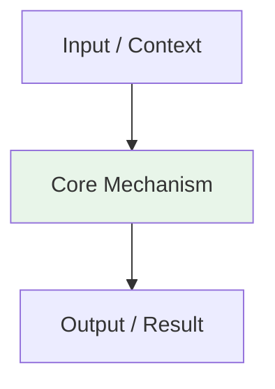

# 05_GPU Scheduling

> Part of [[README|AI MOC]] • `AI/05_Kubernetes-Operations` • Weeks 13
> 🎨 **Visual diagram:** Create Excalidraw drawing from template: `Cmd+P → Excalidraw: New from template → AI Diagram`

## Intent
Understand **GPU scheduling** — MIG partitioning, time-slicing, topology-aware scheduling, GPU sharing, and bin-packing — to maximize GPU utilization and cost efficiency.

## Why It Matters
- Where this appears in interviews (FAANG, senior vs. junior)
- Production impact (cost, latency, quality, GPU utilization)
- Senior signal: recognizing the *disguised* form of this pattern

## Diagram


## Key Points
- Key point 1
- Key point 2

## Code / Config Example
```python
# Python 3.11+: Minimal example for 05_GPU Scheduling
# Core concept - implementation varies by framework

from dataclasses import dataclass
from typing import Optional

@dataclass
class 05_GPUSchedulingConfig:
    component: str = "05_GPU Scheduling"
    capacity: int = 10000
    strategy: str = "default"

# Example usage
config = 05_GPUSchedulingConfig()
```

## When to Use / NOT
| Scenario | Use? | Reason |
|----------|------|--------|
|          | ✅   |        |
|          | ❌   |        |

## Trade-offs / Decision Matrix
| Dimension | This Approach | Alternative A | Alternative B | Pick When |
|-----------|---------------|---------------|---------------|-----------|
| Complexity | | | | |
| Latency | | | | |
| Cost (GPU/hr) | | | | |
| Quality | | | | |

## Vs. Alternatives
| Alternative | When to Choose It | Decision Rule |
|-------------|-------------------|---------------|
| | | |

## Pitfalls
1. [Concrete mistake] → [Fix]
2. [Concrete mistake] → [Fix]

## Interview Q&A (Senior Depth)

**Q1: Walk me through the core mechanism of 05_GPU Scheduling. Why does it work?**
**A:** In 2–3 sentences. Connect the *why* to the mathematical/architectural invariant.

**Q2: When would you choose an alternative over this approach?**
**A:** Cite concrete constraints (scale, latency, cost, quality) and name the alternative.

**Q3: How does this change for production vs. prototype?**
**A:** Explain the hardening needed: evaluation, monitoring, cost optimization, guardrails.

**Q4: Walk me through a non-obvious problem that reduces to this pattern.**
**A:** Describe the reduction step-by-step.

**Q5: What is the GPU memory / latency implication at scale?**
**A:** Discuss VRAM, batching, KV cache, quantization trade-offs.

## Flashcards (Spaced Repetition)

#flashcard
**Q:** What is the trigger keyword for 05_GPU Scheduling? :: **A:** [trigger keywords] #flashcard

#flashcard
**Q:** Key hyperparameter for 05_GPU Scheduling? :: **A:** [hyperparameter + typical range] #flashcard

#flashcard
**Q:** When do you NOT use 05_GPU Scheduling? :: **A:** [anti-pattern scenarios] #flashcard

#flashcard
**Q:** Cost order of magnitude for 05_GPU Scheduling? :: **A:** [GPU hours / $ per 1M tokens] #flashcard

## Practice Tasks (Tasks Plugin)
- [ ] Restate the intent from memory 📅 2026-09-30
- [ ] Code the config without looking 📅 2026-10-02
- [ ] Answer all Interview Q&A aloud 📅 2026-10-06
- [ ] Review flashcards (Spaced Repetition) 📅 2026-09-30

```tasks
not done
path includes 05_Kubernetes-Operations
sort by due
limit 10
```

## Related
- [[README|AI MOC]]
- [[05_Kubernetes-Operations/README|05_Kubernetes-Operations Folder]]

---

*Category: AI/05_Kubernetes-Operations • Part of [[README|AI MOC]]*