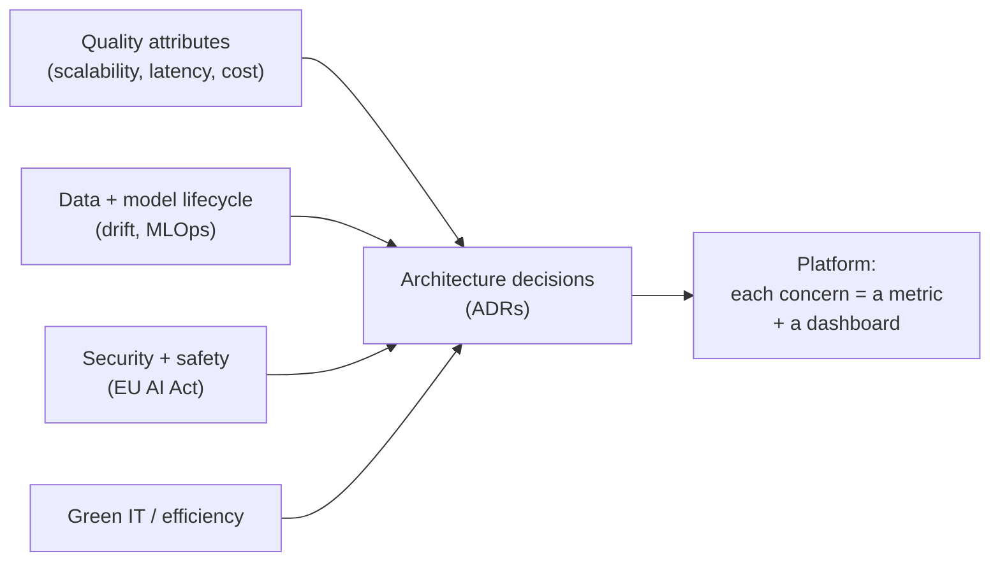

## Why it Matters

Internationally recognized, vendor-neutral architecture certification, bridge traditional enterprise architecture with AI's unique concerns.

## Diagram



## Code

```proto

## When to use / NOT

- **Use:** when an AI system needs to be defensible to an architecture review — quality attributes, lifecycle, compliance and efficiency as named, measurable concerns.
- **NOT:** as paperwork for a prototype; governance before a working system is ceremony that gets ignored later.

## Trade-offs

| Choice | Cost |
|--------|------|
| Every concern → a metric | Real engineering time per metric; some are hard to define |
| ADRs for major decisions | Slower decisions; the ADR must be maintained or it rots |
| EU AI Act checklist | Effort to map obligations to concrete controls |

## Vs

| Framework | Centre of gravity | Output |
|-----------|-------------------|--------|
| SWARC4AI (iSAQB) | Quality attributes + AI lifecycle | ADRs + controls |
| TOGAF | Enterprise capability | Layers and committees |
| Cloud-vendor Well-Architected | Vendor workload review | Pillar review doc |

## Pitfalls

- Writing quality attributes without targets; "scalable" is not a quality attribute, "p95 under 200 ms at 6 replicas" is.
- Governance artifacts that live outside the repo, so they decay invisibly.
- Treating Green IT as a reporting duty instead of a cost lever — the same metric, tokens per answer, is both.
- Skipping ADRs for the controversial decisions, which is precisely where they pay.

## Interview Q&A

- **Q:** Why iSAQB after CKAD? **A:** CKAD proves you can *deploy*; iSAQB proves you can *govern* — you need both for Staff/Principal.
- **Q:** EU AI Act relevance? **A:** Risk-tiered obligations (high-risk AI needs conformity, logging, human oversight) — your audit logs + HITL gates satisfy them.

## Flashcards (Spaced Repetition)

#flashcard
**Q:** What is the trigger keyword for SWARC4AI Syllabus (iSAQB)? :: **A:** [trigger keywords] #flashcard

#flashcard
**Q:** Key hyperparameter for SWARC4AI Syllabus (iSAQB)? :: **A:** [hyperparameter + typical range] #flashcard

#flashcard
**Q:** When do you NOT use SWARC4AI Syllabus (iSAQB)? :: **A:** [anti-pattern scenarios] #flashcard

#flashcard
**Q:** Cost order of magnitude for SWARC4AI Syllabus (iSAQB)? :: **A:** [GPU hours / $ per 1M tokens] #flashcard

## Practice Tasks (Tasks Plugin)
- [ ] Restate the intent from memory 📅 2026-09-30
- [ ] Code the config without looking 📅 2026-10-02
- [ ] Answer all Interview Q&A aloud 📅 2026-10-06
- [ ] Review flashcards (Spaced Repetition) 📅 2026-09-30

```tasks
not done
path includes 06_Architecture-Governance
sort by due
limit 10
```

## Related
- [[README|AI MOC]]
- [[06_Architecture-Governance/README|06_Architecture-Governance Folder]]

---

*Category: AI/06_Architecture-Governance • Part of [[README|AI MOC]]*