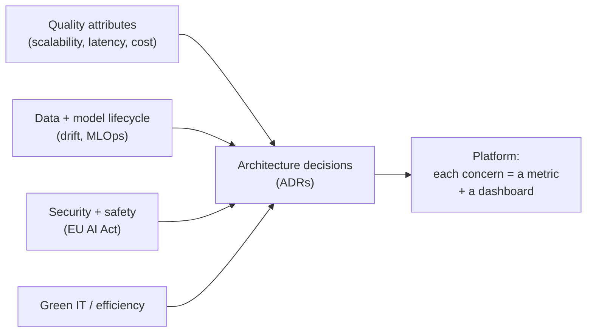

## Why it Matters

Internationally recognized, vendor-neutral architecture certification, bridge traditional enterprise architecture with AI's unique concerns.

## Diagram



## Code

```proto

## When to use / NOT

- **Use:** when an AI system needs to be defensible to an architecture review — quality attributes, lifecycle, compliance and efficiency as named, measurable concerns.
- **NOT:** as paperwork for a prototype; governance before a working system is ceremony that gets ignored later.

## Trade-offs

| Choice | Cost |
|--------|------|
| Every concern → a metric | Real engineering time per metric; some are hard to define |
| ADRs for major decisions | Slower decisions; the ADR must be maintained or it rots |
| EU AI Act checklist | Effort to map obligations to concrete controls |

## Vs

| Framework | Centre of gravity | Output |
|-----------|-------------------|--------|
| SWARC4AI (iSAQB) | Quality attributes + AI lifecycle | ADRs + controls |
| TOGAF | Enterprise capability | Layers and committees |
| Cloud-vendor Well-Architected | Vendor workload review | Pillar review doc |

## Pitfalls

- Writing quality attributes without targets; "scalable" is not a quality attribute, "p95 under 200 ms at 6 replicas" is.
- Governance artifacts that live outside the repo, so they decay invisibly.
- Treating Green IT as a reporting duty instead of a cost lever — the same metric, tokens per answer, is both.
- Skipping ADRs for the controversial decisions, which is precisely where they pay.

## Interview Q&A

- **Q:** Why iSAQB after CKAD? **A:** CKAD proves you can *deploy*; iSAQB proves you can *govern* — you need both for Staff/Principal.
- **Q:** EU AI Act relevance? **A:** Risk-tiered obligations (high-risk AI needs conformity, logging, human oversight) — your audit logs + HITL gates satisfy them.

## Related

- [[02_Final Capstone Governance]] • [[AI/07_Cross-Cutting/README|Cross-Cutting]] • [[AI/00_Overview/Certification Guide|Certification Guide]]

---
*Category: governance*

# SWARC4AI Syllabus — iSAQB CPSA-A

> Part of [[README|06_Architecture-Governance]] • `governance` • Weeks 31–36

## Syllabus (Official iSAQB)

| Block | Topics |
|-------|--------|
| **Intro & Fundamentals** | Classify AI/ML/GenAI; risks vs traditional software |
| **Compliance, Security & Alignment** | GDPR, **EU AI Act**, copyright, security pitfalls, AI ethics |
| **Design & Development** | ML/data-science lifecycle, process models, data requirements, non-determinism, **model drift**, AI design patterns |
| **Data Management** | Acquisition, labeling, efficient **data pipelines & architectures** |
| **Quality & Operation** | Hardware, **cost & sustainability (Green IT)**, drift types, **MLOps** pipelines, CI/CD, deployment strategies |
| **GenAI & Architectures** | LLMs, **GenAI patterns** (RAG, prompt eng., agentic workflows), **GenAI cost management** |

## How to Use It Here

Don't just pass the exam — **embed each concern in your platform**:

- EU AI Act risk classification → threat model for [[AI/03_Agentic-AI/Enterprise AI Operations Platform|AI Operations Platform]]
- Quality attributes (security, explainability, sustainability) → architecture decision records (ADRs)
- MLOps + drift handling → pipeline for embeddings/model routing (see [[AI/07_Cross-Cutting/02_AI Evaluation|Evaluation]])
- Green IT → cost/energy dashboard

# SWARC4AI made concrete: each concern maps to something measurable

CONCERNS = {
 "scalability": ("hpa_max_replicas", "6 replicas, scale on latency"),
 "latency": ("grpc_p95_ms", "target < 200 ms"),
 "cost": ("cost_per_request_usd", "tracked per route"),
 "drift": ("drift_detection_lead", ">= 2 weeks warning"),
 "compliance": ("eu_ai_act_checklist", "100% complete"),
 "green_it": ("tokens_per_answer", "lower = cheaper and less energy"),
}

# Governance that cannot be queried is a document, not a control.

# for concern, (metric, target) in CONCERNS.items():

# assert dashboard_has_panel(concern), f"no metric for {concern}"

```