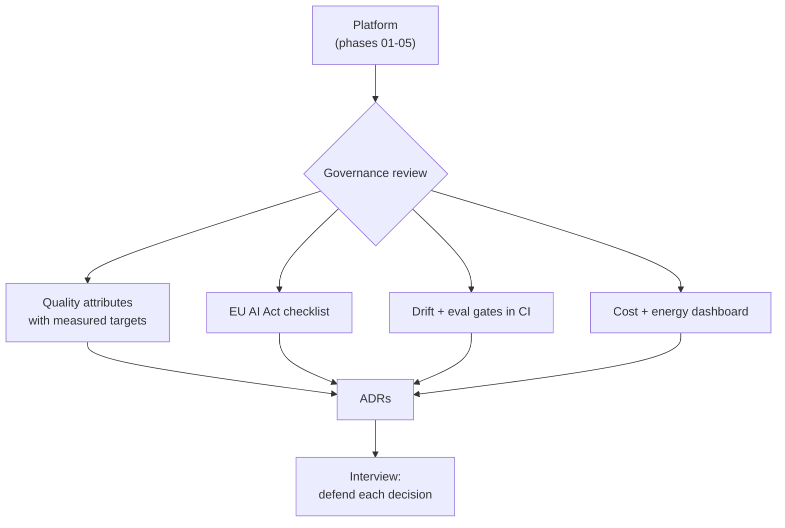

## Why it Matters

Incorporate iSAQB concerns into [[AI/03_Agentic-AI/Enterprise AI Operations Platform|AI Operations Platform]] rather than adding features, show architectural maturity.

## Diagram



## Code

```python

## When to use / NOT

- **Use:** as the Phase 06 deliverable — the platform is re-presented as a governed system with ADRs, controls and measurable quality attributes.
- **NOT:** as a compliance document exercise; governance that produces no metrics and no ADRs is shelfware.

## Trade-offs

- Reviewer can trace every AI decision to an ADR, a quality scenario, and a compliance control.

## Vs

| Artifact | Capstone version | Weak version |
|---------|------------------|--------------|
| Quality attribute | Measured target in a dashboard | "It should be fast" |
| ADR | Decision + rejected alternatives + date | None, decision lives in chat |
| Compliance | Checklist mapped to controls | A slide |

## Pitfalls

- Governance artifacts written at the end to look complete — they are recognisable and worthless.
- Quality attributes without owners or measurement; unmeasured attributes are aspirations.
- ADRs that record only the chosen option; the rejected alternatives are the interesting part.
- No link from the governance view back to the code it governs.

## Interview Q&A

- **Q:** What does "governed AI platform" mean in practice for what you built? **A:** It means each governance concern resolves to an artifact and a metric: latency and cost targets measured in dashboards, an EU AI Act checklist mapped to actual controls, eval gates in CI, and ADRs that record why — including the options I rejected.
- **Q:** Why write ADRs at all on a solo project? **A:** Because the future reader is an interviewer or a new teammate, and "we chose pgvector" is useless without the alternatives considered and the threshold at which the choice changes. An ADR is the artifact that survives the conversation.
- **Q:** Which governance control is hardest to keep honest? **A:** Drift and eval gates — they are the controls whose failure is silent. Everything else fails loudly; a slowly degrading retrieval quality metric fails quietly until a user notices.

## Flashcards (Spaced Repetition)

#flashcard
**Q:** What is the trigger keyword for Final Capstone, Governed Platform? :: **A:** [trigger keywords] #flashcard

#flashcard
**Q:** Key hyperparameter for Final Capstone, Governed Platform? :: **A:** [hyperparameter + typical range] #flashcard

#flashcard
**Q:** When do you NOT use Final Capstone, Governed Platform? :: **A:** [anti-pattern scenarios] #flashcard

#flashcard
**Q:** Cost order of magnitude for Final Capstone, Governed Platform? :: **A:** [GPU hours / $ per 1M tokens] #flashcard

## Practice Tasks (Tasks Plugin)
- [ ] Restate the intent from memory 📅 2026-09-30
- [ ] Code the config without looking 📅 2026-10-02
- [ ] Answer all Interview Q&A aloud 📅 2026-10-06
- [ ] Review flashcards (Spaced Repetition) 📅 2026-09-30

```tasks
not done
path includes 06_Architecture-Governance
sort by due
limit 10
```

## Related
- [[README|AI MOC]]
- [[06_Architecture-Governance/README|06_Architecture-Governance Folder]]

---

*Category: AI/06_Architecture-Governance • Part of [[README|AI MOC]]*