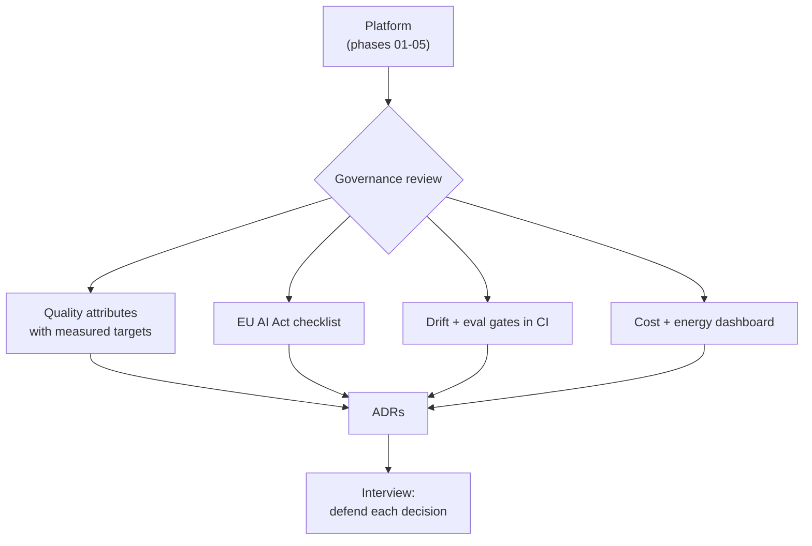

## Why it Matters

Incorporate iSAQB concerns into [[AI/03_Agentic-AI/Enterprise AI Operations Platform|AI Operations Platform]] rather than adding features, show architectural maturity.

## Diagram



## Code

```python

## When to use / NOT

- **Use:** as the Phase 06 deliverable — the platform is re-presented as a governed system with ADRs, controls and measurable quality attributes.
- **NOT:** as a compliance document exercise; governance that produces no metrics and no ADRs is shelfware.

## Trade-offs

- Reviewer can trace every AI decision to an ADR, a quality scenario, and a compliance control.

## Vs

| Artifact | Capstone version | Weak version |
|---------|------------------|--------------|
| Quality attribute | Measured target in a dashboard | "It should be fast" |
| ADR | Decision + rejected alternatives + date | None, decision lives in chat |
| Compliance | Checklist mapped to controls | A slide |

## Pitfalls

- Governance artifacts written at the end to look complete — they are recognisable and worthless.
- Quality attributes without owners or measurement; unmeasured attributes are aspirations.
- ADRs that record only the chosen option; the rejected alternatives are the interesting part.
- No link from the governance view back to the code it governs.

## Interview Q&A

- **Q:** What does "governed AI platform" mean in practice for what you built? **A:** It means each governance concern resolves to an artifact and a metric: latency and cost targets measured in dashboards, an EU AI Act checklist mapped to actual controls, eval gates in CI, and ADRs that record why — including the options I rejected.
- **Q:** Why write ADRs at all on a solo project? **A:** Because the future reader is an interviewer or a new teammate, and "we chose pgvector" is useless without the alternatives considered and the threshold at which the choice changes. An ADR is the artifact that survives the conversation.
- **Q:** Which governance control is hardest to keep honest? **A:** Drift and eval gates — they are the controls whose failure is silent. Everything else fails loudly; a slowly degrading retrieval quality metric fails quietly until a user notices.

## Related

- [[01_SWARC4AI Syllabus]] • [[AI/99_Revision/README|99_Revision]] • [[AI/07_Cross-Cutting/README|Cross-Cutting]]

---
*Category: governance*

# Final Capstone — Governed Platform (Weeks 35–36)

> Part of [[README|06_Architecture-Governance]] • `project` • The same platform, now **governed**.

## Required Additions

- [ ] **ADRs** for key decisions (vector DB choice, agent framework, model routing, MCP adoption)
- [ ] **Quality attribute scenarios** (security, scalability, explainability, sustainability) with measurable responses
- [ ] **Compliance matrix:** GDPR + EU AI Act obligations → platform controls (audit logs, HITL, data lineage)
- [ ] **MLOps pipeline:** embedding versioning, drift detection (data/concept), rollback plan
- [ ] **Threat model:** prompt injection, secret leakage, supply-chain, sandboxing (link [[AI/07_Cross-Cutting/04_AI Security|Security]])
- [ ] **Cost & Green IT** report: tokens, GPU, energy — with optimization levers
- [ ] **Enterprise integration** diagram: how this platform plugs into existing Java/Spring estate

# Capstone rule: a governance control is a file + a metric, not a statement

CONTROLS = [
 ("quality_attributes", "06_Governance/adr-001-latency-vs-cost.md", "grpc_p95_ms"),
 ("ai_act", "06_Governance/eu-ai-act-checklist.md", "checklist_complete"),
 ("drift", "04_Production/eval-harness", "eval_gate_in_ci"),
 ("cost", "07_Cross-Cutting/cost-dashboard", "cost_per_request_usd"),
]

def control_is_real(name: str, artifact_exists: bool, metric_reported: bool) -> bool:
 """A control with no artifact is an intention; with no metric it is unverified."""
 return artifact_exists and metric_reported
```