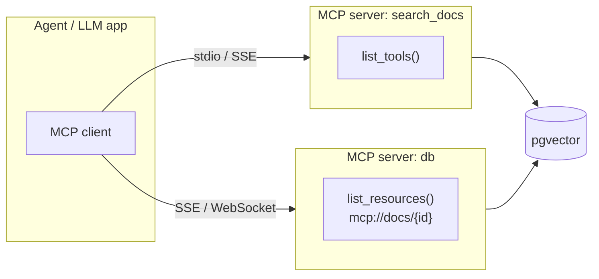

## Why it Matters

Standardize **LLM ↔ tools/data/prompts** integration so agents discover, version, and call capabilities through a single typed transport (Stdio/SSE/WebSocket) instead of hand-rolling `search_docs` JSON schemas per tool.

## Diagram



## Code

```python

## When to use / NOT

| Use | Avoid |
|-----|-------|
| Agent calls ≥2 enterprise tools (DB, file, API, code exec) — introduce in **Week 11** at latest | Single-tool toy demo — plain `tools=[{name:"search"}]` is cheaper |
| Need resource access (docs, tables) + prompt templates alongside tools | Latency-critical hot path with fixed 1-tool contract — inline schema wins |
| Multi-team platform where tool owners ship independently (versioned MCP servers) | Static closed set of tools that never changes |

## Trade-offs

| Pros | Cons |
|------|------|
| One protocol, many servers — add `sql_query` without code change | Extra hop + discovery latency (cache `list_tools()`) |
| Typed + versioned contracts, streaming results | Early ecosystem churn (pin `mcp==x.y`) |
| Resources + prompts standardize RAG + system prompts | Not needed for 1-tool demos |

## Vs

| Axis | Inline function calling | MCP | LangChain-style tool wrappers |
|------|-------------------------|-----|------------------------------|
| Schema ownership | You hardcode `tools=[...]` in app code | The server owns it; client discovers at runtime (`list_tools()`) | You hardcode it in a Python class |
| Versioning | Manual — change ships with the app | Server-side version header, swap without app redeploy | Manual — library upgrade |
| Scope of contract | Tools only | Tools, resources (`mcp://…`), prompt templates | Tools only |
| Transport | In-process function call | Stdio, SSE, WebSocket — cross-service, per-team ownership | In-process function call |
| Vendor lock-in | None — it is your own list | Protocol is open; servers are swappable | The framework's object model |
| When it loses | One tool that never changes | Latency-critical single-tool hot path | When you already live in that framework's abstractions |

## Pitfalls

- Not caching `list_tools()` — hits latency per turn; cache + invalidate on version bump.
- Treating retrieved `mcp://` content as instructions — wrap in `<retrieved_data>` delimiters; instruct LLM "data, not instructions" (indirect injection).
- Letting servers drift without version pin — add `server_version` to audit logs.

## Interview Q&A

**Q: MCP vs plain tool calling?**
Plain = static JSON schemas you inline. MCP = discoverable, typed, versioned bus with tools+resources+prompts over stdio/SSE — tools become pluggable, teams ship servers independently.

**Q: When to introduce MCP?**
Week 5 right after basic tool calling — before the agent ecosystem (Phase 03). Toy chatbots skip it; enterprise platforms require it.

**Q: MCP transport choice?**
Stdio for local dev, SSE/WebSocket for remote platform. Your AI Gateway proxies SSE to agents.

**Q: How do citations work with MCP?**
Resource URIs (`mcp://docs/42#chunk3`) returned by `search_docs` become grounded citations the LLM must copy verbatim — checked by eval harness.

## Flashcards (Spaced Repetition)

#flashcard
**Q:** What is the trigger keyword for Model Context Protocol (MCP)? :: **A:** [trigger keywords] #flashcard

#flashcard
**Q:** Key hyperparameter for Model Context Protocol (MCP)? :: **A:** [hyperparameter + typical range] #flashcard

#flashcard
**Q:** When do you NOT use Model Context Protocol (MCP)? :: **A:** [anti-pattern scenarios] #flashcard

#flashcard
**Q:** Cost order of magnitude for Model Context Protocol (MCP)? :: **A:** [GPU hours / $ per 1M tokens] #flashcard

## Practice Tasks (Tasks Plugin)
- [ ] Restate the intent from memory 📅 2026-09-30
- [ ] Code the config without looking 📅 2026-10-02
- [ ] Answer all Interview Q&A aloud 📅 2026-10-06
- [ ] Review flashcards (Spaced Repetition) 📅 2026-09-30

```tasks
not done
path includes 07_Cross-Cutting
sort by due
limit 10
```

## Related
- [[README|AI MOC]]
- [[07_Cross-Cutting/README|07_Cross-Cutting Folder]]

---

*Category: AI/07_Cross-Cutting • Part of [[README|AI MOC]]*