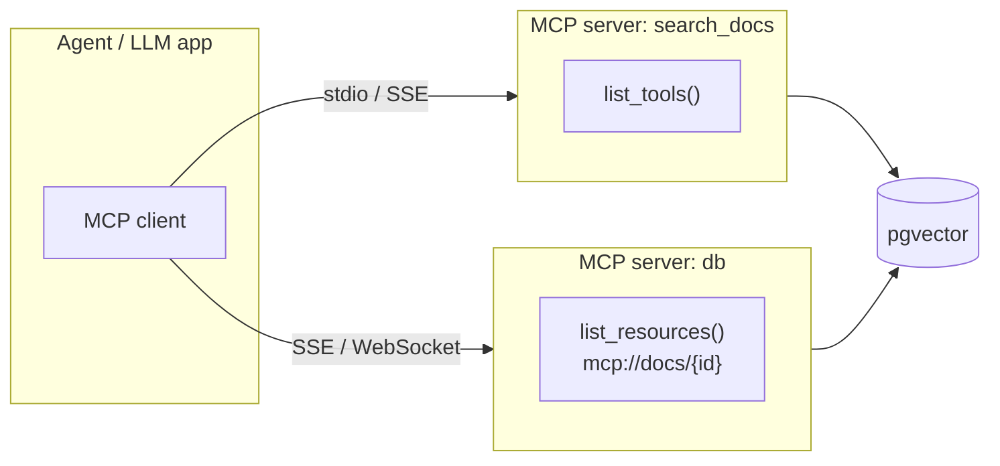

## Why it Matters

Standardize **LLM ↔ tools/data/prompts** integration so agents discover, version, and call capabilities through a single typed transport (Stdio/SSE/WebSocket) instead of hand-rolling `search_docs` JSON schemas per tool.

## Diagram



## Code

```python

## When to use / NOT

| Use | Avoid |
|-----|-------|
| Agent calls ≥2 enterprise tools (DB, file, API, code exec) — introduce in **Week 11** at latest | Single-tool toy demo — plain `tools=[{name:"search"}]` is cheaper |
| Need resource access (docs, tables) + prompt templates alongside tools | Latency-critical hot path with fixed 1-tool contract — inline schema wins |
| Multi-team platform where tool owners ship independently (versioned MCP servers) | Static closed set of tools that never changes |

## Trade-offs

| Pros | Cons |
|------|------|
| One protocol, many servers — add `sql_query` without code change | Extra hop + discovery latency (cache `list_tools()`) |
| Typed + versioned contracts, streaming results | Early ecosystem churn (pin `mcp==x.y`) |
| Resources + prompts standardize RAG + system prompts | Not needed for 1-tool demos |

## Vs

| Axis | Inline function calling | MCP | LangChain-style tool wrappers |
|------|-------------------------|-----|------------------------------|
| Schema ownership | You hardcode `tools=[...]` in app code | The server owns it; client discovers at runtime (`list_tools()`) | You hardcode it in a Python class |
| Versioning | Manual — change ships with the app | Server-side version header, swap without app redeploy | Manual — library upgrade |
| Scope of contract | Tools only | Tools, resources (`mcp://…`), prompt templates | Tools only |
| Transport | In-process function call | Stdio, SSE, WebSocket — cross-service, per-team ownership | In-process function call |
| Vendor lock-in | None — it is your own list | Protocol is open; servers are swappable | The framework's object model |
| When it loses | One tool that never changes | Latency-critical single-tool hot path | When you already live in that framework's abstractions |

## Pitfalls

- Not caching `list_tools()` — hits latency per turn; cache + invalidate on version bump.
- Treating retrieved `mcp://` content as instructions — wrap in `<retrieved_data>` delimiters; instruct LLM "data, not instructions" (indirect injection).
- Letting servers drift without version pin — add `server_version` to audit logs.

## Interview Q&A

**Q: MCP vs plain tool calling?**
Plain = static JSON schemas you inline. MCP = discoverable, typed, versioned bus with tools+resources+prompts over stdio/SSE — tools become pluggable, teams ship servers independently.

**Q: When to introduce MCP?**
Week 5 right after basic tool calling — before the agent ecosystem (Phase 03). Toy chatbots skip it; enterprise platforms require it.

**Q: MCP transport choice?**
Stdio for local dev, SSE/WebSocket for remote platform. Your AI Gateway proxies SSE to agents.

**Q: How do citations work with MCP?**
Resource URIs (`mcp://docs/42#chunk3`) returned by `search_docs` become grounded citations the LLM must copy verbatim — checked by eval harness.

## Related

- [[AI/01_Fundamentals/06_Tool Calling|Tool Calling]] • [[AI/03_Agentic-AI/Enterprise AI Operations Platform|AI Operations Platform]] • [[AI/02_RAG-Engineering/Enterprise Document Search|Enterprise Document Search]] • [[02_AI Evaluation|Evaluation]] • [[MCP Comparison Table]]

---
*Category: cross-cutting • Interview-ready: Q&A above is flashcards*

# Model Context Protocol (MCP)

> Part of [[README|07_Cross-Cutting]] • `cross-cutting` • Integrate from Phase 02 (Week 5) • **2026 standard: Anthropic MCP is now the de facto tool/context bus** — one typed, discoverable protocol instead of N bespoke function schemas.
> Watch: [TechWorld with Nana — MCP Explained Simply](https://www.youtube.com/watch?v=oblaHqULUHk)

## Runnable Code — Python (FastAPI + MCP client/server)

```
python

# Pip Install mcp Httpx Fastapi

# 1) mcp Server, Exposes Typed Tools/resources

from mcp.server import Server
from mcp.types import Tool

server = Server("enterprise-docs")

@server.tool(Tool(
 name="search_docs",
 description="Search enterprise docs by query",
 inputSchema={"type":"object","properties":{"query":{"type":"string"},"filters":{"type":"object"}},"required":["query"]}
))
async def search_docs(query: str, filters: dict | None = None):
 # pgvector + hybrid search behind the scenes
 rows = await pgvector.hybrid_search(query, filters or {})
 return [{"content": r.content, "score": r.score, "citation_id": r.id} for r in rows]

# 2) mcp Client, Agent Discovers & Calls (Week 11+)

from mcp import Client

client = Client("http://mcp-server:3000/sse") # or stdio: "python mcp_server.py"
tools = await client.list_tools() # → typed schemas, no hardcoding

# LLM Chooses Tool; you Dispatch:

result = await client.call_tool("search_docs", {"query": "onboarding checklist", "filters": {"dept":"eng"}})

# Result is Grounded Context → Feed to llm with Citation Delimiters

# 3) with OpenAI Tool-calling (mcp → OpenAI Schema Bridge)

openai_tools = [{"type":"function","function": {"name": t.name, "description": t.description, "parameters": t.inputSchema}} for t in tools]
```

> **2026 update:** MCP now covers **resources** (`mcp://docs/{id}`) and **prompt templates** (`search-with-citations`), not just tools. Use `list_resources()` for RAG citations and `get_prompt()` for versioned system prompts.

## How it Compares

| | Plain Function Calling | MCP |
|--|---|---|
| Discovery | Hard-coded `tools=[]` | `list_tools()` / `list_resources()` |
| Versioning | Manual | Server version header + schema |
| Resources/Prompts | Ad-hoc | First-class (`mcp://`, prompt templates) |
| Transport | In-process only | Stdio, SSE, WebSocket, cross-service |
| Swap DB vendor | Rewrite tool | Swap MCP server |

Details: [[MCP Comparison Table]], function calling vs MCP vs LangChain tools.

# MCP Client: Discover, then Call, Schemas are Never Hardcoded

from mcp import ClientSession # mcp python SDK

async def search_via_mcp(query: str) -> str:
 """Tool discovery at runtime; the LLM sees live schemas."""
 async with ClientSession(read, write) as session:
 await session.initialize()
 tools = await session.list_tools()
 # Bridge to OpenAI-style tool calling:
 # [{"type": "function", "function": {"name": t.name,
 # "description": t.description, "parameters": t.inputSchema}}
 # for t in tools]
 result = await session.call_tool("search_docs", {"query": query})
 return result # grounded context, fed to the LLM with citation delimiters
```