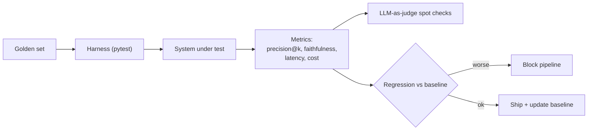

## Why it Matters

Continuously measure **retrieval quality, answer quality, hallucination, and latency/cost**, with a **golden set + LLM-as-judge**, so RAG/agentic changes are gated in CI, not demo'd.

## Diagram



## Code

```python
import pytest

def precision_at_k(retrieved: list[str], relevant: set[str], k: int) -> float:
 return sum(1 for d in retrieved[:k] if d in relevant) / k

GOLDEN = [
 {"q": "onboarding checklist eng", "relevant": {"doc-42", "doc-43"}, "answer_contains": "week one"},
]

@pytest.mark.parametrize("case", GOLDEN)
def test_rag_regression(case):
 got = search(case["q"])
 assert precision_at_k(got, set(case["relevant"]), k=5) >= 0.8
 assert case["answer_contains"] in generate(got[:5]) # cheap faithfulness proxy

## When to use / NOT

| Use | Avoid |
|-----|-------|
| Every PR that touches ingest, embed, rerank, prompts, or model routing | One-off toy answers with no ground truth — manual spot-check cheaper |
| Track delta vs baseline on 100+ queries (golden set) | Over-evaluating on <10 queries — noise, not signal |

## Trade-offs

| Pros | Cons |
|------|------|
| Grounds "RAG variant X vs Y" in numbers (Week 8) | Judge models cost tokens — sample + cache |
| Catches hallucination before prod | Golden set drifts — refresh quarterly with human review |
| Enables cost/perf tradeoff table (context compression) | Flaky if golden set too small |

## Vs

| Axis | Manual spot-check | LLM-as-judge (RAGAS) | Behaviour tests (TDD) |
|------|-------------------|----------------------|-----------------------|
| Scale | 10s of queries, by eye | 100s–1k per run | A fixed snapshot of scenarios |
| Signal | Anecdotal — remembers the vivid failure | Faithfulness / citation metrics over the whole set | Pass/fail on the exact scenario |
| Cost | Engineer's time | Judge-model tokens per run | Cheapest per run, expensive to author |
| Catches drift | No — you re-check what you remember | Yes — metric moves on `main` | Only on scenarios someone wrote down in advance |
| Best as | Triage on a new system, before a harness exists | The regression gate in CI | Guarding a specific past incident from recurring |

## Pitfalls

- Golden set not versioned — eval not reproducible; pin `eval/` to git tag.
- Judge = same model as generator — self-bias; use different judge (e.g., Claude judges GPT answers).
- No cost tracking — add `$` to Weekly Tracker; Week 10 cost comparison requires it.
- Citing but not checking — validate citation IDs resolve to retrieved chunks.

## Interview Q&A

**Q: How to detect hallucination automatically?**
LLM-as-judge checks each claim vs retrieved context; flag unsupported sentences. Pair with citation coverage (≥1 citation per factual sentence).

**Q: What goes into `golden.jsonl`?**
`{query, filters, expected_doc_ids, reference_answer, domain}` — 100+ queries spanning departments, dates, confidentiality; versioned, covers hybrid-search and metadata filtering.

**Q: Regression gate example?**
PR switches embed model → eval delta: faithfulness -1.2% (pass), p95 +25% (fail gate) → block merge. See [[AI/04_Production-Platform/02_AI TDD and Evaluation|AI TDD]].

**Q: Phoenix vs Langfuse here?**
Phoenix for **eval traces** (retrieval vs answer view); Langfuse for **LLM observability** (cost/latency stream). Use both.

## Related

- [[AI/02_RAG-Engineering/RAG Variants and Retrieval Strategies|RAG Variants]] • [[AI/04_Production-Platform/02_AI TDD and Evaluation|AI TDD]] • [[03_LLM Observability|LLM Observability]] • [[AI/02_RAG-Engineering/Enterprise Document Search|Enterprise Document Search]]

---
*Category: cross-cutting • Interview-ready*

# AI Evaluation Frameworks

> Part of [[README|07_Cross-Cutting]] • `cross-cutting` • From **Phase 02 (Week 6)** — shift from "it works" to **measured** retrieval/answer quality, regression-gated releases.
> Watch: [RAG Evaluation: Precision, Recall, Faithfulness, RAGAS](https://www.youtube.com/watch?v=7_LTU0LA374)

## Framework — 4 Layers

| Layer | Metric | How to Measure (runner in `eval/`) |
|-------|--------|-------------------------------------|
| **Retrieval** | precision@k, recall@k, MRR, nDCG | Golden `Q → doc_ids` set; scored per query |
| **Answer** | Faithfulness (grounded?), Relevance, Citation accuracy | **RAGAS/DeepEval** LLM-as-judge on `(Q, context, answer)` |
| **Regression** | Δ vs `main` on 100+ queries | Snapshot + CI gate: fail if faithfulness ↓2% or p95 ↑20% |
| **Hallucination** | Unsupported claim rate, refusal accuracy | Judge + human spot-check (10%) |
| **Latency/Cost** | p50/p95, tokens/query, $/1k queries | Prometheus histogram + Langfuse cost |

## Runnable Code — Eval Harness (Python)

```
python

# Eval/run.py, Runs on Every pr (Phase 04: ai TDD)

from ragas.metrics import faithfulness, answer_relevancy
from datasets import Dataset

golden = Dataset.from_json("eval/golden.jsonl") # {query, expected_doc_ids, context, reference_answer}

def score_retrieval(gold, retrieved_ids):
 prec = len(set(gold) & set(retrieved_ids)) / len(retrieved_ids)
 return prec

# Answer Eval, LLM-as-judge

results = []
for row in golden:
 retrieved = await rag.retrieve(row["query"])
 answer = await llm.ask(row["query"], context=retrieved, citations=True)
 f = faithfulness.score({"question": row["query"], "contexts": retrieved, "answer": answer.text})
 rel = answer_relevancy.score({"question": row["query"], "answer": answer.text})
 results.append({"q": row["query"], "faithfulness": f, "relevancy": rel, "citations_ok": answer.citations_valid})

# Gate, Phase 04 Maps to "Refactor & Test"

assert avg(r["faithfulness"] for r in results) >= 0.85, "Regression: faithfulness below floor"
assert unsupported_rate(results) < 0.05
```

**Repo layout:**```eval/golden.jsonl # versioned with code
eval/expected/ # frozen answers for regression diff
eval/run.py # CI entry```

## How It Compares

| | Manual Spot-Check | LLM-as-Judge (RAGAS) | Behavior Tests (TDD) |
|--|---|---|---|
| Scale | 10s queries | 100s–1k | Fixed snapshots |
| Signal | Anecdotal | Faithfulness/citation metric | Exact answer match (brittle for GenAI) |
| Use | Week 5 demo | Week 6+ harness | Regression gate |

# Answer-level faithfulness uses an LLM-as-judge with its own spot checks;

# exact-match is brittle for generative output and is used for retrieval only.

```