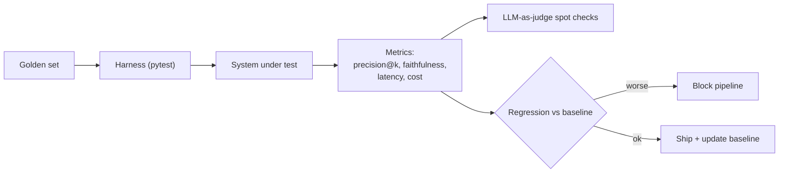

## Why it Matters

Continuously measure **retrieval quality, answer quality, hallucination, and latency/cost**, with a **golden set + LLM-as-judge**, so RAG/agentic changes are gated in CI, not demo'd.

## Diagram



## Code

```python
import pytest

def precision_at_k(retrieved: list[str], relevant: set[str], k: int) -> float:
 return sum(1 for d in retrieved[:k] if d in relevant) / k

GOLDEN = [
 {"q": "onboarding checklist eng", "relevant": {"doc-42", "doc-43"}, "answer_contains": "week one"},
]

@pytest.mark.parametrize("case", GOLDEN)
def test_rag_regression(case):
 got = search(case["q"])
 assert precision_at_k(got, set(case["relevant"]), k=5) >= 0.8
 assert case["answer_contains"] in generate(got[:5]) # cheap faithfulness proxy

## When to use / NOT

| Use | Avoid |
|-----|-------|
| Every PR that touches ingest, embed, rerank, prompts, or model routing | One-off toy answers with no ground truth — manual spot-check cheaper |
| Track delta vs baseline on 100+ queries (golden set) | Over-evaluating on <10 queries — noise, not signal |

## Trade-offs

| Pros | Cons |
|------|------|
| Grounds "RAG variant X vs Y" in numbers (Week 8) | Judge models cost tokens — sample + cache |
| Catches hallucination before prod | Golden set drifts — refresh quarterly with human review |
| Enables cost/perf tradeoff table (context compression) | Flaky if golden set too small |

## Vs

| Axis | Manual spot-check | LLM-as-judge (RAGAS) | Behaviour tests (TDD) |
|------|-------------------|----------------------|-----------------------|
| Scale | 10s of queries, by eye | 100s–1k per run | A fixed snapshot of scenarios |
| Signal | Anecdotal — remembers the vivid failure | Faithfulness / citation metrics over the whole set | Pass/fail on the exact scenario |
| Cost | Engineer's time | Judge-model tokens per run | Cheapest per run, expensive to author |
| Catches drift | No — you re-check what you remember | Yes — metric moves on `main` | Only on scenarios someone wrote down in advance |
| Best as | Triage on a new system, before a harness exists | The regression gate in CI | Guarding a specific past incident from recurring |

## Pitfalls

- Golden set not versioned — eval not reproducible; pin `eval/` to git tag.
- Judge = same model as generator — self-bias; use different judge (e.g., Claude judges GPT answers).
- No cost tracking — add `$` to Weekly Tracker; Week 10 cost comparison requires it.
- Citing but not checking — validate citation IDs resolve to retrieved chunks.

## Interview Q&A

**Q: How to detect hallucination automatically?**
LLM-as-judge checks each claim vs retrieved context; flag unsupported sentences. Pair with citation coverage (≥1 citation per factual sentence).

**Q: What goes into `golden.jsonl`?**
`{query, filters, expected_doc_ids, reference_answer, domain}` — 100+ queries spanning departments, dates, confidentiality; versioned, covers hybrid-search and metadata filtering.

**Q: Regression gate example?**
PR switches embed model → eval delta: faithfulness -1.2% (pass), p95 +25% (fail gate) → block merge. See [[AI/04_Production-Platform/02_AI TDD and Evaluation|AI TDD]].

**Q: Phoenix vs Langfuse here?**
Phoenix for **eval traces** (retrieval vs answer view); Langfuse for **LLM observability** (cost/latency stream). Use both.

## Flashcards (Spaced Repetition)

#flashcard
**Q:** What is the trigger keyword for AI Evaluation Frameworks? :: **A:** [trigger keywords] #flashcard

#flashcard
**Q:** Key hyperparameter for AI Evaluation Frameworks? :: **A:** [hyperparameter + typical range] #flashcard

#flashcard
**Q:** When do you NOT use AI Evaluation Frameworks? :: **A:** [anti-pattern scenarios] #flashcard

#flashcard
**Q:** Cost order of magnitude for AI Evaluation Frameworks? :: **A:** [GPU hours / $ per 1M tokens] #flashcard

## Practice Tasks (Tasks Plugin)
- [ ] Restate the intent from memory 📅 2026-09-30
- [ ] Code the config without looking 📅 2026-10-02
- [ ] Answer all Interview Q&A aloud 📅 2026-10-06
- [ ] Review flashcards (Spaced Repetition) 📅 2026-09-30

```tasks
not done
path includes 07_Cross-Cutting
sort by due
limit 10
```

## Related
- [[README|AI MOC]]
- [[07_Cross-Cutting/README|07_Cross-Cutting Folder]]

---

*Category: AI/07_Cross-Cutting • Part of [[README|AI MOC]]*