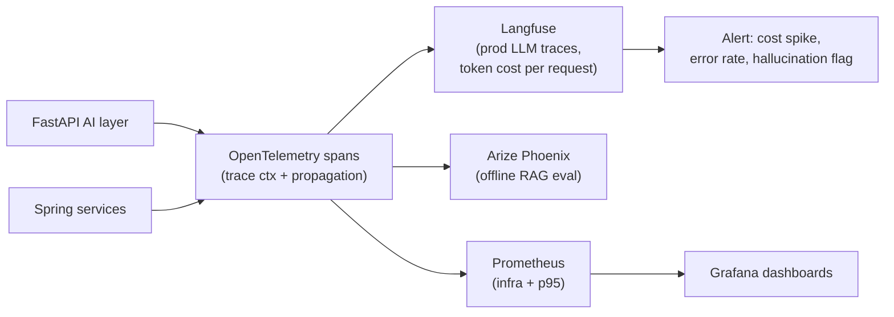

## Why it Matters

Trace every **prompt → tool/MCP call → retrieval → LLM → citations** with latency, tokens, cost, and faithfulness, so you can debug, alert, and A/B route.

## Diagram



## Code

```python
from opentelemetry import trace
from openinference.semconv.trace import SpanAttributes

tracer = trace.get_tracer("ai-backend")

@tracer.start_as_current_span("llm.chat")
async def chat(model: str, messages: list[dict]) -> str:
 """LLM spans carry the attributes that make traces queryable."""
 span = trace.get_current_span()
 span.set_attributes({
 SpanAttributes.LLM_MODEL_NAME: model,
 SpanAttributes.LLM_MESSAGES: str(messages),
 })
 # ... provider call; record usage on completion
 # span.set_attribute(SpanAttributes.LLM_TOKEN_COUNT_PROMPT, usage.prompt_tokens)
 # span.set_attribute(SpanAttributes.LLM_TOKEN_COUNT_COMPLETION, usage.completion_tokens)
 return "..."

## When to use / NOT

| Use | Avoid |
|-----|-------|
| Any LLM call that hits prod (ask, search, agent fork) — instrument via OTel | Throwaway `jshell` prompt tests — `print()` suffices |
| Need p95 + cost per query + hallucination drift | Tracing every embedding call verbatim — sample at 10% beyond 1k QPS |

## Trade-offs

| Pros | Cons |
|------|------|
| Pinpoint prompt/retrieval/LLM latency breakdown | Trace volume — sample + drop PII |
| Cost per model/route drives Week 10/34 decisions | Judge scoring extra tokens — batch offline |
| Correlate hallucination with retrieval precision@k | Requires PII redaction (see Security) |

## Vs

| Axis | Prometheus metrics only | Log lines only | OTel + Langfuse traces |
|------|-------------------------|----------------|------------------------|
| Unit of investigation | A dashboard spike with no request attached | Text search across a log stream | One trace: retrieval → LLM → tool spans, fully attributed |
| Token / cost attribution | Not available — no token dimension | Parse it out of the message body by hand | First-class span attributes |
| Prompt and completion bodies | Not captured | Captured, but unstructured | Captured and queryable, with PII redaction at export |
| Cross-service correlation | Infra only, app-level correlation manual | Request IDs, if you remembered to thread them | Trace context propagated through FastAPI → MCP servers → LLM |
| Failure mode | You know p95 rose and cannot ask "on which prompts" | You can find the slow line, not the prompt that triggered it | Cost per request, per model, per tenant |

## Pitfalls

- Tracing without redaction — leaks PII into observability store; gate with security review.
- No sampling at scale — OTel collector OOM; sample 10% + keep 100% of errors.
- Treating traces as logs — instrument spans, not `print()`; use attributes for slicing.

## Interview Q&A

**Q: What do you trace?**
Prompt (+ filtered PII), MCP/tool args + latency, retrieved `doc_ids` + precision@k, LLM model/tokens/cost, answer + citations, judge score. All as OTel spans.

**Q: How to alert on drift?**
Prometheus alert: `avg(faithfulness) by (model) < 0.85` over 1h → page + auto-fallback routing (see [[06_Multi-Model Routing|Routing]]).

**Q: PII in traces?**
Redact before export — middleware that strips `email/ssn` from spans; Langfuse scrub + retention policy.

## Related

- [[02_AI Evaluation|Evaluation]] • [[06_Multi-Model Routing|Multi-Model Routing]] • [[AI/04_Production-Platform/03_gRPC and Observability|gRPC + Observability]] • [[04_AI Security|Security]]

---
*Category: cross-cutting • Interview-ready*

# LLM Observability — Langfuse / Phoenix / OpenTelemetry

> Part of [[README|07_Cross-Cutting]] • `cross-cutting` • From **Phase 04 (Week 24)** • Production without LLM traces is blind — add traces **before** gRPC/Helm.
> Watch: [James Briggs — LangSmith 101 for AI Observability](https://www.youtube.com/watch?v=Iyc80hY2yYk)

## Runnable Code — OpenTelemetry + Langfuse (Python/FastAPI)

```
python

# Pip Install Langfuse Opentelemetry-exporter-otlp Openinference-instrumentation-openai

from langfuse import Langfuse
from opentelemetry import trace
from opentelemetry.exporter.otlp.proto.http.trace_exporter import OTLPSpanExporter

langfuse = Langfuse() # env: LANGFUSE_HOST, SECRET_KEY
tracer = trace.get_tracer("ai-platform")

@tracer.start_as_current_span("ask")
async def ask(query: str, filters: dict):
 # 1) retrieval span
 with tracer.start_as_current_span("retrieval") as s:
 docs = await mcp.call_tool("search_docs", {"query": query, "filters": filters})
 s.set_attribute("retrieval.count", len(docs))
 s.set_attribute("retrieval.precision_at_k", prestige(docs)) # from eval harness
 # 2) llm span, auto-traced by instrumentation
 with tracer.start_as_current_span("llm") as s:
 stream = await llm.chat.completions.create(model=route(query), messages=build_messages(query, docs), stream=True)
 s.set_attribute("llm.model", stream.model)
 s.set_attribute("llm.tokens", stream.usage.total_tokens)
 s.set_attribute("llm.cost", cost(stream.model, stream.usage))
 # 3) citation check span
 with tracer.start_as_current_span("citation_check"):
 assert citations_grounded(stream.text, docs)
 langfuse.score(name="faithfulness", value=judge(stream.text, docs))
 return stream
```

**Collector:**```yaml
# Otel-collector.yaml (k8s Week 25+)

exporters:
 otlp/langfuse: {endpoint: "https://cloud.langfuse.com/api/public/otel"}
 prometheus: {endpoint: "prometheus:9090"}
service: {pipelines: {traces: {exporters: [otlp/langfuse, prometheus]}}}```

**Dashboards (Grafana Week 27+):** `llm_p95`, `tokens_per_query`, `cost_per_1k`, `faithfulness`, `citation_coverage`, `tool_latency` (MCP).

## How It Compares

| | Phoenix (Arize) | Langfuse | Custom Prometheus only |
|--|---|---|---|
| Focus | Retrieval/answer eval traces | LLM traces + scores + datasets | Infra metrics |
| LLM-as-judge | Built-in RAG eval | Score API + eval datasets | DIY |
| Cost | Self-host OK | Cloud + self-host | No token/cost |
| Use | Eval harness (02_AI Evaluation) | Prod traces + experiments | infra (Phase 05 Grafana) |

> **2026 stack:** **Langfuse** for prod LLM traces + **Phoenix** for offline RAG eval, both export via **OTel**. Don't pick one.

# OTel → Langfuse (prod) and Phoenix (offline eval) via the same export path.

```