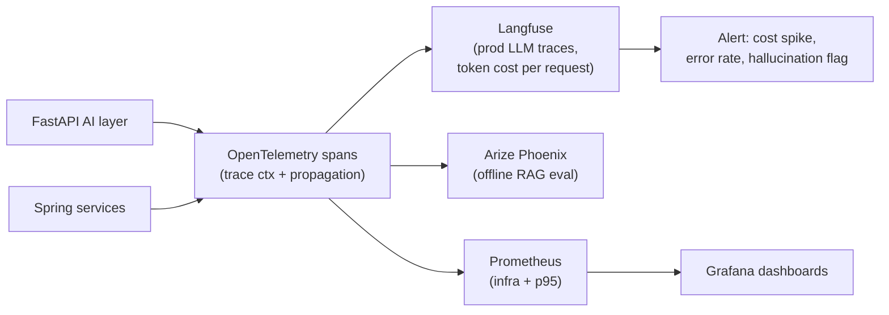

## Why it Matters

Trace every **prompt → tool/MCP call → retrieval → LLM → citations** with latency, tokens, cost, and faithfulness, so you can debug, alert, and A/B route.

## Diagram



## Code

```python
from opentelemetry import trace
from openinference.semconv.trace import SpanAttributes

tracer = trace.get_tracer("ai-backend")

@tracer.start_as_current_span("llm.chat")
async def chat(model: str, messages: list[dict]) -> str:
 """LLM spans carry the attributes that make traces queryable."""
 span = trace.get_current_span()
 span.set_attributes({
 SpanAttributes.LLM_MODEL_NAME: model,
 SpanAttributes.LLM_MESSAGES: str(messages),
 })
 # ... provider call; record usage on completion
 # span.set_attribute(SpanAttributes.LLM_TOKEN_COUNT_PROMPT, usage.prompt_tokens)
 # span.set_attribute(SpanAttributes.LLM_TOKEN_COUNT_COMPLETION, usage.completion_tokens)
 return "..."

## When to use / NOT

| Use | Avoid |
|-----|-------|
| Any LLM call that hits prod (ask, search, agent fork) — instrument via OTel | Throwaway `jshell` prompt tests — `print()` suffices |
| Need p95 + cost per query + hallucination drift | Tracing every embedding call verbatim — sample at 10% beyond 1k QPS |

## Trade-offs

| Pros | Cons |
|------|------|
| Pinpoint prompt/retrieval/LLM latency breakdown | Trace volume — sample + drop PII |
| Cost per model/route drives Week 10/34 decisions | Judge scoring extra tokens — batch offline |
| Correlate hallucination with retrieval precision@k | Requires PII redaction (see Security) |

## Vs

| Axis | Prometheus metrics only | Log lines only | OTel + Langfuse traces |
|------|-------------------------|----------------|------------------------|
| Unit of investigation | A dashboard spike with no request attached | Text search across a log stream | One trace: retrieval → LLM → tool spans, fully attributed |
| Token / cost attribution | Not available — no token dimension | Parse it out of the message body by hand | First-class span attributes |
| Prompt and completion bodies | Not captured | Captured, but unstructured | Captured and queryable, with PII redaction at export |
| Cross-service correlation | Infra only, app-level correlation manual | Request IDs, if you remembered to thread them | Trace context propagated through FastAPI → MCP servers → LLM |
| Failure mode | You know p95 rose and cannot ask "on which prompts" | You can find the slow line, not the prompt that triggered it | Cost per request, per model, per tenant |

## Pitfalls

- Tracing without redaction — leaks PII into observability store; gate with security review.
- No sampling at scale — OTel collector OOM; sample 10% + keep 100% of errors.
- Treating traces as logs — instrument spans, not `print()`; use attributes for slicing.

## Interview Q&A

**Q: What do you trace?**
Prompt (+ filtered PII), MCP/tool args + latency, retrieved `doc_ids` + precision@k, LLM model/tokens/cost, answer + citations, judge score. All as OTel spans.

**Q: How to alert on drift?**
Prometheus alert: `avg(faithfulness) by (model) < 0.85` over 1h → page + auto-fallback routing (see [[06_Multi-Model Routing|Routing]]).

**Q: PII in traces?**
Redact before export — middleware that strips `email/ssn` from spans; Langfuse scrub + retention policy.

## Flashcards (Spaced Repetition)

#flashcard
**Q:** What is the trigger keyword for LLM Observability? :: **A:** [trigger keywords] #flashcard

#flashcard
**Q:** Key hyperparameter for LLM Observability? :: **A:** [hyperparameter + typical range] #flashcard

#flashcard
**Q:** When do you NOT use LLM Observability? :: **A:** [anti-pattern scenarios] #flashcard

#flashcard
**Q:** Cost order of magnitude for LLM Observability? :: **A:** [GPU hours / $ per 1M tokens] #flashcard

## Practice Tasks (Tasks Plugin)
- [ ] Restate the intent from memory 📅 2026-09-30
- [ ] Code the config without looking 📅 2026-10-02
- [ ] Answer all Interview Q&A aloud 📅 2026-10-06
- [ ] Review flashcards (Spaced Repetition) 📅 2026-09-30

```tasks
not done
path includes 07_Cross-Cutting
sort by due
limit 10
```

## Related
- [[README|AI MOC]]
- [[07_Cross-Cutting/README|07_Cross-Cutting Folder]]

---

*Category: AI/07_Cross-Cutting • Part of [[README|AI MOC]]*