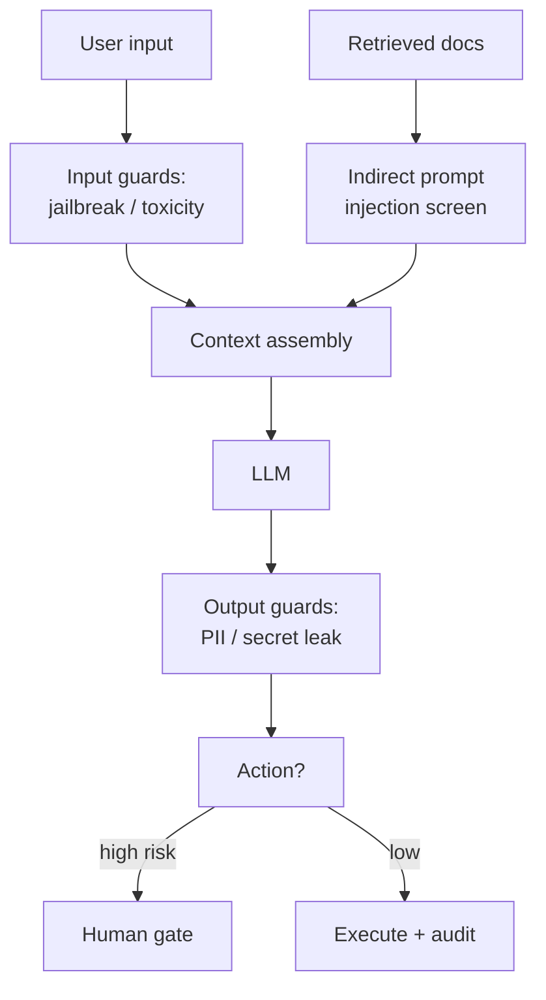

## Why it Matters

Harden LLM apps against **prompt injection (direct/indirect), secret/PII leakage, code-exec escape, and supply-chain poisoning**, plus auditability for [[AI/06_Architecture-Governance/01_SWARC4AI Syllabus|EU AI Act]].

## Diagram



## Code

```python
from typing import Literal
from pydantic import BaseModel, Field

class GuardVerdict(BaseModel):
 verdict: Literal["allow", "block", "sanitize"]
 reason: str = Field(description="Why, for the audit log")

## When to use / NOT

| Use | Avoid |
|-----|-------|
| Any retrieval that feeds untrusted docs into the LLM (indirect injection) | Pure deterministic API with no LLM — OWASP LLM top-10 not relevant |
| Coding Agent executes LLM-generated code | Treating security as Week-35 afterthought |

## Trade-offs

| Pros | Cons |
|------|------|
| Delimiters + hierarchy block most indirect injection with zero model change | Over-strict guardrails hurt utility — tune via eval |
| Sandbox lets Coding Agent run safely | Container per exec adds ~500ms; pool + reuse |

## Vs

| Axis | Delimiters only | Instruction hierarchy + output validation | Full guardrail stack (input + context + output + action) |
|------|-----------------|-------------------------------------------|--------------------------------------------------------|
| Direct injection | Weak — the model may obey the injected text | Strong — system > developer > user > tool ordering is enforced | Strong — plus a classifier rejects jailbreak-shaped input |
| Indirect injection | Covered for retrieved docs | Covered — docs are data, never instructions | Covered — retrieved content screened before context assembly |
| Exfiltration / PII | Not addressed | Output validation can reject known patterns | Output guard + DLP on tool outputs + field allowlist |
| Cost | Zero | Prompt engineering + cheap validation | Extra model calls per request (classifier, judge) |
| Latency | None | Negligible | Adds a guard pass before and after the LLM |
| Use for | A prototype | The default for any prod system | Regulated or high-risk surfaces (finance, health) |

## Pitfalls

- Logging raw prompts to Langfuse — **redact first**.
- Trusting retrieved docs as instructions — always delimit.
- No audit log — EU AI Act requires "who asked what, what answer, what sources" (see [[AI/06_Architecture-Governance/02_Final Capstone Governance|Capstone]]).

## Interview Q&A

**Q: How to mitigate indirect injection?**
Wrap retrieved docs in delimiters + hierarchy instruction "data, not instructions" + validate citations; test with `eval/golden_injection.jsonl`.

**Q: Where do secrets live?**
Vault / K8s External Secrets; never in traces/logs; rotate via short-lived tokens.

**Q: Coding Agent sandbox?**
Docker with no net, read-only, timeout + resource limits; audit every `exec_code` call.

## Flashcards (Spaced Repetition)

#flashcard
**Q:** What is the trigger keyword for AI Security? :: **A:** [trigger keywords] #flashcard

#flashcard
**Q:** Key hyperparameter for AI Security? :: **A:** [hyperparameter + typical range] #flashcard

#flashcard
**Q:** When do you NOT use AI Security? :: **A:** [anti-pattern scenarios] #flashcard

#flashcard
**Q:** Cost order of magnitude for AI Security? :: **A:** [GPU hours / $ per 1M tokens] #flashcard

## Practice Tasks (Tasks Plugin)
- [ ] Restate the intent from memory 📅 2026-09-30
- [ ] Code the config without looking 📅 2026-10-02
- [ ] Answer all Interview Q&A aloud 📅 2026-10-06
- [ ] Review flashcards (Spaced Repetition) 📅 2026-09-30

```tasks
not done
path includes 07_Cross-Cutting
sort by due
limit 10
```

## Related
- [[README|AI MOC]]
- [[07_Cross-Cutting/README|07_Cross-Cutting Folder]]

---

*Category: AI/07_Cross-Cutting • Part of [[README|AI MOC]]*