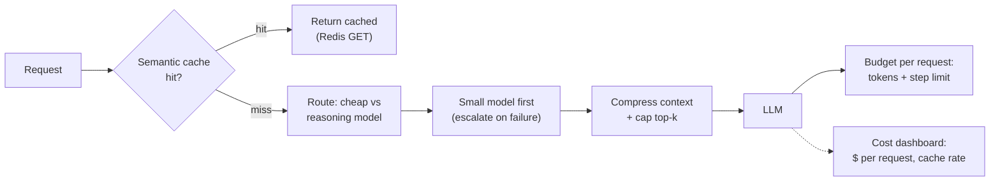

## Why it Matters

Cut **$ + latency** per query via layered optimization: **semantic cache → batching → routing (small/cheap first) → fallback**, without hurting faithfulness.

## Diagram



## Code

```python
import hashlib, json, redis.asyncio as redis

r = redis.Redis(decode_responses=True)

async def cached_or_call(key_parts: dict, call, ttl: int = 3600) -> str:
 """Semantic cache: exact-key here; embedding-keyed lookup for paraphrases."""
 key = "ans:" + hashlib.sha256(json.dumps(key_parts, sort_keys=True).encode()).hexdigest()
 if (hit := await r.get(key)) is not None:
 return hit # ~free answer; no provider call
 answer = await call() # model call, routed cheap-first
 await r.setex(key, ttl, answer)
 return answer

## When to use / NOT

| Use | Avoid |
|-----|-------|
| Prod queries with repetition (enterprise search, coding QA) | One-off explorations — cache hit rate ~0 |
| Need p95 + cost SLO (platform) | Micro-optimizing before eval harness exists |

## Trade-offs

| Pros | Cons |
|------|------|
| Semantic cache 20–40% on repeated enterprise queries | Stale cache — invalidate on doc update (hook ingest) |
| Routing 30–50% via small model | Mis-route hard Q to small model — gate with eval |
| Batching trivial win | Adds latency if you batch live queries |

## Vs

| Axis | No optimisation | Semantic cache | Routing cheap-first | Batching |
|------|------------------|----------------|---------------------|----------|
| What it buys | Nothing | Skip the LLM call entirely on a repeated query | Pay a small-model price for the majority of queries | Pay per batch, not per call, on embed and judge work |
| Per-query latency | Baseline | Near-free on a hit — near-baseline plus an embed on a miss | Lower p50, same p95 | None for live queries; batching live traffic adds wait |
| Correctness risk | None | Staleness — cached answer quoted a doc that has since changed | Mis-route a hard query to a weak model | None — batching changes unit economics, not outputs |
| Operational cost | None | An extra datastore (Redis + vector) to keep coherent with the docs | A classifier and an eval gate that keeps routing honest | Batches must be sized and drained before request timeouts |
| Invalidated by | — | Any source-document edit | A capability shift in the small model | A move to streaming-first interfaces |

## Pitfalls

- Cache without invalidation — serves stale citations after docs change.
- Routing without eval — cheap model hallucinates; gate via faithfulness score.
- Optimizing before measuring — run harness first (02_AI Evaluation).

## Interview Q&A

**Q: How did you build the Week 10 cost table?**
`cost = tokens_in*in_price + tokens_out*out_price`; compare: (managed embeddings vs self-hosted) × (with/without reranker) × (naive vs compressed) on 100 golden queries — report `$/1k`, `p95`, `faithfulness`.

**Q: When to invalidate semantic cache?**
On ingest that updates chunk embedding; bump `doc_version` → cache entry requires `doc_version == current`; else miss.

**Q: Routing vs fallback?**
Routing = choose cheap model **before** call (classifier). Fallback = retry cheap after failure (429/timeout). Use both — see [[AI/04_Production-Platform/01_AI Gateway|AI Gateway]].

## Related

- [[06_Multi-Model Routing|Multi-Model Routing]] • [[02_AI Evaluation|Evaluation]] • [[03_LLM Observability|Observability]] • [[AI/02_RAG-Engineering/RAG Variants and Retrieval Strategies|RAG Variants]] • [[AI/04_Production-Platform/01_AI Gateway|AI Gateway]]

---
*Category: cross-cutting • Interview-ready*

# Cost Optimization — Semantic Cache, Batching, Routing, Fallback

> Part of [[README|07_Cross-Cutting]] • `cross-cutting` • From **Phase 02 Week 10 + Phase 06 Week 34** — Week 10 cost table becomes Week 34 finance review.

## Stack — 4 Layers

| Layer | How | Saving (typical) | When |
|-------|-----|------------------|-----|
| **Semantic cache** (Redis + vector) | Embed query; hit if cosine >0.96 → return cached answer+citations | 20–40% for top 1k queries | Before LLM call |
| **Batching** | Batch 8–16 embed calls → one `embed()`; batch judge scoring | 15% embed cost | Ingest + eval |
| **Routing** | Route to `gpt-4o-mini`/Haiku for simple Q; `gpt-4o`/Sonnet for hard Q | 30–50% | Via [[06_Multi-Model Routing\|Router]] |
| **Fallback** | On 429/timeout, retry cheaper model | Availability vs cost | Gateway retry policy |
| **Context compression** | RAG variants: naive 4k → compressed 1.2k tokens | 30–50% token saving | Week 9 |

## Runnable Code — Semantic Cache (Redis + pgvector)

```
python

# Pip Install Redis Openai

import redis, hashlib
r = redis.Redis(host="redis")

async def ask_cached(query: str, filters: dict):
 key = f"q:{hashlib.sha256((query+str(filters)).encode()).hexdigest()}"
 # 1) exact cache
 if (hit := r.get(key)): return json.loads(hit)
 # 2) semantic cache, nearest cached query
 qvec = await embed(query)
 near = await pg.query("SELECT answer FROM semantic_cache ORDER BY embedding <=> %s LIMIT 1", (qvec,))
 if near and cosine(near.embedding, qvec) > 0.96:
 return near.answer # hit, skip LLM
 # 3) miss, full RAG
 docs = await mcp.call_tool("search_docs", {"query": query, "filters": filters})
 answer = await llm.chat.completions.create(model=route(query), messages=build_messages(query, docs))
 r.setex(key, 3600, answer.model_dump_json())
 await pg.execute("INSERT INTO semantic_cache (query, embedding, answer) VALUES (%s,%s,%s)", (query, qvec, answer.text))
 return answer
```

**Weekly Tracker metric:** `cost_per_query = (input_tokens*price_in + output_tokens*price_out)/1000` → record per phase.

## How it Compares

| | No Cache (LLM every time) | Exact Cache (key=query) | Semantic Cache (vector) |
|--|---|---|---|
| Hit rate | 0% | 5–10% (typos miss) | 20–40% |
| Complexity | None | Redis `GET` | Embed + vector search |
| Staleness | None | TTL | TTL + doc-version invalidation |

# Cache Freshness: ttl + a Document-version Stamp in the Key, so an Updated

# Source Document Invalidates the Answers that Quoted it, not Just after TTL.
```