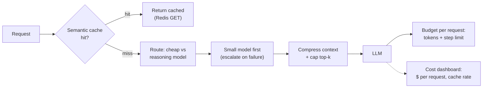

## Why it Matters

Cut **$ + latency** per query via layered optimization: **semantic cache → batching → routing (small/cheap first) → fallback**, without hurting faithfulness.

## Diagram



## Code

```python
import hashlib, json, redis.asyncio as redis

r = redis.Redis(decode_responses=True)

async def cached_or_call(key_parts: dict, call, ttl: int = 3600) -> str:
 """Semantic cache: exact-key here; embedding-keyed lookup for paraphrases."""
 key = "ans:" + hashlib.sha256(json.dumps(key_parts, sort_keys=True).encode()).hexdigest()
 if (hit := await r.get(key)) is not None:
 return hit # ~free answer; no provider call
 answer = await call() # model call, routed cheap-first
 await r.setex(key, ttl, answer)
 return answer

## When to use / NOT

| Use | Avoid |
|-----|-------|
| Prod queries with repetition (enterprise search, coding QA) | One-off explorations — cache hit rate ~0 |
| Need p95 + cost SLO (platform) | Micro-optimizing before eval harness exists |

## Trade-offs

| Pros | Cons |
|------|------|
| Semantic cache 20–40% on repeated enterprise queries | Stale cache — invalidate on doc update (hook ingest) |
| Routing 30–50% via small model | Mis-route hard Q to small model — gate with eval |
| Batching trivial win | Adds latency if you batch live queries |

## Vs

| Axis | No optimisation | Semantic cache | Routing cheap-first | Batching |
|------|------------------|----------------|---------------------|----------|
| What it buys | Nothing | Skip the LLM call entirely on a repeated query | Pay a small-model price for the majority of queries | Pay per batch, not per call, on embed and judge work |
| Per-query latency | Baseline | Near-free on a hit — near-baseline plus an embed on a miss | Lower p50, same p95 | None for live queries; batching live traffic adds wait |
| Correctness risk | None | Staleness — cached answer quoted a doc that has since changed | Mis-route a hard query to a weak model | None — batching changes unit economics, not outputs |
| Operational cost | None | An extra datastore (Redis + vector) to keep coherent with the docs | A classifier and an eval gate that keeps routing honest | Batches must be sized and drained before request timeouts |
| Invalidated by | — | Any source-document edit | A capability shift in the small model | A move to streaming-first interfaces |

## Pitfalls

- Cache without invalidation — serves stale citations after docs change.
- Routing without eval — cheap model hallucinates; gate via faithfulness score.
- Optimizing before measuring — run harness first (02_AI Evaluation).

## Interview Q&A

**Q: How did you build the Week 10 cost table?**
`cost = tokens_in*in_price + tokens_out*out_price`; compare: (managed embeddings vs self-hosted) × (with/without reranker) × (naive vs compressed) on 100 golden queries — report `$/1k`, `p95`, `faithfulness`.

**Q: When to invalidate semantic cache?**
On ingest that updates chunk embedding; bump `doc_version` → cache entry requires `doc_version == current`; else miss.

**Q: Routing vs fallback?**
Routing = choose cheap model **before** call (classifier). Fallback = retry cheap after failure (429/timeout). Use both — see [[AI/04_Production-Platform/01_AI Gateway|AI Gateway]].

## Flashcards (Spaced Repetition)

#flashcard
**Q:** What is the trigger keyword for Cost Optimization? :: **A:** [trigger keywords] #flashcard

#flashcard
**Q:** Key hyperparameter for Cost Optimization? :: **A:** [hyperparameter + typical range] #flashcard

#flashcard
**Q:** When do you NOT use Cost Optimization? :: **A:** [anti-pattern scenarios] #flashcard

#flashcard
**Q:** Cost order of magnitude for Cost Optimization? :: **A:** [GPU hours / $ per 1M tokens] #flashcard

## Practice Tasks (Tasks Plugin)
- [ ] Restate the intent from memory 📅 2026-09-30
- [ ] Code the config without looking 📅 2026-10-02
- [ ] Answer all Interview Q&A aloud 📅 2026-10-06
- [ ] Review flashcards (Spaced Repetition) 📅 2026-09-30

```tasks
not done
path includes 07_Cross-Cutting
sort by due
limit 10
```

## Related
- [[README|AI MOC]]
- [[07_Cross-Cutting/README|07_Cross-Cutting Folder]]

---

*Category: AI/07_Cross-Cutting • Part of [[README|AI MOC]]*