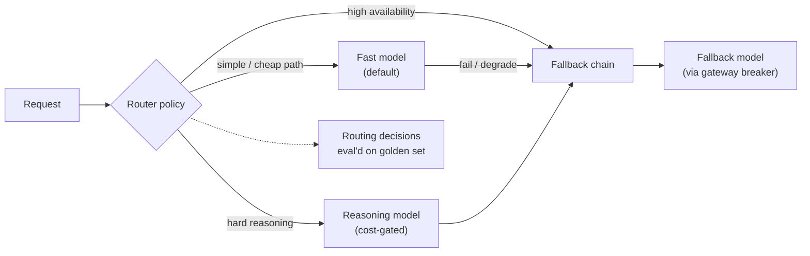

## Why it Matters

Dynamically choose the cheapest capable model per query (e.g., Haiku for fact lookup, Sonnet for coding, Gemini for long context, self-hosted Llama for cheap bulk), with **fallbacks** on 429/timeout.

## Diagram



## Code

```python
from typing import Literal
from pydantic import BaseModel

class RouteDecision(BaseModel):
 model_tier: Literal["fast", "reasoning"]
 reason: str

def route(task_complexity: float, budget_ok: bool) -> RouteDecision:
 """Default cheap; reasoning only when it earns its cost."""
 if task_complexity > 0.7 and budget_ok:
 return RouteDecision(model_tier="reasoning", reason="hard multi-step reasoning")
 return RouteDecision(model_tier="fast", reason="default cheap tier")

## When to use / NOT

| Use | Avoid |
|-----|-------|
| Platform serves varied workloads (search vs code vs QA) | Single model suffices (toy) — static `model="gpt-4o-mini"` cheaper to operate |
| Need cost/latency SLOs across tenants | Routing without eval — mis-routes hard queries to weak model |

## Trade-offs

| Pros | Cons |
|------|------|
| 30–50% cost cut vs single frontier model | Classifier errors — gate via eval harness |
| Long-context → Gemini, code → Sonnet | Vendor sprawl — pin versions, handle per-provider quirks |
| Fallback survives 429 without user error | Need unified message schema |

## Vs

| Axis | Single model | Static routing (rules per feature) | Classifier routing | Cascade / fallback chain |
|------|--------------|-----------------------------------|--------------------|---------------------------|
| Cost | Flat and high | Cuts cost where the rule is right | Lowest — cheap on the queries that deserve cheap | Medium — pays for the failed attempt |
| Latency | Flat | Best — no classification step | Adds a classification hop before the call | Worst — worst case is two calls |
| Failure mode | None on capability, high on bill | Rules rot as queries drift | Mis-routes hard queries to a weak model | Adds calls exactly when a provider is degraded |
| Needs eval gate | No | Yes — a rule is a hypothesis | Yes — validate faithfulness never drops below baseline | Yes — on the fallback path too |
| Use when | MVP, or one workload | Workloads are separable by feature | Varied query shapes at platform scale | Availability is the SLO and providers are flaky |

## Pitfalls

- Routing without eval — hard queries on cheap model hallucinate; gate with [[02_AI Evaluation|Evaluation]].
- No provider abstraction — `openai` vs `anthropic` message formats differ; wrap in unified `ask()` adapter.
- No fallback — single vendor outage = outage; ship fallback Day 1.

## Interview Q&A

**Q: How do you decide the route?**
Classifier: `is_simple_fact()` (regex + 1k training set) + domain + context length; validate via weekly eval — faithfulness must not drop >1% vs frontier.

**Q: Open-weight when?**
Bulk ingest, offline judge, or tenants with data-residency; self-host Llama on K8s (Phase 05) — cost $0.10/1M vs $2.50.

**Q: Fallback vs routing?**
Routing = choose **before** call; fallback = retry **after** failure. Use both — router picks Sonnet, fallback to Haiku on 429.

**Q: How to A/B test?**
Langfuse experiment: 10% traffic to candidate route, compare `faithfulness`, `cost_per_1k`, `p95` — promote if cost ↓ and faithfulness ≥ baseline.

## Related

- [[05_Cost Optimization|Cost Optimization]] • [[03_LLM Observability|Observability]] • [[02_AI Evaluation|Evaluation]] • [[AI/04_Production-Platform/01_AI Gateway|AI Gateway]] • [[AI/06_Architecture-Governance/01_SWARC4AI Syllabus|SWARC4AI]]

---
*Category: cross-cutting • Interview-ready*

# Multi-Model Routing — GPT/Claude/Gemini/Open-Weights

> Part of [[README|07_Cross-Cutting]] • `cross-cutting` • From **Phase 04 (Week 17+)** — the AI Gateway's brain: route by **latency / capability / cost** with fallback.

## Runnable Code — Router + Fallback (Python)

```
python

# Config: Cost/latency/capability Table, 2026 Snapshot

MODELS = {
 "haiku": {"cost":0.25, "latency":400, "cap":"fast-fact", "provider":"anthropic"},
 "sonnet": {"cost":3.0, "latency":900, "cap":"code/reasoning", "provider":"anthropic"},
 "gpt-4o-mini":{"cost":0.15,"latency":500,"cap":"fast-fact","provider":"openai"},
 "gpt-4o": {"cost":2.5, "latency":1100,"cap":"reasoning","provider":"openai"},
 "gemini-2.5-flash":{"cost":0.3,"latency":600,"cap":"long-context","provider":"google"},
 "llama-3.3-70b":{"cost":0.1, "latency":800,"cap":"bulk","provider":"self-host"},
}

# 1) Classifier, Rule + Tiny Model

def route(query: str, domain: str) -> str:
 if len(query) > 8000: return "gemini-2.5-flash" # long context
 if domain == "code": return "sonnet"
 if is_simple_fact(query): return "haiku" # or gpt-4o-mini, A/B via eval
 return "gpt-4o-mini"

# 2) Fallback Chain, Retry Cheaper on Failure

FALLBACK = {"sonnet":["haiku","gpt-4o-mini"], "gpt-4o":["gpt-4o-mini","haiku"]}

async def ask_resilient(query: str):
 model = route(query, domain="search")
 for m in [model] + FALLBACK.get(model, []):
 try:
 with tracer.start_as_current_span("llm", attributes={"llm.model": m}):
 return await llm.chat.completions.create(model=m, messages=build(query))
 except (RateLimitError, TimeoutError):
 continue
 raise RuntimeError("all fallbacks exhausted")
```

**Gateway wiring (Phase 04):** Router lives in `api/gateway/router.py`; reads per-tenant policy from config; emits `llm.model` span + cost metric to Langfuse/Prometheus.

## How it Compares

| | Single Model (gpt-4o) | Router (this note) | Cascading (small→large on fail) |
|--|---|---|---|
| Cost | High, flat | 30–50% lower (eval-gated) | Medium (extra call on fail) |
| Latency | p95 fixed | p50 lower (cheap hits) | p95 higher |
| Use | MVP | Platform (Weeks 17+) | Simple fallback-only |

# Circuit Breaker on the Fallback Chain: a Failed Provider Routes to the

# Fallback Model, not to a User-facing Error (see ai Gateway).
```