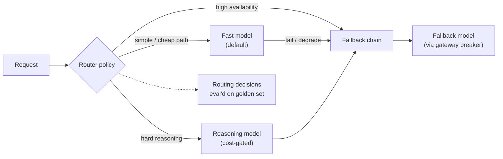

## Why it Matters

Dynamically choose the cheapest capable model per query (e.g., Haiku for fact lookup, Sonnet for coding, Gemini for long context, self-hosted Llama for cheap bulk), with **fallbacks** on 429/timeout.

## Diagram



## Code

```python
from typing import Literal
from pydantic import BaseModel

class RouteDecision(BaseModel):
 model_tier: Literal["fast", "reasoning"]
 reason: str

def route(task_complexity: float, budget_ok: bool) -> RouteDecision:
 """Default cheap; reasoning only when it earns its cost."""
 if task_complexity > 0.7 and budget_ok:
 return RouteDecision(model_tier="reasoning", reason="hard multi-step reasoning")
 return RouteDecision(model_tier="fast", reason="default cheap tier")

## When to use / NOT

| Use | Avoid |
|-----|-------|
| Platform serves varied workloads (search vs code vs QA) | Single model suffices (toy) — static `model="gpt-4o-mini"` cheaper to operate |
| Need cost/latency SLOs across tenants | Routing without eval — mis-routes hard queries to weak model |

## Trade-offs

| Pros | Cons |
|------|------|
| 30–50% cost cut vs single frontier model | Classifier errors — gate via eval harness |
| Long-context → Gemini, code → Sonnet | Vendor sprawl — pin versions, handle per-provider quirks |
| Fallback survives 429 without user error | Need unified message schema |

## Vs

| Axis | Single model | Static routing (rules per feature) | Classifier routing | Cascade / fallback chain |
|------|--------------|-----------------------------------|--------------------|---------------------------|
| Cost | Flat and high | Cuts cost where the rule is right | Lowest — cheap on the queries that deserve cheap | Medium — pays for the failed attempt |
| Latency | Flat | Best — no classification step | Adds a classification hop before the call | Worst — worst case is two calls |
| Failure mode | None on capability, high on bill | Rules rot as queries drift | Mis-routes hard queries to a weak model | Adds calls exactly when a provider is degraded |
| Needs eval gate | No | Yes — a rule is a hypothesis | Yes — validate faithfulness never drops below baseline | Yes — on the fallback path too |
| Use when | MVP, or one workload | Workloads are separable by feature | Varied query shapes at platform scale | Availability is the SLO and providers are flaky |

## Pitfalls

- Routing without eval — hard queries on cheap model hallucinate; gate with [[02_AI Evaluation|Evaluation]].
- No provider abstraction — `openai` vs `anthropic` message formats differ; wrap in unified `ask()` adapter.
- No fallback — single vendor outage = outage; ship fallback Day 1.

## Interview Q&A

**Q: How do you decide the route?**
Classifier: `is_simple_fact()` (regex + 1k training set) + domain + context length; validate via weekly eval — faithfulness must not drop >1% vs frontier.

**Q: Open-weight when?**
Bulk ingest, offline judge, or tenants with data-residency; self-host Llama on K8s (Phase 05) — cost $0.10/1M vs $2.50.

**Q: Fallback vs routing?**
Routing = choose **before** call; fallback = retry **after** failure. Use both — router picks Sonnet, fallback to Haiku on 429.

**Q: How to A/B test?**
Langfuse experiment: 10% traffic to candidate route, compare `faithfulness`, `cost_per_1k`, `p95` — promote if cost ↓ and faithfulness ≥ baseline.

## Flashcards (Spaced Repetition)

#flashcard
**Q:** What is the trigger keyword for Multi-Model Routing? :: **A:** [trigger keywords] #flashcard

#flashcard
**Q:** Key hyperparameter for Multi-Model Routing? :: **A:** [hyperparameter + typical range] #flashcard

#flashcard
**Q:** When do you NOT use Multi-Model Routing? :: **A:** [anti-pattern scenarios] #flashcard

#flashcard
**Q:** Cost order of magnitude for Multi-Model Routing? :: **A:** [GPU hours / $ per 1M tokens] #flashcard

## Practice Tasks (Tasks Plugin)
- [ ] Restate the intent from memory 📅 2026-09-30
- [ ] Code the config without looking 📅 2026-10-02
- [ ] Answer all Interview Q&A aloud 📅 2026-10-06
- [ ] Review flashcards (Spaced Repetition) 📅 2026-09-30

```tasks
not done
path includes 07_Cross-Cutting
sort by due
limit 10
```

## Related
- [[README|AI MOC]]
- [[07_Cross-Cutting/README|07_Cross-Cutting Folder]]

---

*Category: AI/07_Cross-Cutting • Part of [[README|AI MOC]]*