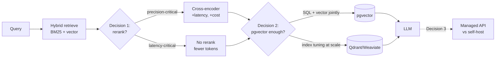

## Why it Matters

These are the three decisions that recur at every architecture review in this vault: rerank or not, pgvector or a dedicated vector DB, managed API or self-hosted. The table exists so the answer is a row with trade-offs, not a preference, and so the *condition* under which each choice flips is written down next to it.

## Diagram



## Code

```python

## When to use / NOT

- **Use:** when presenting one of these three choices with its trade-offs and the condition that would change the decision.
- **NOT:** as a permanent verdict — the rows are decisions tied to current scale and pricing; re-check them when either moves.

## Trade-offs

| Decision | Choosing the first option costs | Choosing the second costs |
|----------|--------------------------------|---------------------------|
| Reranker | Latency + tokens per query | Lower precision@k |
| pgvector | Index tuning at scale | A second distributed system to operate |
| Managed API | Higher per-token spend at volume | Operate inference infra yourself |

## Vs

| Decision axis | Option A | Option B | Flip condition |
|--------------|----------|----------|---------------|
| Retrieval | No rerank | Cross-encoder rerank | Precision@k gap > ~5pp within latency budget |
| Storage | pgvector | Dedicated vector DB | Index latency/size fails at our scale |
| Serving | Managed API | Self-hosted | Token volume passes break-even |

## Pitfalls

- Copying these numbers into an architecture review; the rows here are relationships — substitute measured figures.
- Making the reranker decision without the latency column; precision gains that blow the p95 budget are not a win.
- Choosing a vector DB for "scale" before pgvector has measurably failed.
- Forgetting that managed-vs-self-hosted flips with volume, so a decision made at month 3 is wrong at month 18.

## Interview Q&A

- **Q:** How do you decide whether to rerank? **A:** By the measured precision@k gap against the latency and token cost it adds. If the gap is small or the p95 budget breaks, no rerank is the correct architecture — the table makes that a defensible answer rather than a shortcut.
- **Q:** When does pgvector stop being enough? **A:** When the index stops meeting its latency or size targets at our actual scale — not because a benchmark said so. Until then it keeps hybrid SQL and vector queries in one transactional boundary, which is worth a lot operationally.
- **Q:** Self-host or managed API? **A:** It is a function of volume, not of principle: below the break-even volume, managed wins on team cost; above it, self-hosting pays. The decision is revisited when volume or pricing moves, because a static answer is guaranteed to age badly.

## Related

- [[AI/07_Cross-Cutting/01_MCP|MCP]] • [[AI/02_RAG-Engineering/RAG Variants and Retrieval Strategies|RAG Variants]] • [[AI/02_RAG-Engineering/02_Design LLM Architectures|Design LLM Architectures]] • [[AI/07_Cross-Cutting/05_Cost Optimization|Cost Optimization]] • [[AI/07_Cross-Cutting/06_Multi-Model Routing|Multi-Model Routing]]

# Cross-Phase Comparison Tables

## 1. Reranker vs No-Reranker

| Scenario | Retrieval Only | +Reranker (cross-encoder) | Delta |
|----------|---------------|--------------------------|-------|
| **Precision@5** | ~0.45 on keyword-heavy queries | ~0.55–0.60 | +15–25% |
| **Latency per query** | 80–120 ms (vector only) | 180–250 ms (+80–120 ms) | +80–120 ms |
| **Cost per query** | embedding-only + 1 LLM call | embedding + reranker call + 1 LLM call | +30–50% tokens |
| **When to choose** | Summarization, open-ended chat, high-throughput UI | High-stakes QA, legal/medical, exact-answer required | — |
| **When to skip** | Latency-sensitive real-time chat, bulk ingestion | When precision gain doesn't justify cost/latency | — |

*Fill in your own numbers from Phase 02 experiments.*

## 2. pgvector vs Dedicated Vector DB

| Aspect | pgvector (PostgreSQL) | Qdrant / Weaviate |
|--------|----------------------|-------------------|
| **Deployment** | Single DB, no extra container | Separate service, Helm chart or managed |
| **Scale** | ~10k–50k vectors (depends on hardware) | >100k, horizontal scale |
| **Transactions** | Full ACID, joins, filtering in SQL | Eventually consistent, limited SQL-like filters |
| **Payload size** | JSONB columns, moderate | Dedicated payload fields, larger |
| **Ops overhead** | None new if PG already running | New service: monitor, scale, upgrade, backups |
| **Cost** | $0 if PG already running | $0.50–$2.00 / month per GB + VM/containers |
| **When to choose** | Existing PG estate, <50k vectors, need SQL joins | Growing beyond 50k, multi-tenant, need advanced vector features |
| **When to skip** | Prototype / early phases, keeping stack minimal | Production at scale with many tenants |

*Populate with your own benchmark numbers.*

## 3. Managed API vs Self-Hosted Cost

| Dimension | Managed (OpenAI/Anthropic) | Self-Hosted (Llama-3-8B via Ollama/Oobabooga) |
|-----------|----------------------------|-----------------------------------------------|
| **$/1k tokens** | $0.00015 – $0.03 (model-dependent) | $0.10 – $0.50 (GPU hourly + electricity) |
| **Latency** | 200–800 ms (network + provider) | 500–2000 ms (depends on GPU, batch size) |
| **Model updates** | Instant (provider handles) | You rebuild container, pin version |
| **Rate limits** | Provider-enforced (e.g. 350 RPM) | Your infra limit (can over-provision) |
| **Data governance** | Provider stores prompts unless you opt-out | Full control, on-prem if needed |
| **When to choose** | Prototype, <5M tokens/month, want fastest iteration | >5M tokens/month, compliance, cost optimization |
| **Break-even** | ≈ 5M tokens / month → self-host cheaper after | — |

*Replace with your actual token counts and cloud spend.*

# The three decisions as data, so the table is reproducible

from typing import Literal

def rerank_needed(precision_gain: float, latency_budget_ok: bool) -> bool:
 """Decision 1: rerank only if the measured gain fits the latency budget."""
 return precision_gain > 0.05 and latency_budget_ok

def vector_backend(hybrid_sql_needed: bool, index_pressure: bool) -> str:
 """Decision 2: pgvector unless the index measurably fails at our scale."""
 if hybrid_sql_needed and not index_pressure: return "pgvector"
 return "dedicated vector DB"

def managed_vs_selfhost(tokens_per_month: int, break-even_tokens: int = 5_000_000) -> str:
 """Decision 3: a relationship, not a figure — swap in your own numbers."""
 return "self-host cheaper" if tokens_per_month > break_even_tokens else "managed API"
```