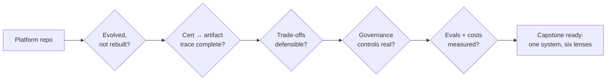

## Why it Matters

The capstone is not the platform, it is the **defence** of the platform, the moment 36 weeks of building has to survive an architecture review. This checklist asks the questions an interviewer actually asks: can you show evolution rather than rebuild, trace each certification to an artifact, and defend the trade-offs out loud.

## Diagram



## Code

```python

## When to use / NOT

- **Use:** at the end of Phase 06 as the final review gate before treating the program as complete.
- **NOT:** as a completion form filled in afterwards — the questions are for finding gaps while there is still time to close them.

## Trade-offs

| Choice | Cost |
|--------|------|
| Defend rather than demo | You must know the rejected alternatives, not just the chosen one |
| Trace every cert to an artifact | A cert without an artifact fails the trace and cannot be claimed |
| One platform, six lenses | No varied portfolio; breadth is traded for depth |

## Vs

| Capstone style | This one | Alternative |
|---------------|-----------|------------|
| Evidence | Repo artifacts + measured metrics | Slide deck |
| Depth | Six lenses on one system | Six unrelated projects |
| Failure signal | A question that cannot be answered with a file | None |

## Pitfalls

- Presenting features instead of decisions; an architecture review cares about why, not what.
- A trace that stops at a folder name — the artifact must be the specific system or document.
- Being unable to name the rejected alternative for a major choice; that is the answer that reveals depth.
- Claiming completion while the eval gate is still manual.

## Interview Q&A

- **Q:** If you could only show me one thing from 36 weeks, what would it be? **A:** The same repository at six different phases — it shows the system evolving rather than being rebuilt, which is the only evidence that the architecture was learned rather than assembled.
- **Q:** What is the weakest part of your capstone? **A:** Anything whose answer is a description instead of a measurement — typically the governance controls until they have a live metric behind them. The checklist exists to find those before the review, not after.
- **Q:** How do you know you are done? **A:** When each of the six lenses answers with an artifact and a number: phases landed, certs traced, trade-offs documented, evals in CI. If one cannot, the program is not finished, it is just paused.

## Related

- [[README]] • [[AI/README|AI MOC]] • [[AI/06_Architecture-Governance/02_Final Capstone Governance|Final Capstone]]

---
*Category: revision*

# Capstone Checklist — Final Review

> Part of [[README|99_Revision]] • `revision` • Use before marking any phase complete.

## Platform Evolution — Did You Evolve, Not Rebuild?

- [ ] Phase 01 → 02: `AI Backend Template` extended into `Enterprise Document Search` (same repo/evolution, not a new repo)?
- [ ] Phase 02 → 03: RAG search became a tool for the `Researcher` agent — not duplicated?
- [ ] Phase 03 → 04: Agents hardened with gateway, resilience, TDD, Helm, gRPC, observability?
- [ ] Phase 04 → 05: Same Helm charts deployed to K8s — not rewritten?
- [ ] Phase 05 → 06: Governance artifacts (ADRs, quality scenarios, compliance matrix) added — not just features?

## Certification → Platform Trace

| Cert | Evidence in Platform |
|------|----------------------|
| Coursera C1/C2 | Eval table, variant experiments, cost comparison — in `Enterprise Document Search` |
| NUS-ISS | 7-agent orchestration, memory, HITL, audit logs — in `AI Operations Platform` |
| Coursera C3–C7 | Gateway, circuit breaker, Helm, HPA, gRPC, Prometheus dashboards |
| CKAD/CKA | `kubectl` deploys full stack, all pods healthy |
| iSAQB SWARC4AI | ADRs, quality scenarios, EU AI Act matrix, drift/MLOps, threat model |

## Interview Readiness

- [ ] Can whiteboard the 36-week timeline in 2 minutes?
- [ ] Can explain *why* NUS-ISS after RAG (ecosystem thinking) and *why* iSAQB last (formalize after building)?
- [ ] Can defend pgvector vs Qdrant, LangGraph vs AutoGen, CKAD vs CKA with trade-offs?

# Capstone readiness as an executable check, not a feeling

def readiness(phases_built: list[str], certs_with_artifact: list[str],
 tradeoffs_documented: list[str], eval_gates: list[str]) -> dict:
 """Every question must be answerable with a file or a number."""
 return {
 "phases_landed": len(phases_built) == 6,
 "cert_traceable": len(certs_with_artifact) >= 3,
 "tradeoffs_documented": len(tradeoffs_documented) >= 3,
 "eval_gates_in_ci": len(eval_gates) >= 1,
 "ready": all([len(phases_built) == 6, len(certs_with_artifact) >= 3,
 len(tradeoffs_documented) >= 3, len(eval_gates) >= 1]),
 }

# Example evidence:

# phases_built = ["01","02","03","04","05","06"]

# certs_with_artifact = ["NUS-ISS -> 03_Agentic-AI/", "CKAD -> 05_Kubernetes/",

# "SWARC4AI -> 06_Architecture-Governance/"]

```