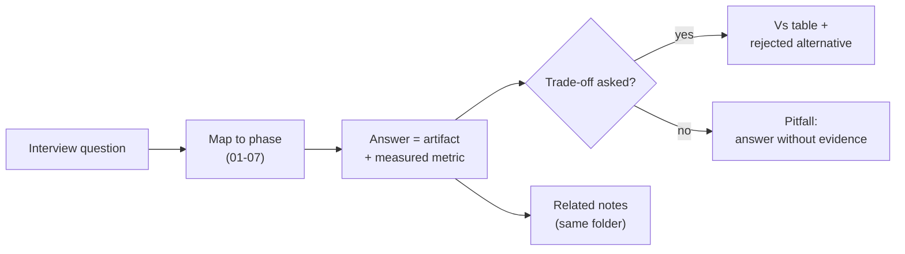

## Why it Matters

An interview bank only helps if it rehearses retrieval under pressure, not recognition. This note is organised by phase so a question can be answered with the specific artifact built in that phase, the answers are pointers to evidence, which is what separates a candidate who studied from one who built.

## Diagram



## Code

```python

## When to use / NOT

- **Use:** for spaced, out-loud rehearsal in the final weeks; answer first, then open the note to check.
- **NOT:** as reading material the night before — passive review produces recognition, not the retrieval the room actually demands.

## Trade-offs

| Choice | Cost |
|--------|------|
| Answer = artifact + metric | You must have built and measured it; no bluffing |
| Organised by phase | Cross-cutting questions need two entries |
| Out-loud rehearsal | Uncomfortable and slow; the only method that works |

## Vs

| Prep method | This bank | Flashcard apps | Watching talks |
|-------------|-----------|-----------------|---------------|
| Trains | Verbal retrieval with evidence | Recognition | Familiarity |
| Detects | Where the answer has no artifact | Little | Nothing |
| Time cost | High per question | Low | Low |

## Pitfalls

- Answers that describe instead of defend; "we used pgvector" is a description, "we chose pgvector over a dedicated vector DB because X, and it flips when Y" is an answer.
- Rehearsing by reading; recognition feels like readiness and is not.
- No cross-cutting entries — MCP, security and cost questions do not belong to one phase.
- Memorising numbers you did not measure; when probed, they collapse.

## Interview Q&A

- **Q:** How do you prepare for an AI architecture interview? **A:** By rehearsing answers out loud that always end in an artifact and a metric. If an answer cannot name the file or the number, that is the gap — and finding it in rehearsal is the entire point of the bank.
- **Q:** What makes an answer sound senior? **A:** Naming the rejected alternative. A junior says what was built; a senior says what was considered, why it lost, and the condition under which the decision flips.
- **Q:** How do you handle a question you cannot answer? **A:** Say what you do know, name the artifact you would check, and be specific about the limits. A pointed "I would look in the eval harness for that number" beats a vague guess every time.

---
*Category: revision*

## Related

- [[AI/00_Overview/Learning Philosophy|Learning Philosophy]] • [[AI/99_Revision/Capstone Checklist|Capstone Checklist]] • [[AI/99_Revision/Metrics Dashboard|Metrics Dashboard]] • [[AI/07_Cross-Cutting/02_AI Evaluation|Evaluation]] • [[AI/04_Production-Platform/02_AI TDD and Evaluation|AI TDD and Evaluation]]

# Interview Bank — AI Platform

> Part of [[README|99_Revision]] • `revision` • Curated Q&A aggregated from `00..07`. Source of truth remains in each note.

## How to Use

- This is a **cram index** — answers live in source notes (linked). Don't duplicate.
- For spaced repetition, add `sr-due: YYYY-MM-DD` to source notes; [[README|Dashboard]] tracks due.

## Fundamentals (01)

- Why Pydantic v2 for LLM outputs? → [[AI/01_Fundamentals/01_Python for AI|Python for AI]]
- FastAPI streaming for LLM tokens? → [[AI/01_Fundamentals/02_FastAPI Backend|FastAPI Backend]]
- Tool calling vs RAG? → [[AI/01_Fundamentals/06_Tool Calling|Tool Calling]]

## RAG (02)

- pgvector vs dedicated vector DB? → [[AI/02_RAG-Engineering/01_LLM Engineering with RAG|C1]]
- When does hybrid beat pure vector? → [[AI/02_RAG-Engineering/02_Design LLM Architectures|C2]]
- Why rerank? → [[AI/02_RAG-Engineering/RAG Variants and Retrieval Strategies|RAG Variants]]

## Agentic (03)

- LangGraph vs AutoGen vs Assistants API? → [[AI/03_Agentic-AI/Multi-Agent Patterns|Multi-Agent Patterns]]
- How to prevent agent loops? → [[AI/03_Agentic-AI/Multi-Agent Patterns|Multi-Agent Patterns]]

## Production (04)

- Why circuit breaker for LLM? → [[AI/04_Production-Platform/01_AI Gateway|AI Gateway]]
- How to TDD a non-deterministic LLM service? → [[AI/04_Production-Platform/02_AI TDD and Evaluation|AI TDD]]

## K8s (05)

- Why StatefulSet for PG? → [[AI/05_Kubernetes-Operations/01_Kubernetes Deployment|K8s Deployment]]
- CKAD vs CKA? → [[AI/05_Kubernetes-Operations/02_CKAD Preparation|CKAD Prep]]

## Governance (06)

- Why iSAQB after CKAD? → [[AI/06_Architecture-Governance/01_SWARC4AI Syllabus|SWARC4AI]]
- EU AI Act risk tiers? → [[AI/06_Architecture-Governance/01_SWARC4AI Syllabus|SWARC4AI]]

## Cross-Cutting (07)

- MCP vs plain tool calling? → [[AI/07_Cross-Cutting/01_MCP|MCP]]
- Hallucination detection? → [[AI/07_Cross-Cutting/02_AI Evaluation|Evaluation]]
- Semantic cache invalidation? → [[AI/07_Cross-Cutting/05_Cost Optimization|Cost Optimization]]

## 2026 Trends (from [[AI/00_Overview/2026 Trends Update|2026 Trends]])

- Why MCP is now the tool bus, not "additional"? → [[AI/00_Overview/2026 Trends Update|Trends]] + [[AI/07_Cross-Cutting/01_MCP|MCP]]
- Reasoning vs fast model routing? → [[AI/07_Cross-Cutting/06_Multi-Model Routing|Multi-Model Routing]]
- GraphRAG vs hybrid search? → [[AI/02_RAG-Engineering/RAG Variants and Retrieval Strategies|RAG Variants]] + [[AI/00_Overview/2026 Trends Update|Trends]]
- How do you gate AI changes in CI? → [[AI/07_Cross-Cutting/02_AI Evaluation|Evaluation]] + [[AI/04_Production-Platform/02_AI TDD and Evaluation|AI TDD]]

---

Use Dataview to live-aggregate all Q&A (source stays in notes):

```
dataviewTABLE WITHOUT ID file.link as "Note", category as "Category"FROM "AI"
WHERE category AND file.folder != "AI/99_Revision"
SORT file.path ASC
```

[[README|← Back to 99_Revision]]

# Answer Shape Used Across Every Phase Section

def answer(phase: str, question: str) -> dict:
 """A real answer names the artifact, the metric, and the alternative rejected."""
 return {
 "artifact": f"AI/{phase}/<the system or note you built>",
 "metric": "precision@k / p95 ms / cost per request, whatever the phase measured",
 "rejected": "the nearest alternative you did NOT pick, and why",
 }

# Drill Rule: Answer Aloud, then Check the Note. Recognition (Reading the Answer

# And Nodding) is not Retrieval, and Only Retrieval Survives the Interview.
```