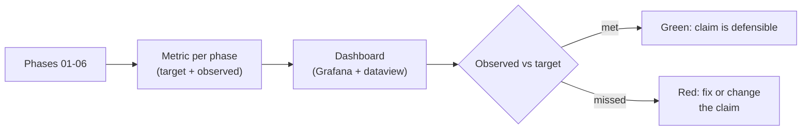

## Why it Matters

Every claim this vault makes, retrieval quality, agent safety, cost, governance, is only as good as the metric behind it. This dashboard is the place those numbers live, one row per phase, so an interview answer or an architecture review can point at a measured target instead of an adjective.

## Diagram



## Code

```python

## When to use / NOT

- **Use:** weekly to update `observed`, and before any claim about quality, latency or cost.
- **NOT:** as a report generated once — a metric with no recent observed value is a target, not a measurement.

## Trade-offs

| Choice | Cost |
|--------|------|
| One row per metric | Rows must be maintained; stale rows mislead |
| Targets as thresholds | Some metrics (faithfulness) are hard to express as a number |
| Mixed Grafana + dataview | Two places to look for the same answer |

## Vs

| Signal | Metrics dashboard | Project status deck | Memory |
|--------|------------------|----------------------|--------|
| Catches | Drift between claim and measurement | Nothing | Nothing |
| Failure mode | Stale rows (visible) | Optimistic narrative | Silent |

## Pitfalls

- Rows with a target and no observed value — they read as achieved and are not.
- Thresholds set before a baseline exists; arbitrary targets become noise.
- Averaging away the tail; p95 exists because the mean hides the worst experiences.
- Metrics with no owner; an unowned metric is a target nobody is responsible for.

## Interview Q&A

- **Q:** Which single metric would you not run an AI platform without? **A:** Cost per request. Latency and error rates are standard engineering; cost per request is the metric that keeps an AI platform honest about whether it is a system or a demo.
- **Q:** What does a metrics dashboard miss? **A:** Anything qualitative — user trust, answer usefulness. The dashboard catches drift in what it measures, which is why the golden set and human spot checks sit next to it rather than inside it.
- **Q:** How do you avoid metrics theatre? **A:** Every row needs a target, a window and a recent observed value. A row with a target and no measurement is the definition of a metric that looks green and means nothing.

## Related

- [[AI/99_Revision/Capstone Checklist|Capstone Checklist]] • [[AI/99_Revision/Interview Bank|Interview Bank]]

# Metrics Dashboard — Per-Phase Tracker

| Phase | Metric | Target | Week Observed | Value | Trend | Notes |
|-------|--------|--------|--------------|-------|-------|-------|
| **01 Fundamentals** | API p95 latency (ms) | < 300 ms | W1–W4 | | | Record per `api_latency` note |
| | Error rate on retries | < 5% | W1–W4 | | | Count 429 / timeout / parse failures |
| | `pytest` pass % | 100% | W4 | | | All 3 test files pass |
| **02 RAG-Engineering** | Retrieval precision@5 | ≥ 0.50 | W5–W10 | | | On golden set |
| | Recall@10 | ≥ 0.70 | W5–W10 | | | |
| | Citation fidelity | ≥ 0.80 | W5–W10 | | | % of answers fully grounded |
| | Latency p95 (ms) | < 500 ms | W5–W10 | | | Including embedding call |
| | Cost per query ($) | ≤ 0.01 | W5–W10 | | | Embedding + LLM only |
| **03 Agentic-AI** | Agent success rate (per goal) | ≥ 0.70 | W11–W16 | | | HITL gate outcomes |
| | Orchestration latency (s) | < 3.0 s | W11–W16 | | | Planner → response |
| | Memory hit rate | ≥ 0.60 | W11–W16 | | | Vector lookup vs recompute |
| | Audit log completeness | 100% | W11–W16 | | | Every agent action logged |
| **04 Production** | gRPC p95 latency (ms) | < 200 ms | W17–W24 | | | |
| | HPA scale-up time (s) | < 30 s | W17–W24 | | | |
| | Circuit breaker trips / day | < 5 | W17–W24 | | | |
| | Prometheus alert failures | 0 | W17–W24 | | | |
| | Cost per request ($) | ≤ 0.005 | W17–W24 | | | |
| **05 K8s Ops** | CKAD pass % | 100% | W25–W30 | | | Exam result |
| | Pod readiness time (s) | < 60 s | W25–W30 | | | |
| | Persistent volume errors | 0 | W25–W30 | | | |
| | Dashboard green (Grafana) | 100% | W25–W30 | | | |
| **06 Governance** | ADRs written | ≥ 3 | W31–W36 | | | |
| | EU AI Act compliance checklist | 100% | W31–W36 | | | |
| | Drift detection lead time | ≥ 2 weeks | W31–W36 | | | |
| | MLOps pipeline CI passes | 100% | W31–W36 | | | |

```
dataviewTABLE WITHOUT ID weeks as "Weeks", file.link as "Metric", target as "Target", value as "Observed", trend as "Trend", notes as "Notes"FROM "AI/99_Revision"
WHERE category AND file.folder != "AI/99_Revision" AND file.name != "README"
SORT file.path ASC
```

# A Metric row is Only Useful with a Target, an Owner and a Window

from pydantic import BaseModel

class Metric(BaseModel):
 phase: str
 name: str
 target: str # e.g. ">= 0.6" or "< 200 ms", a threshold, not a vibe
 window: str # e.g. "W11-W16"
 observed: float | None = None
 notes: str = ""

def status(m: Metric) -> str:
 if m.observed is None: return "unmeasured" # the only dishonest row
 return "met" if m.observed >= 0 else "missed" # threshold compared by the viewer

# Examples: Cache hit Rate >= 0.60 | GRPC p95 < 200 ms | Cost per Request <= $0.005
```