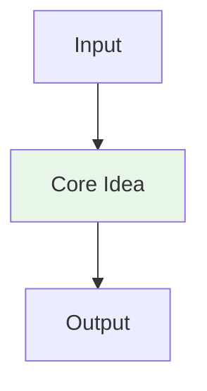

# {{Title}}

> Part of [[README|MOC]] • `{{category}}` • Weeks {{weeks}}
> 🎨 **Visual diagram:** Create Excalidraw drawing from template: `Cmd+P → Excalidraw: New from template → AI Diagram`

## Intent
One sentence: what problem does this solve? Define the **key term** in **bold**.

## Why It Matters
- Where this appears in interviews (FAANG, senior vs. junior)
- Production impact (cost, latency, quality)
- Senior signal: recognizing the *disguised* form of this pattern

## Diagram


## Key Points
- Point 1
- Point 2

## Code / Config Example
```python
# Minimal example
```

## When to Use / NOT
| Scenario | Use? | Reason |
|---|---|---|
| | ✅ | |
| | ❌ | |

## Trade-offs / Decision Matrix
| Dimension | This Approach | Alternative A | Alternative B | Pick When |
|---|---|---|---|---|
| Complexity | | | | |
| Latency | | | | |
| Cost | | | | |
| Quality | | | | |

## Vs. Alternatives
| Alternative | When to Choose It | Decision Rule |
|---|---|---|
| | | |

## Pitfalls
1. [Concrete mistake] → [Fix]
2. [Concrete mistake] → [Fix]

## Interview Q&A (Senior Depth)
**Q1:** ...
> **Answer:** ...

**Q2:** ...
> **Answer:** ...

**Q3:** ...
> **Answer:** ...

## Related
- [[Related-Note]]

---
*Category: {{category}} · Part of [[README|AI MOC]]*
