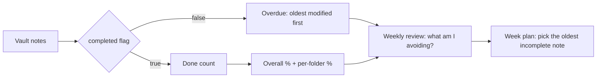

## Why it Matters

What gets measured gets finished. A dashboard over the vault's own `completed` flags is what turns a 24-week plan from intention into evidence, it shows the syllabus's actual shape instead of the version you remember, and it makes the topics you're avoiding visible rather than comfortable.

## Diagram



## Code

```dataviewjs
// Per-phase coverage: same query the tables run, grouped for one glance.
const folders = ["00_Overview","01_Architecture-Foundations","02_Requirements-Quality-Attributes",
 "03_Architecture-Styles","04_Design-Patterns-Building-Blocks","05_DDD-Modeling","06_Data-Architecture",
 "07_Integration-APIs","08_NonFunctional-Ops","09_Governance-Documentation",
 "10_System-Design-Interviews","99_Revision"];
const rows = folders.map(f => {
 const pages = dv.pages(`"Architect/${f}"`).where(p => p.completed !== undefined);
 const done = pages.where(p => p.completed).length;
 return `| ${f} | ${done}/${pages.length} | ${pages.length ? Math.round(done/pages.length*100) : 0}% |`;
});
dv.paragraph("Coverage by phase:\n\n| Phase | Done | % |\n|---|---|---|\n" + rows.join("\n"));
```

## When to use / not

- **Use:** weekly, the `completed` flag is the single input, so a glance tells you what's behind; treat it as the syllabus's heartbeat, not decoration.
- **Use:** before starting a study session: the "Overdue / incomplete" table is the highest-signal view, since it's ordered by oldest modified.
- **Use:** as the honest metric of progress, percentage complete per folder catches a phase you've been avoiding.

**When NOT:** do not game the flag, marking a note `completed: true` without the canonical sections present makes the dashboard lie, and a lying dashboard is worse than an empty one. Do not confuse activity (file.mtime) with progress; a note you keep editing without finishing is a stuck note, not a moving one.

## Trade-offs

| Pros | Cons |
|---|---|
| Shows the syllabus's true shape, not the remembered one | Coverage % can become the goal, recall is the real target |
| Overdue table surfaces avoidance by oldest-modified | `completed` is self-reported; an unearned tick makes it lie |
| Zero-maintenance: derived entirely from frontmatter | Dataview queries break silently if a folder is renamed |

## Vs

| Companion | Use it for |
|---|---|
| [[Roadmap Overview\|Roadmap]] | The plan this dashboard measures progress against |
| [[Study Plan - Architect\|Study Plan]] | Day-level work, the dashboard measures, the plan acts |
| [[../99_Revision/Interview-Bank\|Interview Bank]] | The recall test coverage % cannot measure |

## Pitfalls

- Flag inflation, ticking `completed` without the canonical sections present; the dashboard then reports fiction.
- Mistaking `file.mtime` activity for progress: a note edited weekly without finishing is a stuck note.
- Dashboard-as-procrastination, polishing queries instead of finishing the oldest incomplete note.

## Interview q&a

**Q: How do you measure your own learning progress in a self-directed study program?**
A: With a per-note completion flag that means something structural, a note is complete only when it carries the canonical sections (Why it matters, Diagram, Code, When to use / NOT, Trade-offs, Vs, Pitfalls, Interview Q&A, Related), because that's the shape of a thing I can *explain*, not just read. Then a dashboard aggregates the flag by phase, so I see percentage-done per topic and, more importantly, the overdue list, the topics I'm avoiding are the ones I need next. The dashboard's real value isn't the percentage; it's that it makes avoidance visible.

**Q: Your dashboard says you're 70% through the syllabus. Does that mean you're ready for interviews?**
A: Percentage coverage measures the syllabus, not readiness. Readiness is recall under pressure, which the dashboard can't measure, that's what the [[../99_Revision/Interview-Bank|Interview Bank]] and timed mocks are for. A 70% syllabus with 90% cold-recall on the covered topics beats 100% coverage with shaky recall, so I'd rather have an accurate dashboard showing the gap than a flattering one hiding it.

**Q: Why track completion per folder instead of one overall number?**
A: Because an aggregate hides the shape that matters, one phase at 20% while others are at 90% means a whole topic family is missing, and architecture interviews move across topics within a single question. Per-folder breakdown turns "I'm behind" into "I'm behind on data architecture", which is an actionable statement.

## Related

- [[Roadmap Overview|Roadmap]] · [[Tech Stack|Tech Stack]] · [[Study Plan - Architect|Study Plan]]
- Recall testing: [[../99_Revision/Interview-Bank|Interview Bank]] · [[../99_Revision/Capstone-Checklist|Capstone Checklist]]

# Dashboard

## Overall Progress

```dataviewjs
const pages = dv.pages('"Architect"').where(p => p.completed !== undefined);
const done = pages.where(p => p.completed).length;
dv.paragraph(`**Overall: ${done}/${pages.length} (${pages.length ? Math.round(done/pages.length*100) : 0}%)**`);
```

## By Folder

```dataviewjs
const folders = ["00_Overview","01_Architecture-Foundations","02_Requirements-Quality-Attributes"];
for (const f of folders) {
 const pages = dv.pages(`"${f}"`).where(p => p.completed !== undefined);
 const done = pages.where(p => p.completed).length;
 const pct = pages.length ? Math.round(done/pages.length*100) : 0;
 dv.paragraph(`**${f}**: ${done}/${pages.length} — ${pct}%`);
}
```

## Overdue / Incomplete

```dataview
TABLE file.mtime AS Modified
FROM "Architect"
WHERE completed = false
SORT file.mtime ASC
LIMIT 20
```

## Open Tasks

```dataview
TASK WHERE !completed
SORT file.mtime ASC
LIMIT 30
```