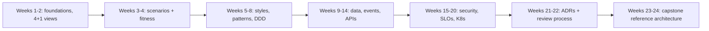

Why it Matters

One-page map of the 24-week architect journey so every week connects to the capstone.

## Diagram



## Code

```text
Weekly loop (the roadmap's operating rhythm):
Mon plan: read this roadmap row + Study Plan week -> name one deliverable
Wed build: lab on the Tech Stack platform (code, diagram, or ADR draft)
Fri write: finish the ADR/C4 artefact; tick the note's completed flag
Sun dashboard: check Dashboard overdue list -> next week's row is the oldest incomplete note
```
```mermaidgraph LR
 PH[Phase: e.g. Weeks 9-10, Data] --> L[Lab on one platform]
 L --> AR[Artefact: schema + ADR + fitness test]
 AR --> CT[completed: true on the notes]
 CT --> NX[Next phase builds on the same codebase]
```
## When to use / not

- **Use:** at the start of each week to pick rows from [[Study Plan - Architect|Study Plan]], the roadmap is the what, the study plan is the when.
- **Use:** when motivation dips, the single-codebase thread (monolith → modular → microservices → event-driven) shows why a phase exists: each one is a fork of the same platform.
- **Use:** when planning a certification or interview timeline, the phase order matches how interview topics actually build on each other.

**When NOT:** do not substitute reading the roadmap for doing the labs in [[Tech Stack|Tech Stack]], architecture is learned by building and writing ADRs, and the roadmap is a schedule, not a skill. Do not treat the week count as a deadline rather than a pace: compress, never skip the ADR, because the written decision record is the actual deliverable of each phase.

## Trade-offs

| Pros | Cons |
|---|---|
| One page connects every week to the capstone | Fixed week numbers create false urgency; real life isn't linear |
| Same platform throughout, skills compound | One platform means breadth gaps; note them in ADRs, not silence |
| Deliverable per phase = portfolio by week 24 | A plan on paper doesn't build the thing; the labs do |

## Vs

| Companion | Use it for |
|---|---|
| [[Study Plan - Architect\|Study Plan]] | Day-level schedule; this is the phase map |
| [[Tech Stack\|Tech Stack]] | What you build with; this is when |
| [[Dashboard\|Dashboard]] | Where you actually are vs this plan |
| [[../99_Revision/Capstone-Checklist\|Capstone Checklist]] | The standard the final artefact must meet |

## Pitfalls

- Tutorial-hopping; anchor everything to the one platform.
- Skipping writing (ADR/C4), that IS the architect skill.

## Interview q&a

**Q: Why plan a 24-week program when you could cram?**
A: Because architecture is a skill of *judgement under trade-off*, and judgement consolidates between sessions, not during them, the spacing is what lets each phase's ADR get reviewed and revisited. Cramming fills short-term recall for the concept questions but doesn't build the design fluency that a senior round actually probes. Six to eight hours a week for 24 weeks is the dose that survives a full-time job.

**Q: What do you do when you fall behind on a study plan?**
A: Compress, never skip the deliverable, the ADR, the C4 diagram, or the fitness test is the artefact that makes the phase real, and skipping it means the next phase has no foundation. Concretely: the dashboard's overdue view names the lagging phase, I cut reading time before I cut building time, and I protect the per-phase artefact above all else. The roadmap is a pace, not a deadline.

**Q: How does your study plan prove you can do the architect job?**
A: Through artefacts, not hours: a reference architecture (C1–C3), an ADR log with supersede chains, fitness-function gates in CI, and a deployed capstone with SLOs. Those are the same artefacts the job produces, which is exactly why a reviewer can evaluate them. A plan that produces no artefacts is a reading list.

**Q: How do you keep a self-directed plan from drifting?**
A: Three mechanisms: a dashboard that makes avoidance visible, a fixed deliverable per phase so "done" is objective, and a weekly review that asks one question, what did I write or build this week? If the answer is nothing, the plan has become consumption, and consumption doesn't transfer to a design whiteboard.

## Related

- [[Study Plan - Architect|Study Plan]], [[Dashboard|Dashboard]], [[../01_Architecture-Foundations/What-is-Architecture|What is Architecture]]

# Roadmap Overview

## Phases

| Weeks | Theme | Key deliverable |
|-------|-------|-----------------|
| 1–2 | Architecture Foundations | 4+1 views of monolith |
| 3–4 | Requirements + Qualities | Scenarios + fitness functions |
| 5–6 | Styles + Patterns | Style decision ADR |
| 7–8 | DDD + C4 | Bounded contexts |
| 9–10 | Data | Postgres/Redis scheme |
| 11–12 | Event-driven | Outbox + saga |
| 13–14 | APIs | Versioned API + gateway |
| 15–16 | Security | Threat model |
| 17–18 | Observability/SRE | SLOs + dashboards |
| 19–20 | Cloud/K8s | EKS deploy |
| 21–22 | Docs/Review | arc42 + 10 ADRs |
| 23–24 | Capstone | Reference architecture |

## When / not

- Use when planning the week, pick rows from [[Study Plan - Architect|Study Plan]].
- NOT a substitute for doing the labs in [[Tech Stack|Tech Stack]].

## Platform Thread

Monolith → modular → microservices → event-driven. Same codebase evolves; every fork gets an ADR.

## Q&A

1. **Why 24 weeks?** Depth without burnout at 6–8h/week.
2. **What if I fall behind?** Dashboard flags overdue; compress, don't skip ADRs.
3. **Cert overlap?** iSAQB early, AWS late, see [[../README|Master MOC]] cert map.
