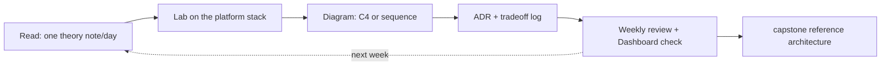

## Why it Matters

Reading notes without a schedule is how a 24-week plan becomes 24 months of tutorial-hopping. This plan pins one theme and one deliverable per week so every lab, ADR and diagram compounds into the capstone, depth comes from the sequence, not from the number of tabs open.

## Diagram



## Code

```java
// Weekly rhythm as code: one theory note, one lab, one ADR — repeatable
record StudyWeek(int week, String theme, Note theory, Lab lab, Adr adr) {
 // Day 1: read theory; Day 2: lab; Day 3: diagram; Day 4: ADR; Day 5: review
 static StudyWeek foundations(int n) {
 return new StudyWeek(n, "Architecture Foundations",
 Note.read("01_Architecture-Foundations/What-is-Architecture.md"),
 Lab.c4Context("monolith"), Adr.draft("principles"));
 }
}
// Fitness check for the plan itself: a week with no ADR is a week not finished.
```

## When to use / not

**Use when:**
- You have 6-8 hours/week and want the sequence to compound toward a capstone.
- You need external structure: one theme, one deliverable, five days each.

**When NOT:**
- Deadline-driven prep (an interview in two weeks), go straight to [[../99_Revision/Interview-Bank|Interview Bank]] and the [[../10_System-Design-Interviews/README|drills]].
- Skimming for breadth without labs, the deliverables (ADR, C4, fitness test) are the actual skill.

## Trade-offs

| Pros | Cons |
|---|---|
| Compounding sequence: each week builds on the last | 24 weeks needs patience; no shortcut to depth |
| Deliverable per week = portfolio evidence | Rigid pace can skip a weak area instead of pausing |
| One stack, one platform, no re-choosing tools | Less breadth across ecosystems than a survey course |

## Vs

| Plan | Best for |
|---|---|
| This 24-week plan | Career pivot to architect with a capstone portfolio |
| [[../99_Revision/Interview-Bank\|Interview Bank]] | Interview in weeks; question-first revision |
| [[../10_System-Design-Interviews/00_Video-Map\|Video map]] + drills | System-design rounds specifically |
| Certification track (iSAQB/AWS) | Credential for enterprise roles |

## Pitfalls

- Reading without doing, an ADR a week is the metric, not pages read.
- Falling behind and compressing the labs instead of the reading.
- Skipping the review day; the Dashboard catches drift early.

## Interview q&a

**Q: How do you study architecture, not just read about it?**
A: One deliverable per week on one codebase: C4 diagram, ArchUnit fitness test, ADR with real options. The artifact is the recall anchor, in an interview you retrieve the thing you built.

**Q: What if you fall behind?**
A: Compress reading, never the lab. A week with no artifact is the week to repeat; the plan's value is in the sequence of deliverables.

## Related

- [[Roadmap Overview|Roadmap]] · [[Dashboard|Dashboard]] · [[Tech Stack|Tech Stack]]
- Weekly outputs: [[../09_Governance-Documentation/01_C4-Modeling|C4 modeling]] · [[../09_Governance-Documentation/02_ADRs|ADRs]] · [[../02_Requirements-Quality-Attributes/Fitness-Functions|Fitness functions]]

# Study Plan - Architect (24 Weeks, 6–8h/week, 5d/week)

> Tick TASK boxes in Obsidian. Each day ~60–90 min.

## Week 1, What is Architecture

- [ ] Day 1: Read [[../01_Architecture-Foundations/What-is-Architecture|What is Architecture]]
- [ ] Day 2: Read [[../01_Architecture-Foundations/Architect-Roles|Architect Roles]]
- [ ] Day 3: C4 context diagram of monolith
- [ ] Day 4: Write 3 architecture principles
- [ ] Day 5: Weekly review + 1 ADR draft

## Week 2, Views + Stakeholders

- [ ] Day 1: Read [[../01_Architecture-Foundations/Views-and-Viewpoints-4-plus-1|Views 4+1]]
- [ ] Day 2: Read [[../01_Architecture-Foundations/Stakeholders-Concerns|Stakeholders]]
- [ ] Day 3: C4 container diagram
- [ ] Day 4: Stakeholder/concern matrix
- [ ] Day 5: Review + flashcards

## Week 3, Requirements

- [ ] Day 1: Read [[../02_Requirements-Quality-Attributes/Functional-vs-Constraints|Functional vs Constraints]]
- [ ] Day 2: Read [[../02_Requirements-Quality-Attributes/ISO-25010-Qualities|ISO 25010]]
- [ ] Day 3: Extract 10 requirements from capstone brief
- [ ] Day 4: Classify functional / quality / constraint
- [ ] Day 5: Review

## Week 4, Scenarios + Fitness

- [ ] Day 1: Read [[../02_Requirements-Quality-Attributes/Quality-Scenarios|Quality Scenarios]]
- [ ] Day 2: Read [[../02_Requirements-Quality-Attributes/Tradeoffs-Tensions|Tradeoffs]]
- [ ] Day 3: Read [[../02_Requirements-Quality-Attributes/Fitness-Functions|Fitness Functions]]
- [ ] Day 4: Write 5 scenarios + 2 ArchUnit fitness tests
- [ ] Day 5: Review + mock Q&A

## Weeks 5–24 (Rolling Template, Duplicate per Week)

- [ ] Day 1: Read theory note
- [ ] Day 2: Lab on platform stack ([[Tech Stack|Tech Stack]])
- [ ] Day 3: Diagram (C4/sequence)
- [ ] Day 4: ADR + tradeoff log
- [ ] Day 5: Review + Dashboard check ([[Dashboard|Dashboard]])

| Week | Theme | Done |
|------|-------|------|
| 5–6 | Styles + Patterns | [ ] |
| 7–8 | DDD + C4 | [ ] |
| 9–10 | Data | [ ] |
| 11–12 | Event-driven | [ ] |
| 13–14 | APIs | [ ] |
| 15–16 | Security | [ ] |
| 17–18 | Observability | [ ] |
| 19–20 | K8s | [ ] |
| 21–22 | ADRs + Review | [ ] |
| 23–24 | Capstone | [ ] |
