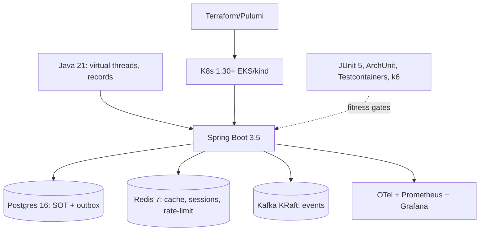

## Why it Matters

Fixed baseline so every phase builds on the same platform instead of re-choosing tools.

## Diagram



## Code

```java
// Why virtual threads: high-throughput I/O (API → DB/Kafka) without reactive rewrite
// Spring Boot 3.5 enables them in one property; fits existing MVC code
// spring.threads.virtual.enabled=true
```
```yaml
## When to use / not

- **Use:** for every lab and note in the vault, one pinned baseline means each phase compounds on the last instead of re-choosing tools.
- **Use:** when a reviewer asks "why this stack?", the table's "Why" column is the answer key, and the rejected options belong in an ADR.
- **Use:** when a version bumps (Java 25, Spring Boot 4), pin it here once, and every note stays consistent.

**When NOT:** do not use it to relitigate tool choice in every phase, the point of a baseline is decision fatigue elimination; if a choice keeps hurting, that's an ADR with evidence, not a recurring debate. Do not run the full stack always-on locally: use Docker Compose profiles per phase so your laptop survives week 11.

## Trade-offs

| Pros | Cons |
|---|---|
| Boring + hireable; matches AWS-SA and iSAQB labs | Kafka/K8s heavy locally → Docker Compose profiles + kind, single-broker Kafka for dev |
| One platform: skills and notes compound across phases | Breadth gap: alternatives only appear as rejected ADR options |
| Every quality attribute demonstrable on one stack | Vendor-aligned choices (EKS/MSK) reduce portability evidence |

## Vs

| Option | Pick when | Trade-off |
|---|---|---|
| Java 21 vs 17 | 21 for greenfield (virtual threads, records) | 17 if the org is pinned or a dependency lags |
| Kafka vs RabbitMQ/SQS | Kafka for replay, event sourcing, stream processing | SQS/RabbitMQ for pure ops simplicity at small scale |
| EKS vs ECS | EKS for the K8s phase and portability | ECS is cheaper and simpler for a capstone demo |
| Postgres vs DynamoDB | Postgres for transactional core + outbox | DynamoDB for serverless scale and per-request cost |

## Pitfalls

- Version drift across notes; pin versions here, update once.
- Running full stack always-on; compose profiles per phase.

## Interview q&a

**Q: Why Java 21 and Spring Boot 3.5 as the baseline for an architecture lab?**
A: Because the interesting architectural decisions are visible in one stack: virtual threads make the "thread-per-request vs reactive" trade-off measurable instead of religious, JPA + module boundaries expose the anemic-domain and coupling traps, and Spring's mature Kafka/Redis/K8s integrations mean the lab exercises real distribution rather than simulating it. It's also the stack that cert labs (AWS-SA, iSAQB) and most enterprise jobs assume, so study time and career time compound.

**Q: Virtual threads or WebFlux for a high-throughput I/O service?**
A: Virtual threads, unless the workload is genuinely streaming/reactive. Virtual threads give thread-per-request simplicity (existing MVC code, normal debugging, no reactive API retraining) with throughput close to reactive for I/O-bound paths, because the JVM, not the application code, manages the scheduling. WebFlux wins when you need backpressure semantics or a streaming protocol; the cost is a programming model that most teams use incorrectly. Measure both, the interesting part of the answer is the measurement, not the choice.

**Q: Why Kafka KRaft instead of ZooKeeper, and what's the honest downside?**
A: KRaft removes ZooKeeper as a separate failure mode and operational component, one fewer system to secure, patch, and reason about during a partition. The honest downsides: earlier KRaft releases had feature gaps (now largely closed), and a single-node dev broker is not a production topology, so the local lab doesn't prove the multi-broker quorum behaviour that actually matters in prod. Note it as a lab limitation rather than pretending the demo proved resilience.

**Q: How do you keep the stack from becoming resume-driven?**
A: Every component has to answer for a quality attribute or it doesn't earn a place, Redis exists because a scenario needs a p99 target, Kafka because a scenario needs replay, K8s because the deploy/failure-mode experiments need it. Rejected options get recorded in an ADR with the reason, which is what makes the stack evidence of judgement rather than a shopping list.

## Related

- [[Roadmap Overview|Roadmap]], [[Dashboard|Dashboard]], [[../02_Requirements-Quality-Attributes/Fitness-Functions|Fitness Functions]]

# Tech Stack

## Stack

| Layer | Choice | Why |
|-------|--------|-----|
| Language | Java 21 (LTS; 25 when GA stable) | Virtual threads, records, pattern matching |
| Framework | Spring Boot 3.5 | Baseline the user knows; modular + native-ready |
| DB | Postgres 16 | Relational core, JSONB, transactional outbox |
| Cache | Redis 7 | Session, rate-limit, read-through cache |
| Messaging | Kafka (KRaft) | Event-driven backbone, replay |
| K8s | Kubernetes 1.30+ (EKS/kind) | Deployment target W19–20 |
| Observability | OTel + Prometheus + Grafana + Loki | SRE phase |
| IaC | Terraform or Pulumi | EKS + MSK provisioning |
| Tests | JUnit 5, ArchUnit, Testcontainers, Gatling | Fitness functions + load |

## When / not

- Use for all labs. NOT for comparing every alternative, record rejected options in ADRs.

# Why Outbox Table in Postgres: Atomic Business Write + Event Publish Intent

# A Relay Publishes to Kafka → Avoids Dual-write Loss
```
## Q&A

1. **Java 25?** Adopt when LTS/CI supports it; code stays 21-compatible.
2. **Spring Boot 3.5 requirements?** Java 17+; virtual threads need 21+.
3. **Local Kafka without ZooKeeper?** Yes, KRaft mode, single node.
