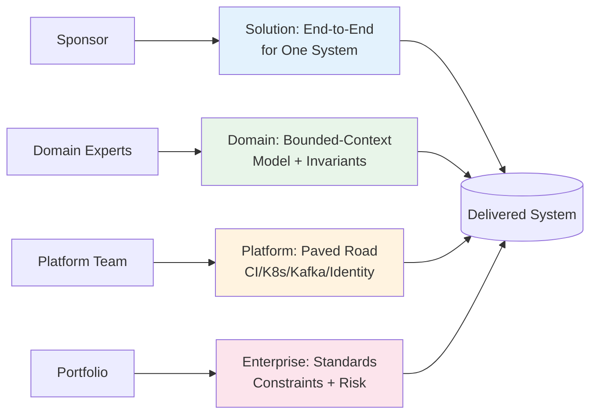

## 🎯 Intent
Distinguish Solution / Domain / Platform / Enterprise Architect so you operate at the right scope, resolve conflicts via RACI, and avoid becoming a PowerPoint architect who never validates decisions in code.

## 💡 Why It Matters
- **Interview signal**: "How do solution, domain, platform, and enterprise architecture differ, and who owns a spanning decision?" — mapping disagreement to role boundary tells you if it's technical debate or authority gap
- **Org scaling**: Roles scale with org size and concurrency, not ambition; a 5-person team wears multiple hats
- **Accountability**: One accountable owner per decision; RACI prevents every decision landing on one person

## 🧩 Diagram: Architect Role Boundaries


## 💻 Code: RACI for Spanning Decision (Java 25)
```java
// Why RACI: Order checkout spans solution (flow), domain (pricing rules),
// platform (Kafka/EKS), enterprise (PCI scope) — one owner per decision

record Decision(String name, String accountable, List<String> consulted, List<String> informed) {}

var pciCheckout = new Decision(
    "PCI-scoped Checkout Flow",
    "Solution Architect",                           // Accountable: end-to-end design
    List.of("Enterprise Arch", "Platform Arch", "Domain Arch"), // Consulted
    List.of("Security", "Finance", "SRE")           // Informed
);

// Solution owns end-to-end fitness for one system
// Domain owns bounded-context model and its invariants
// Platform owns paved road (CI, K8s, Kafka, identity)
// Enterprise owns portfolio constraints, standards, risk
```

## ✅ When to Use / ❌ When NOT to Use
| Scenario | Use? | Reason |
|---|---|---|
| Program kickoff, cross-team design | ✅ | Before someone "just starts building" |
| Hiring or slotting yourself | ✅ | Match scope (one system, one domain, platform, portfolio) to actual need, not title |
| Conflict resolution | ✅ | Map disagreement to role boundary: technical debate vs authority gap |
| Instantiating all four on 5-person team | ❌ | One person wears several hats; overhead kills throughput |
| Using model to avoid coding | ❌ | Architect who never validates in code drifts into PowerPoint architecture |

## ⚖️ Trade-offs
| Role | Owns | Doesn't Own | Scaling Trigger |
|---|---|---|---|
| **Solution** | End-to-end for one system | Org-wide standards | Multiple concurrent systems |
| **Domain** | Bounded-context model + invariants | Deployment platform | Multiple domains needing independent evolution |
| **Platform** | Paved road (CI, K8s, Kafka, identity) | Business rules | Team spending >20% on infra toil |
| **Enterprise** | Portfolio constraints, standards, risk | Sprint-level design | Regulatory/compliance complexity |

## 🆚 Vs. Alternatives
| Role | Owns | Doesn't Own | Decision Rule |
|---|---|---|---|
| **Solution** | End-to-end fitness for one system | Org-wide standards | One system, one accountable |
| **Domain** | Bounded-context model | Deployment platform | Domain needs independent deploy/evolve |
| **Platform** | Paved road (CI/K8s/Kafka/identity) | Business rules | Infra toil >20% team capacity |
| **Enterprise** | Portfolio constraints, standards | Sprint-level design | Regulatory/compliance scope |

## ⚠️ Pitfalls
1. **Becoming a PowerPoint architect** — keep one concrete artifact per phase: spike, ArchUnit test, load-test run, code review
2. **Owning implementation details instead of constraints** — architect prescribes boundaries, team owns implementation
3. **Title inflation** — roles scale with org concurrency, not headcount ambition
4. **Silos if roles don't code-review** — architect must hold their own designs to same fitness gates as product teams

## 🎤 Interview Q&A (Senior Depth)

**Q1: "How do solution, domain, platform, and enterprise architecture differ, and who owns a decision that spans all four?"**
> **Answer**: Solution: end-to-end fitness for one system. Domain: bounded-context model + invariants. Platform: paved road (CI, K8s, Kafka, identity). Enterprise: portfolio constraints, standards, risk. For PCI checkout: Enterprise sets constraint (PCI scope), Solution owns design, Platform owns infra contract, Domain owns pricing rules. RACI: one Accountable, others Consulted/Informed. **Rejected**: "Enterprise decides everything" — that's governance, not architecture.

**Q2: "Do architects need to code, and how much?"**
> **Answer**: Enough to stay honest: spikes, ADR prototypes, fitness-function tests, code review. The test isn't velocity but whether their decisions survive contact with the codebase. An architect who hasn't felt the friction they created will keep prescribing it. **Metric**: At least one spike/ADR prototype per phase.

**Q3: "I'm a backend dev moving into architecture — which role do I target first?"**
> **Answer**: Solution or Domain — closest to the code and concerns you already own. From there the capstone is proof: C4 diagrams, an ADR log, and a fitness-function gate, one per role level you claim. **Rejected**: "Enterprise first" — too far from code; you can't govern what you haven't built.

**Q4: "How do you avoid becoming an ivory-tower architect?"**
> **Answer**: Keep one concrete artifact per phase: a spike, an ArchUnit test, a load-test run. Hold your own designs to the same fitness gates as product teams. If a principle can't pass its own test, it isn't one. **Rejected**: "Review PRs" — reviewing ≠ validating your own architectural decisions.

**Q5: "When does a team need a dedicated Platform Architect?"**
> **Answer**: When team spends >20% capacity on infra toil (CI, K8s, Kafka ops) instead of business logic. Before that, platform is a hat the Solution/Domain architect wears. **Rejected**: "When we have microservices" — services don't mandate platform role; toil does.

## 🔗 Related
- [[What-is-Architecture|What is Architecture]] • [[Stakeholders-Concerns|Stakeholders]] • [[../05_DDD-Modeling/01_Strategic-DDD|Strategic DDD]]