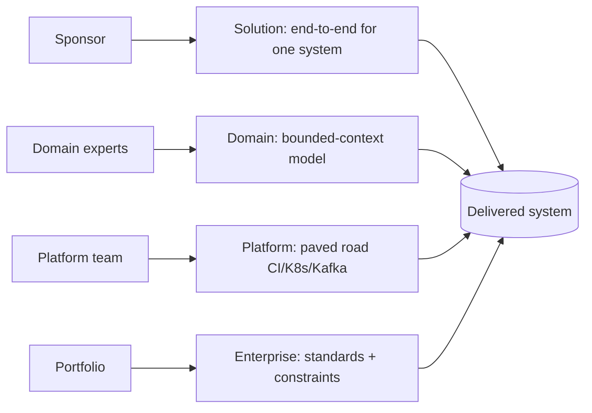

## Why it Matters

Distinguish solution / domain / enterprise / platform architect so you operate at the right scope.

## Diagram



## Code

```text
Why RACI: Order checkout spans solution (flow), domain (pricing rules),
platform (Kafka/EKS), enterprise (PCI scope) — one owner per decision
```

## When to use / not

- **Use:** at program kickoff and on any cross-team design, before someone "just starts building" and again whenever a new party needs to know who owns what.
- **Use:** when hiring or slotting yourself, matching scope (one system, one domain, the platform, or the portfolio) to the actual need, not the title.
- **Use:** in conflict resolution, mapping a disagreement to a role boundary tells you whether it's a technical debate or an authority gap.

**When NOT:** do not instantiate all four roles on a five-person team, one person wears several hats and the overhead kills throughput; roles scale with org size and concurrency, not ambition. Do not use the model to avoid coding; an architect who never validates decisions in real code drifts into PowerPoint architecture.

## Trade-offs

- Pros: clear escalation; avoids every decision landing on one person.
- Cons: title inflation; silos if roles don't code-review.

## Vs

| Role | Owns | Doesn't own |
|------|------|-------------|
| Solution | End-to-end for one system | Org-wide standards |
| Domain | Bounded context model | Deployment platform |
| Platform | Paved road (CI/K8s/Kafka) | Business rules |
| Enterprise | Portfolio constraints | Sprint-level design |

## Pitfalls

- Becoming a PowerPoint architect; keep a spike per phase.
- Owning implementation details instead of constraints.

## Interview q&a

**Q: How do solution, domain, platform, and enterprise architecture differ, and who owns a decision that spans all four?**
A: Solution owns end-to-end fitness for one system; domain owns the bounded-context model and its invariants; platform owns the paved road (CI, K8s, Kafka, identity); enterprise owns portfolio constraints, standards, and risk. For a spanning decision, say, a PCI-scoped checkout flow, the enterprise architect sets the constraint (PCI scope), solution owns the design, platform owns the infrastructure contract, and domain owns the pricing rules. RACI it: one accountable owner, the rest consulted or informed.

**Q: Do architects need to code, and how much?**
A: Enough to stay honest, spikes, ADR prototypes, fitness-function tests, and code review. The test isn't velocity but whether their decisions survive contact with the codebase. An architect who hasn't felt the friction they created will keep prescribing it.

**Q: I'm a backend dev moving into architecture, which role do I target first?**
A: Solution or domain, closest to the code and concerns you already own. From there the capstone is proof: C4 diagrams, an ADR log, and a fitness-function gate, one per role level you claim.

**Q: How do you avoid becoming an ivory-tower architect?**
A: Keep one concrete artifact per phase, a spike, an ArchUnit test, a load-test run, and hold your own designs to the same fitness gates as the product teams. If a principle can't pass its own test, it isn't one.

## Related

- [[What-is-Architecture|What is Architecture]], [[Stakeholders-Concerns|Stakeholders]]

# Architect Roles

## When / not

- Use when scoping ownership (who decides what) on a program.
- NOT as a hierarchy excuse, small teams wear multiple hats.

## Q&A

1. **Backend dev → which first?** Solution/domain, closest to code you know.
2. **Do architects code?** Enough to validate: spikes, ADRs, fitness tests, reviews.
3. **How to show it?** Capstone with C4 + ADRs signed per role.
