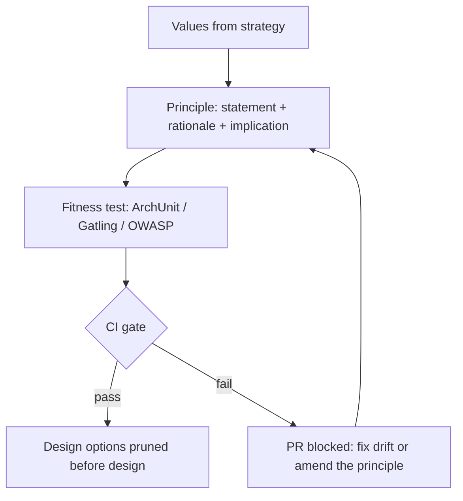

## Why it Matters

Turn values into testable guardrails (e.g. "API-first, modular monolith first") that prune options before design.

## Diagram



## Code

```text
Why principle format: "Modular monolith first — Rationale: deploy simplicity;
Implication: ArchUnit boundaries; Test: mvn test passes boundary rules"
```

## When to use / not

- **Use:** whenever the team keeps relitigating the same choices, modularity level, tech selection, API style, and onboarding needs to be faster than "ask the loudest senior".
- **Use:** as the input to fitness functions: a principle only becomes governance when a CI gate can fail on its violation.
- **Use:** before writing any ADR, principles are the axioms; the ADR is the derived decision.

**When NOT:** do not ship a principle that has no rationale, implication, and test, an untestable "be scalable" is a slogan, and slogans get ignored within a quarter. Do not exceed ~8 principles; beyond that, nobody can recall them under deadline pressure, so they stop mattering at all.

## Trade-offs

- Pros: faster decisions; consistent tradeoffs.
- Cons: rigid if never revisited; ignored if too many (>8).

## Vs

| Principle | Counters | Decide by |
|-----------|----------|-----------|
| Modularity first | Microservices-by-default | Deploy/ops cost |
| API-first | UI-driven schema | Consumer count |
| Boring tech | Resume-driven | Team skill + SLO risk |

## Pitfalls

- Untestable ("be scalable"), rewrite as scenario.
- Principles nobody can veto with.

## Interview q&a

**Q: How do you turn "we should be scalable" into a real architecture principle?**
A: Rewrite it as a decision-shaped statement with three attachments, rationale, implication, and test. "Scale horizontally behind the gateway" → rationale: the top SLO risk is a stateful single point of failure; implication: no session affinity, state externalised to Redis; test: a k6 ramp asserting p99 holds at 3× current peak and an ArchUnit rule banning stateful singletons in the web layer. What can't be tested becomes a wish, not a principle.

**Q: A team wants to bypass a principle they say is slowing them down. What do you do?**
A: Take it as data, not insubordination: ask which of the three parts is wrong, rationale, implication, or test. If the constraint is genuinely wrong now, amend the principle in an ADR and update the fitness function, because a principle nobody can be blocked by is dead weight. If it's right but costly, the answer is usually automation: remove the friction, not the guardrail.

**Q: Where should principles live so they actually get followed?**
A: Three places, in order of effectiveness: the repo (`ARCHITECTURE.md` or a `docs/principles` directory) beside the code, the CI gate that enforces the testable subset, and the ADR template's "principles applied" field that forces every decision to cite one. A wiki page is where principles go to be ignored.

**Q: How does this map to TOGAF?**
A: TOGAF's Principles catalogue in the Preliminary Phase / ADM has the same shape, statement, rationale, implications, the difference is that TOGAF leaves enforcement as a governance-board activity. Adding an automated fitness gate is what makes the same content stick in a delivery org.

## Related

- [[What-is-Architecture|What is Architecture]], [[../02_Requirements-Quality-Attributes/Fitness-Functions|Fitness Functions]]

# Architecture Principles

## When / not

- Use to settle repeated debates and onboard quickly.
- NOT slogans, every principle needs rationale + implication + test.

## Q&A

1. **How many?** 5–8, each with a fitness check.
2. **Where live?** Vault + repo (ARCHITECTURE.md) + ADR template reference.
3. **TOGAF link?** Principles catalog in Preliminary/ADM, same shape.
