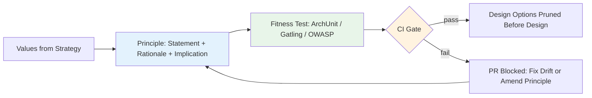

## 🎯 Intent
Turn values into testable guardrails — "API-first, modular monolith first" — that prune options before design. A principle only becomes governance when a CI gate can fail on its violation.

## 💡 Why It Matters
- **Interview signal**: "How do you turn 'we should be scalable' into a real architecture principle?" — untestable slogans get ignored; testable principles block PRs
- **Decision velocity**: When team relitigates same choices (modularity, tech selection, API style), principles are the axioms; ADRs are the derived decisions
- **Onboarding**: New engineer learns constraints from principles + fitness functions, not "ask the loudest senior"

## Problems
### System Design Problem: Architecture Principles

**Requirements:**
- Functional: Core capabilities for architecture principles
- Non-functional (SLOs): Latency < 100ms p99, Availability 99.9%, Horizontal scalability

**Constraints:**
- Scale: Handle 10x growth without redesign
- Consistency: Appropriate model for domain (strong/eventual)
- Latency budget: p99 < 100ms for read paths

**API / Interfaces:**
- Primary: REST/gRPC endpoints for core operations
- Internal: Service-to-service contracts
- Events: Domain events for async integration

## 🧩 Diagram: Principle → Fitness Function Pipeline


## 💻 Code: Testable Principle Format (Java 25 + ArchUnit)
```java
// Why principle format: "Modular monolith first — Rationale: deploy simplicity;
// Implication: ArchUnit boundaries; Test: mvn test passes boundary rules"

@ArchTest
static final ArchRule modularMonolithFirst = layeredArchitecture()
    .layer("Domain").definedBy("com.shop..domain..")
    .layer("Application").definedBy("com.shop..application..")
    .layer("Infrastructure").definedBy("com.shop..infrastructure..")
    .whereLayer("Domain").mayNotBeAccessedByAnyLayer()
    .whereLayer("Application").mayOnlyBeAccessedByLayers("Infrastructure");

// Principle: "Scale horizontally behind gateway"
// Rationale: top SLO risk = stateful single point of failure
// Implication: no session affinity, state externalised to Redis
// Test: k6 ramp asserting p99 holds at 3× peak + ArchUnit banning stateful singletons in web layer

@ArchTest
static final ArchRule noStatefulSingletonsInWeb = noClasses()
    .that().resideInAPackage("..web..")
    .should().beAnnotatedWith("jakarta.ejb.Stateful"); // or custom @Stateful
```

## ✅ When to Use / ❌ When NOT to Use
| Scenario | Use? | Reason |
|

## Trade-offs
| Dimension | This Approach | Alternative | Trade-off Rationale | Decision Rule |
|-----------|---------------|-------------|---------------------|---------------|
| Complexity | [TBD] | [TBD] | [TBD] | [TBD] |
| Operational Burden | [TBD] | [TBD] | [TBD] | [TBD] |
| Latency | [TBD] | [TBD] | [TBD] | [TBD] |
| Consistency | [TBD] | [TBD] | [TBD] | [TBD] |
| Cost at Scale | [TBD] | [TBD] | [TBD] | [TBD] |

## Flashcards (Spaced Repetition)

#flashcard
**Q:** What is the core concept of Architecture Principles? :: **A:** [Key algorithm/architecture pattern] #flashcard

#flashcard
**Q:** When do you apply Architecture Principles? :: **A:** [Trigger scenarios and context] #flashcard

#flashcard
**Q:** What is the primary trade-off in Architecture Principles? :: **A:** [Main tension: e.g., consistency vs latency] #flashcard

#flashcard
**Q:** What breaks first at scale in Architecture Principles? :: **A:** [Primary bottleneck: e.g., coordination, hot keys, replication lag] #flashcard

#flashcard
**Q:** How do you handle failures in Architecture Principles? :: **A:** [Retry, circuit breaker, fallback, graceful degradation] #flashcard

#flashcard
**Q:** What are the key metrics to monitor for Architecture Principles? :: **A:** [RED: rate, errors, duration; USE: utilization, saturation, errors] #flashcard

#flashcard
**Q:** How does Architecture Principles scale to 10x? :: **A:** [Sharding, read replicas, async processing, caching layers] #flashcard

#flashcard
**Q:** What is the consistency model for Architecture Principles? :: **A:** [Strong/eventual/causal - justify with use case] #flashcard

#flashcard
**Q:** How do you test Architecture Principles? :: **A:** [Contract tests, chaos engineering, load tests, fault injection] #flashcard

#flashcard
**Q:** What is the operational cost of Architecture Principles? :: **A:** [Team expertise, tooling, on-call burden, migration risk] #flashcard

#flashcard
**Q:** When would you NOT use Architecture Principles? :: **A:** [Managed service covers need, simple CRUD, team lacks maturity] #flashcard

#flashcard
**Q:** What is the key design decision in Architecture Principles? :: **A:** [The irreversible choice that defines the architecture] #flashcard

#flashcard
**Q:** How do you migrate to Architecture Principles? :: **A:** [Strangler fig, dual-write, canary, feature flags] #flashcard

#flashcard
**Q:** What security considerations for Architecture Principles? :: **A:** [AuthZ, encryption, audit, secrets management] #flashcard

#flashcard
**Q:** How do you debug Architecture Principles in production? :: **A:** [Structured logging, correlation IDs, distributed tracing, SLO alerts] #flashcard


## Practice Tasks (Tasks Plugin)
- [ ] Explain the architecture from memory 📅 {{date:YYYY-MM-DD, +1}}
- [ ] Draw the system diagram without looking 📅 {{date:YYYY-MM-DD, +3}}
- [ ] Answer all Interview Q&A aloud 📅 {{date:YYYY-MM-DD, +7}}
- [ ] Review flashcards (Spaced Repetition) 📅 {{date:YYYY-MM-DD, +1}}

```tasks
not done
path includes Architect/01_Architecture-Foundations
sort by due
limit 10
```

---|---|---|
| Team keeps relitigating same choices | ✅ | Principles = axioms; ADRs = derived decisions |
| Input to fitness functions (CI gates) | ✅ | Principle only becomes governance when testable |
| Before writing any ADR | ✅ | Principles are the axioms |
| Shipping untestable slogan ("be scalable") | ❌ | Slogans get ignored within a quarter |
| Exceeding ~8 principles | ❌ | Beyond 8, nobody recalls under deadline pressure |


## 🆚 Vs. Alternatives
| Principle | Counters | Decide By |
|---|---|---|
| **Modularity first** | Microservices-by-default | Deploy/ops cost |
| **API-first** | UI-driven schema | Consumer count |
| **Boring tech** | Resume-driven | Team skill + SLO risk |
| **Observability by default** | Logs-as-afterthought | MTTR target |

## ⚠️ Pitfalls
1. **Untestable ("be scalable")** — rewrite as scenario with fitness function
2. **Principles nobody can veto with** — if a principle can't block a PR, it's dead weight
3. **Never revisiting** — amend in ADR when constraint is genuinely wrong; update fitness function
4. **Living only in wiki** — principles belong in repo (`ARCHITECTURE.md`), CI gate, ADR template


## Pitfalls
1. Equating architecture with microservices/K8s — service count ≠ architecture
2. Diagrams without decisions (no ADR = no traceability)
3. 60-page doc nobody reads — risk-driven beats completeness-driven
4. Slack decisions becoming load-bearing without record
5. Underestimating operational complexity (backups, monitoring, upgrades)
6. Ignoring failure modes (network partitions, disk failures, clock drift)
7. Not planning for 10x scale from day one

## 🎤 Interview Q&A (Senior Depth)

**Q1: "How do you turn 'we should be scalable' into a real architecture principle?"**
> **Answer**: Rewrite as decision-shaped statement with three attachments: rationale, implication, test. "Scale horizontally behind the gateway" → rationale: top SLO risk is stateful single point of failure; implication: no session affinity, state externalised to Redis; test: k6 ramp asserting p99 holds at 3× current peak + ArchUnit rule banning stateful singletons in web layer. What can't be tested becomes a wish, not a principle. **Rejected**: "Add more servers" — that's capacity planning, not architecture.

**Q2: "A team wants to bypass a principle they say is slowing them down. What do you do?"**
> **Answer**: Take it as data, not insubordination: ask which of the three parts is wrong — rationale, implication, or test. If constraint is genuinely wrong now, amend principle in ADR and update fitness function (a principle nobody can be blocked by is dead weight). If it's right but costly, answer is usually automation: remove the friction, not the guardrail. **Rejected**: "Grant exception" — exceptions without ADR rot the principle.

**Q3: "Where should principles live so they actually get followed?"**
> **Answer**: Three places, in order of effectiveness: 1) Repo (`ARCHITECTURE.md` or `docs/principles`) beside the code, 2) CI gate enforcing testable subset, 3) ADR template's "principles applied" field forcing every decision to cite one. A wiki page is where principles go to be ignored. **Metric**: PR blocked by principle test = principle working.

**Q4: "How does this map to TOGAF?"**
> **Answer**: TOGAF's Principles catalogue in Preliminary Phase / ADM has same shape: statement, rationale, implications. Difference: TOGAF leaves enforcement as governance-board activity. Adding automated fitness gate makes the same content stick in a delivery org. **Rejected**: "TOGAF is too heavy" — the shape is right; automation is the delivery adaptation.

**Q5: "How many principles, and how do you pick them?"**
> **Answer**: 5–8 max. Each must have: statement, rationale, implication, test. Pick by: recurring decision pain (modularity, API style, tech selection), top SLO risks, onboarding friction. **Rejected**: "More principles = better governance" — >8 = nobody remembers = ignored.

## 🔗 Related
- [[What-is-Architecture|What is Architecture]] • [[../02_Requirements-Quality-Attributes/Fitness-Functions|Fitness Functions]] • [[../09_Governance-Documentation/02_ADRs|ADRs]]