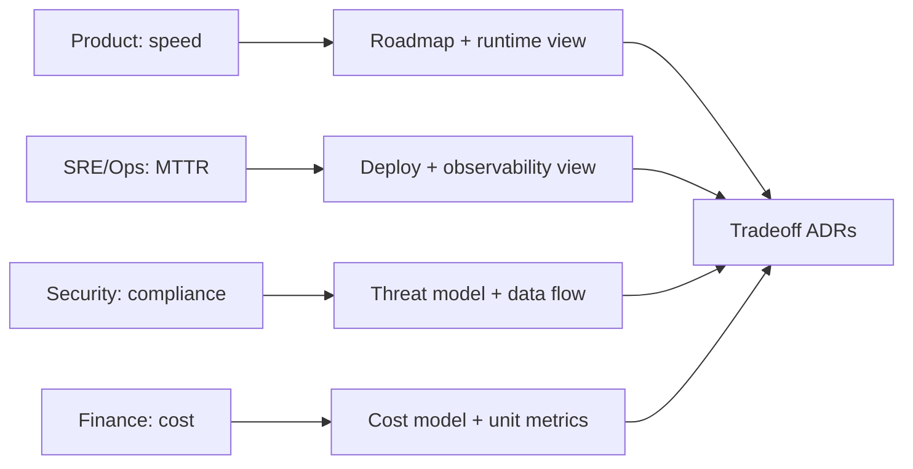

## Why it Matters

Map who cares about what so views and priorities target real concerns, not generic diagrams.

## Diagram



## Code

```text
Why matrix: Product cares time-to-market, SRE cares MTTR, Security cares PCI,
Finance cares cost — same system, conflicting pulls → drives tradeoff ADRs
```

## When to use / not

- **Use:** at the start of every phase, design review, and ADR, before you can pick a view or a tactic, you need to know whose concern you're serving.
- **Use:** when a review keeps circling, it usually means an unnamed stakeholder (finance, compliance, support) is objecting through proxies.
- **Use:** when building the traceability chain that auditors and senior interviewers ask for: stakeholder → concern → quality attribute → scenario → fitness function.

**When NOT:** do not chase completeness, a 40-row matrix no one reads is analysis paralysis; start with five stakeholders and grow it only when someone proves they were missing. Do not treat it as a one-time artifact: scope, compliance regime, and org structure shift, and a stale map silently misdirects the whole design.

## Trade-offs

- Pros: right view per audience; fewer re-reviews.
- Cons: analysis paralysis if you chase every stakeholder.

## Vs

| Stakeholder | Top concern | View that satisfies |
|-------------|-------------|---------------------|
| Product | Features/speed | Roadmap + runtime view |
| SRE/Ops | Availability/MTTR | Deployment + observability |
| Security | Confidentiality/compliance | Threat model + data flow |

## Pitfalls

- Only technical stakeholders; missing business/compliance.
- One diagram for everyone.

## Interview q&a

**Q: Who are the stakeholders for an e-commerce checkout redesign, and what does each one actually care about?**
A: Product, conversion and time-to-market, so latency and release cadence; SRE, availability and MTTR, so failure modes, rollbacks, and observability; Security/Compliance, PCI scope and data minimisation; Finance, unit cost per order and peak capacity; Customer support, failure visibility, because a silent payment failure becomes a ticket. The architect's job is to design for the conflict between these, not to satisfy each in isolation.

**Q: Two stakeholders have directly opposed concerns, say, Security wants strong auth everywhere and Product wants a one-tap guest checkout. How do you resolve it?**
A: Resolve by constraint, not by volume: security sets the boundary (guest checkout never touches PCI scope, tokenise the card, keep the merchant token out of our DB), product optimises inside it (one tap with a tokenised wallet, no account). If no such boundary exists, escalate to the stakeholder who owns the commercial risk, record the trade-off in an ADR, and make the sacrificed concern explicit rather than quietly dropping it.

**Q: Name the stakeholders teams most often forget.**
A: Support, finance, and auditors, plus whoever gets paged at 03:00. They're invisible at design time and expensive at incident time. My test: "who pays, who gets paged, who gets sued", that trio surfaces the missing row.

**Q: How do you record stakeholders without it becoming bureaucratic?**
A: One living table: stakeholder → top concern → quality attribute → scenario link → view that satisfies them. It's the index for the rest of the architecture documentation; if a row can't reach a scenario, either the concern is stale or the design hasn't addressed it.

## Related

- [[Views-and-Viewpoints-4-plus-1|Views 4+1]], [[../02_Requirements-Quality-Attributes/Quality-Scenarios|Quality Scenarios]]

# Stakeholders and Concerns

## When / not

- Use at phase start and before any review.
- NOT a one-time list, revisit when scope or compliance shifts.

## Q&A

1. **Minimum viable list?** User, dev, ops, security, sponsor, plus regulator if PII/payment.
2. **Hidden stakeholders?** Support, finance (cost), auditors, ask "who pays / who gets paged."
3. **How to record?** Table: stakeholder → concern → quality → scenario link.
