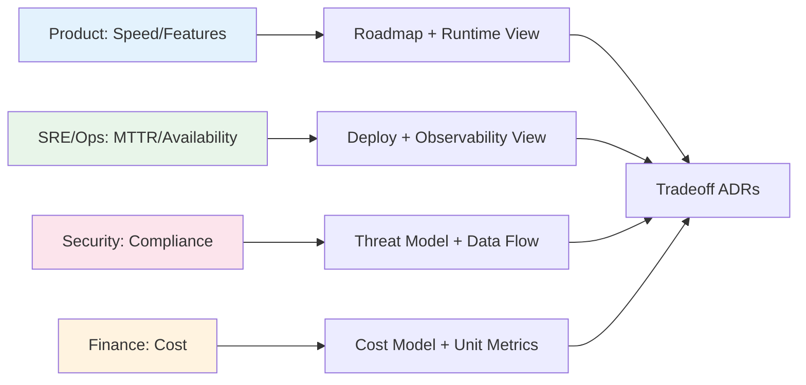

## 🎯 Intent
Map who cares about what so views, priorities, and trade-off ADRs target real concerns, not generic diagrams. The stakeholder → concern → quality → scenario chain is the traceability backbone for audits and interviews.

## 💡 Why It Matters
- **Interview signal**: "Who are the stakeholders for X and what does each care about?" — missing business/compliance stakeholders is a senior red flag
- **Review efficiency**: When a review circles, an unnamed stakeholder (finance, compliance, support) is usually objecting through proxies
- **Traceability chain**: Stakeholder → concern → quality attribute → scenario → fitness function → ADR = auditable architecture

## Problems
### System Design Problem: Stakeholders and Concerns

**Requirements:**
- Functional: Core capabilities for stakeholders and concerns
- Non-functional (SLOs): Latency < 100ms p99, Availability 99.9%, Horizontal scalability

**Constraints:**
- Scale: Handle 10x growth without redesign
- Consistency: Appropriate model for domain (strong/eventual)
- Latency budget: p99 < 100ms for read paths

**API / Interfaces:**
- Primary: REST/gRPC endpoints for core operations
- Internal: Service-to-service contracts
- Events: Domain events for async integration

## 🧩 Diagram: Stakeholder → View Mapping


## 💻 Code: Stakeholder Concern Matrix (Java 25)
```java
record Stakeholder(String name, String topConcern, String qualityAttribute, String view, String scenarioLink) {}

var matrix = List.of(
    new Stakeholder("Product", "Conversion + Time-to-market", "Latency", "Runtime + Roadmap", "checkout-p99"),
    new Stakeholder("SRE/Ops", "Availability + MTTR", "Availability", "Deployment + Observability", "failover-rto"),
    new Stakeholder("Security", "PCI Scope + Data Minimisation", "Security", "Threat Model + Data Flow", "pci-scope"),
    new Stakeholder("Finance", "Unit Cost per Order", "Cost Efficiency", "Cost Model + Unit Metrics", "cost-per-txn"),
    new Stakeholder("Support", "Failure Visibility", "Operability", "Observability + Runbooks", "alert-coverage")
);

// Architect's job: design for the conflict between these, not satisfy each in isolation
```

## ✅ When to Use / ❌ When NOT to Use
| Scenario | Use? | Reason |
|

## Trade-offs
| Dimension | This Approach | Alternative | Trade-off Rationale | Decision Rule |
|-----------|---------------|-------------|---------------------|---------------|
| Complexity | [TBD] | [TBD] | [TBD] | [TBD] |
| Operational Burden | [TBD] | [TBD] | [TBD] | [TBD] |
| Latency | [TBD] | [TBD] | [TBD] | [TBD] |
| Consistency | [TBD] | [TBD] | [TBD] | [TBD] |
| Cost at Scale | [TBD] | [TBD] | [TBD] | [TBD] |

## Flashcards (Spaced Repetition)

#flashcard
**Q:** What is the core concept of Stakeholders and Concerns? :: **A:** [Key algorithm/architecture pattern] #flashcard

#flashcard
**Q:** When do you apply Stakeholders and Concerns? :: **A:** [Trigger scenarios and context] #flashcard

#flashcard
**Q:** What is the primary trade-off in Stakeholders and Concerns? :: **A:** [Main tension: e.g., consistency vs latency] #flashcard

#flashcard
**Q:** What breaks first at scale in Stakeholders and Concerns? :: **A:** [Primary bottleneck: e.g., coordination, hot keys, replication lag] #flashcard

#flashcard
**Q:** How do you handle failures in Stakeholders and Concerns? :: **A:** [Retry, circuit breaker, fallback, graceful degradation] #flashcard

#flashcard
**Q:** What are the key metrics to monitor for Stakeholders and Concerns? :: **A:** [RED: rate, errors, duration; USE: utilization, saturation, errors] #flashcard

#flashcard
**Q:** How does Stakeholders and Concerns scale to 10x? :: **A:** [Sharding, read replicas, async processing, caching layers] #flashcard

#flashcard
**Q:** What is the consistency model for Stakeholders and Concerns? :: **A:** [Strong/eventual/causal - justify with use case] #flashcard

#flashcard
**Q:** How do you test Stakeholders and Concerns? :: **A:** [Contract tests, chaos engineering, load tests, fault injection] #flashcard

#flashcard
**Q:** What is the operational cost of Stakeholders and Concerns? :: **A:** [Team expertise, tooling, on-call burden, migration risk] #flashcard

#flashcard
**Q:** When would you NOT use Stakeholders and Concerns? :: **A:** [Managed service covers need, simple CRUD, team lacks maturity] #flashcard

#flashcard
**Q:** What is the key design decision in Stakeholders and Concerns? :: **A:** [The irreversible choice that defines the architecture] #flashcard

#flashcard
**Q:** How do you migrate to Stakeholders and Concerns? :: **A:** [Strangler fig, dual-write, canary, feature flags] #flashcard

#flashcard
**Q:** What security considerations for Stakeholders and Concerns? :: **A:** [AuthZ, encryption, audit, secrets management] #flashcard

#flashcard
**Q:** How do you debug Stakeholders and Concerns in production? :: **A:** [Structured logging, correlation IDs, distributed tracing, SLO alerts] #flashcard


## Practice Tasks (Tasks Plugin)
- [ ] Explain the architecture from memory 📅 {{date:YYYY-MM-DD, +1}}
- [ ] Draw the system diagram without looking 📅 {{date:YYYY-MM-DD, +3}}
- [ ] Answer all Interview Q&A aloud 📅 {{date:YYYY-MM-DD, +7}}
- [ ] Review flashcards (Spaced Repetition) 📅 {{date:YYYY-MM-DD, +1}}

```tasks
not done
path includes Architect/01_Architecture-Foundations
sort by due
limit 10
```

---|---|---|
| Start of every phase, design review, ADR | ✅ | Before picking view/tactic, know whose concern you serve |
| Review keeps circling | ✅ | Unnamed stakeholder usually objecting via proxies |
| Building traceability chain for auditors/interviews | ✅ | Stakeholder → concern → quality → scenario → fitness function |
| Chasing completeness (40-row matrix) | ❌ | Analysis paralysis; start with 5, grow when someone proves missing |
| Treating as one-time artifact | ❌ | Scope, compliance, org shift — stale map misdirects design |


## 🆚 Vs. Alternatives
| Stakeholder | Top Concern | View That Satisfies | Decision Rule |
|---|---|---|---|
| **Product** | Features/speed | Roadmap + Runtime | Time-to-market drives latency budget |
| **SRE/Ops** | Availability/MTTR | Deployment + Observability | Failover RTO/RPO drives infra |
| **Security** | Confidentiality/compliance | Threat Model + Data Flow | PCI scope boundary non-negotiable |
| **Finance** | Unit cost | Cost Model + Unit Metrics | Cost-per-txn caps architecture choices |

## ⚠️ Pitfalls
1. **Only technical stakeholders** — missing business/compliance; "who pays, who gets paged, who gets sued" surfaces missing rows
2. **One diagram for everyone** — different concerns need different lenses (C4 Context for Product, Sequence for SRE, Threat Model for Security)
3. **Matrix as ceremony** — if a row can't reach a scenario, either concern is stale or design hasn't addressed it
4. **Not revisiting** — org structure, compliance regime, scope shift; stale map silently misdirects design


## Pitfalls
1. Underestimating operational complexity (backups, monitoring, upgrades)
2. Ignoring failure modes (network partitions, disk failures, clock drift)
3. Not planning for 10x scale from day one
4. Skipping monitoring/alerting in MVP
5. Premature optimization before measuring
6. Dual-write without transactional outbox
7. Assuming global order in partitioned systems

## 🎤 Interview Q&A (Senior Depth)

**Q1: "Who are the stakeholders for an e-commerce checkout redesign, and what does each actually care about?"**
> **Answer**: Product: conversion + time-to-market → latency + release cadence. SRE: availability + MTTR → failure modes, rollbacks, observability. Security/Compliance: PCI scope + data minimisation. Finance: unit cost per order + peak capacity. Support: failure visibility (silent payment failure = ticket). **Architect's job**: design for the *conflict* between these, not satisfy each in isolation. **Rejected**: "Satisfy all" — impossible; trade-offs must be explicit in ADRs.

**Q2: "Two stakeholders have opposed concerns: Security wants strong auth everywhere, Product wants one-tap guest checkout. How do you resolve?"**
> **Answer**: Resolve by constraint, not volume. Security sets boundary: guest checkout never touches PCI scope, tokenise card, keep merchant token out of our DB. Product optimises inside: one-tap with tokenised wallet, no account. If no boundary exists, escalate to stakeholder owning commercial risk, record trade-off in ADR, make sacrificed concern explicit. **Rejected**: "Compromise in the middle" — security boundaries are binary.

**Q3: "Name the stakeholders teams most often forget."**
> **Answer**: Support, Finance, Auditors, plus whoever gets paged at 03:00. They're invisible at design time, expensive at incident time. Test: "Who pays, who gets paged, who gets sued" surfaces missing rows. **Rejected**: "Just the dev team" — devs build, others live with consequences.

**Q4: "How do you resolve conflicting stakeholder priorities in an ADR?"**
> **Answer**: Map to quality attributes (latency vs security vs cost). The ADR states: "We choose X over Y because quality Z is the top risk per stakeholder S." The sacrificed concern is explicitly recorded, not quietly dropped. **Metric**: ADR has RACI — one Accountable, others Consulted/Informed.

**Q5: "How do you record stakeholders without it becoming bureaucratic?"**
> **Answer**: One living table: Stakeholder → Top Concern → Quality Attribute → Scenario Link → View That Satisfies. It's the index for architecture docs; if a row can't reach a scenario, either concern is stale or design hasn't addressed it. **Rejected**: "Wiki page" — wiki is where matrices go to be ignored.

## 🔗 Related
- [[Views-and-Viewpoints-4-plus-1|Views 4+1]] • [[../02_Requirements-Quality-Attributes/Quality-Scenarios|Quality Scenarios]] • [[../09_Governance-Documentation/02_ADRs|ADRs]]