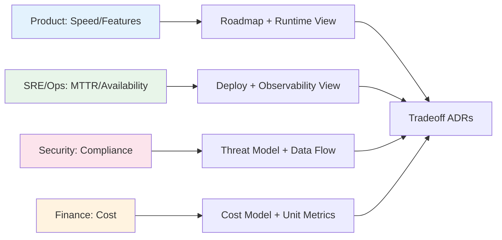

## 🎯 Intent
Map who cares about what so views, priorities, and trade-off ADRs target real concerns, not generic diagrams. The stakeholder → concern → quality → scenario chain is the traceability backbone for audits and interviews.

## 💡 Why It Matters
- **Interview signal**: "Who are the stakeholders for X and what does each care about?" — missing business/compliance stakeholders is a senior red flag
- **Review efficiency**: When a review circles, an unnamed stakeholder (finance, compliance, support) is usually objecting through proxies
- **Traceability chain**: Stakeholder → concern → quality attribute → scenario → fitness function → ADR = auditable architecture

## 🧩 Diagram: Stakeholder → View Mapping


## 💻 Code: Stakeholder Concern Matrix (Java 25)
```java
record Stakeholder(String name, String topConcern, String qualityAttribute, String view, String scenarioLink) {}

var matrix = List.of(
    new Stakeholder("Product", "Conversion + Time-to-market", "Latency", "Runtime + Roadmap", "checkout-p99"),
    new Stakeholder("SRE/Ops", "Availability + MTTR", "Availability", "Deployment + Observability", "failover-rto"),
    new Stakeholder("Security", "PCI Scope + Data Minimisation", "Security", "Threat Model + Data Flow", "pci-scope"),
    new Stakeholder("Finance", "Unit Cost per Order", "Cost Efficiency", "Cost Model + Unit Metrics", "cost-per-txn"),
    new Stakeholder("Support", "Failure Visibility", "Operability", "Observability + Runbooks", "alert-coverage")
);

// Architect's job: design for the conflict between these, not satisfy each in isolation
```

## ✅ When to Use / ❌ When NOT to Use
| Scenario | Use? | Reason |
|---|---|---|
| Start of every phase, design review, ADR | ✅ | Before picking view/tactic, know whose concern you serve |
| Review keeps circling | ✅ | Unnamed stakeholder usually objecting via proxies |
| Building traceability chain for auditors/interviews | ✅ | Stakeholder → concern → quality → scenario → fitness function |
| Chasing completeness (40-row matrix) | ❌ | Analysis paralysis; start with 5, grow when someone proves missing |
| Treating as one-time artifact | ❌ | Scope, compliance, org shift — stale map misdirects design |

## ⚖️ Trade-offs
| Dimension | Pros | Cons |
|---|---|---|
| **Right view per audience** | Fewer re-reviews; targeted communication | **Analysis paralysis** if chasing every stakeholder |
| **Explicit conflict resolution** | Trade-offs documented in ADRs | **Maintenance burden** if matrix not linked to views |
| **Onboarding** | New engineer sees whose needs drive design | **Stale data** if not revisited on scope/compliance change |

**Decision rule**: Start with 5 stakeholders (Product, SRE, Security, Finance, Support). Add only when a review proves one was missing.

## 🆚 Vs. Alternatives
| Stakeholder | Top Concern | View That Satisfies | Decision Rule |
|---|---|---|---|
| **Product** | Features/speed | Roadmap + Runtime | Time-to-market drives latency budget |
| **SRE/Ops** | Availability/MTTR | Deployment + Observability | Failover RTO/RPO drives infra |
| **Security** | Confidentiality/compliance | Threat Model + Data Flow | PCI scope boundary non-negotiable |
| **Finance** | Unit cost | Cost Model + Unit Metrics | Cost-per-txn caps architecture choices |

## ⚠️ Pitfalls
1. **Only technical stakeholders** — missing business/compliance; "who pays, who gets paged, who gets sued" surfaces missing rows
2. **One diagram for everyone** — different concerns need different lenses (C4 Context for Product, Sequence for SRE, Threat Model for Security)
3. **Matrix as ceremony** — if a row can't reach a scenario, either concern is stale or design hasn't addressed it
4. **Not revisiting** — org structure, compliance regime, scope shift; stale map silently misdirects design

## 🎤 Interview Q&A (Senior Depth)

**Q1: "Who are the stakeholders for an e-commerce checkout redesign, and what does each actually care about?"**
> **Answer**: Product: conversion + time-to-market → latency + release cadence. SRE: availability + MTTR → failure modes, rollbacks, observability. Security/Compliance: PCI scope + data minimisation. Finance: unit cost per order + peak capacity. Support: failure visibility (silent payment failure = ticket). **Architect's job**: design for the *conflict* between these, not satisfy each in isolation. **Rejected**: "Satisfy all" — impossible; trade-offs must be explicit in ADRs.

**Q2: "Two stakeholders have opposed concerns: Security wants strong auth everywhere, Product wants one-tap guest checkout. How do you resolve?"**
> **Answer**: Resolve by constraint, not volume. Security sets boundary: guest checkout never touches PCI scope, tokenise card, keep merchant token out of our DB. Product optimises inside: one-tap with tokenised wallet, no account. If no boundary exists, escalate to stakeholder owning commercial risk, record trade-off in ADR, make sacrificed concern explicit. **Rejected**: "Compromise in the middle" — security boundaries are binary.

**Q3: "Name the stakeholders teams most often forget."**
> **Answer**: Support, Finance, Auditors, plus whoever gets paged at 03:00. They're invisible at design time, expensive at incident time. Test: "Who pays, who gets paged, who gets sued" surfaces missing rows. **Rejected**: "Just the dev team" — devs build, others live with consequences.

**Q4: "How do you resolve conflicting stakeholder priorities in an ADR?"**
> **Answer**: Map to quality attributes (latency vs security vs cost). The ADR states: "We choose X over Y because quality Z is the top risk per stakeholder S." The sacrificed concern is explicitly recorded, not quietly dropped. **Metric**: ADR has RACI — one Accountable, others Consulted/Informed.

**Q5: "How do you record stakeholders without it becoming bureaucratic?"**
> **Answer**: One living table: Stakeholder → Top Concern → Quality Attribute → Scenario Link → View That Satisfies. It's the index for architecture docs; if a row can't reach a scenario, either concern is stale or design hasn't addressed it. **Rejected**: "Wiki page" — wiki is where matrices go to be ignored.

## 🔗 Related
- [[Views-and-Viewpoints-4-plus-1|Views 4+1]] • [[../02_Requirements-Quality-Attributes/Quality-Scenarios|Quality Scenarios]] • [[../09_Governance-Documentation/02_ADRs|ADRs]]