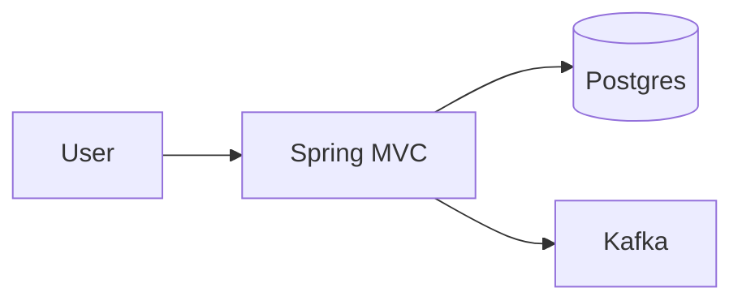

# Views and Viewpoints (4+1)

## Intent
Show the system from complementary angles (logical, process, development, physical + scenarios) so no single diagram lies by omission.

## When / NOT
- Use when communicating to mixed audiences or reviewing cross-cutting risk.
- NOT all five for every change — pick views that answer the decision.

## Example (C4 snippet — why, not line-by-line)
```text
Why C4 maps to 4+1: Context/Container ≈ logical+physical,
Component ≈ development, runtime sequence ≈ process, ADR scenarios tie them
```



## Pros / Cons
- Pros: separation of concerns; each stakeholder gets their lens.
- Cons: view sprawl; stale diagrams.

## Vs
| View | Answers | Tool |
|------|---------|------|
| Logical | Domain structure | C4 L2/L3 |
| Process | Runtime/concurrency | Sequence |
| Development | Build/modules | ArchUnit |
| Physical | Deploy | K8s manifest |

## Q&A
1. **4+1 vs C4?** 4+1 = viewpoints; C4 = notation — use together.
2. **Which view first?** Context, then the view tied to top risk (often runtime/deploy).
3. **How to keep fresh?** Generate what you can (ArchUnit, Structurizr) + review per ADR.

## Pitfalls
- Only static diagrams; missing runtime and deployment.
- Level-mixing (DB tables on a context diagram).

## Related
- [[What-is-Architecture|What is Architecture]], [[Architecture-Principles|Principles]]
