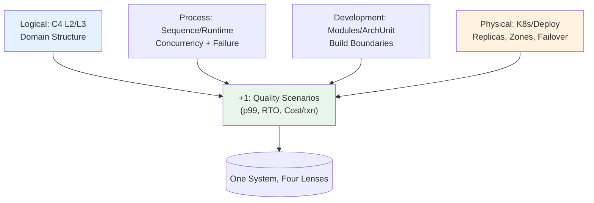

## 🎯 Intent
Show the system from complementary angles — Logical, Process, Development, Physical + Scenarios — so no single diagram lies by omission. The "+1" scenarios are the only view that validates the other four against real quality requirements.

## 💡 Why It Matters
- **Interview signal**: "A reviewer says your doc has a container diagram but nothing about runtime or deployment. Which viewpoints are missing and why?" — missing Process/Physical = untestable availability/capacity claims
- **Stakeholder communication**: Each audience gets their lens (Product: Context, SRE: Physical, Dev: Development, Security: Threat Model)
- **ADR binding**: The +1 quality scenarios tie views to measurable requirements (p99, RTO, cost/txn)

## 🧩 Diagram: 4+1 View Model


## 💻 Code: C4 → 4+1 Mapping + Generation (Java 25)
```java
// Why C4 maps to 4+1:
// Context/Container ≈ Logical + Physical
// Component ≈ Development
// Runtime Sequence ≈ Process
// ADR Scenarios = +1

@ArchTest
static final ArchRule moduleBoundaries = noClasses()
    .that().resideInAPackage("com.shop.order..")
    .should().dependOnClassesThat().resideInAPackage("com.shop.payment.impl..");

// Physical view = K8s manifests (Helm)
// Process view = sequence diagrams from trace replay
// Logical view = Structurizr DSL from repo
// +1 view = ADR quality scenarios with fitness functions

// Example: Checkout flow runtime (Process view)
/*
sequenceDiagram
    Client->>API Gateway: POST /orders
    Gateway->>Order Service: createOrder()
    Order Service->>Payment Service: charge() [sync, timeout 2s]
    Payment Service-->>Order Service: success
    Order Service->>Kafka: OrderPlaced event
    Order Service-->>Client: 201 Created
*/
```

## ✅ When to Use / ❌ When NOT to Use
| Scenario | Use? | Reason |
|---|---|---|
| Design review, architecture doc, stakeholder walkthrough | ✅ | Single picture cannot carry whole story |
| Onboarding new engineer | ✅ | Read view matching their question (runtime, deploy, modules) |
| ADR work | ✅ | +1 scenarios bind four views to quality requirements |
| One-line bugfix or small refactor | ❌ | Pick 1-2 views answering the decision (usually Context + risk view) |
| Maintaining hand-drawn static diagrams | ❌ | Generate: Structurizr/ArchUnit/PlantUML from repo; stale day after review |

## ⚖️ Trade-offs
| Dimension | Pros | Cons |
|---|---|---|
| **Separation of concerns** | Each stakeholder gets their lens | **View sprawl** — 5 views × N systems |
| **Targeted communication** | Product sees Context, SRE sees Physical | **Stale diagrams** if not generated from code |
| **ADR binding** | +1 validates other four | **Overhead** for small changes |

**Decision rule**: Generate what you can (ArchUnit, Structurizr, trace replay, K8s manifests). Review views inside the ADR/RFC that changes them, not quarterly doc cycle.

## 🆚 Vs. Alternatives
| View | Answers | Tool | Generation |
|---|---|---|---|
| **Logical** | Domain structure | C4 L2/L3 (Structurizr) | From repo |
| **Process** | Runtime/concurrency | Sequence diagrams | From trace replay |
| **Development** | Build/modules | ArchUnit tests | From code |
| **Physical** | Deploy | K8s manifests/Helm | From IaC |
| **+1 Scenarios** | Qualities (p99, RTO) | ADR + Fitness Functions | From requirements |

## ⚠️ Pitfalls
1. **Only static diagrams** — missing runtime (Process) and deployment (Physical); availability/capacity claims untestable
2. **Level-mixing** — DB tables on Context diagram; containers on Component diagram
3. **Hand-drawn for weekly-changing system** — generate from code (ArchUnit, Structurizr, Helm)
4. **Dropping +1** — Logical view looks identical whether system meets p99 or not; +1 is the only validator

## 🎤 Interview Q&A (Senior Depth)

**Q1: "A reviewer says your architecture doc has a container diagram but nothing about runtime behaviour or deployment. Which viewpoints are missing and why does it matter?"**
> **Answer**: Process (runtime/concurrency) and Physical (deployment). Container diagram answers "what runs", not "how many, where they fail over, or which calls are synchronous under load". Without them, availability and capacity claims are untestable. I'd add sequence/communication view for two critical flows + deployment view showing replicas, zones, failover before signing off. **Rejected**: "Container diagram is enough" — it's not.

**Q2: "What is the '+1' in 4+1, and can you drop it?"**
> **Answer**: The scenarios — use cases and quality-attribute scenarios that drive design. They are the *only* view that validates the other four. A logical view looks identical whether the system meets p99 or not. Dropping it is why architecture decks drift from qualities stakeholders pay for. **Rejected**: "Scenarios are in requirements" — requirements aren't views; +1 binds views to measurable tests.

**Q3: "How do you keep 4+1 views from becoming shelfware?"**
> **Answer**: Generate, don't draw. Structurizr/C4-DSL/PlantUML from repo for Context/Container; ArchUnit tests for Development view; sequence diagrams from trace replay; K8s manifests/Helm as Physical view. Review views inside the ADR/RFC that changes them. **Metric**: View freshness = last ADR that modified it.

**Q4: "4+1 versus C4 — are they competing?"**
> **Answer**: No. 4+1 is a *viewpoint framework* (which lenses to show). C4 is *notation* (how to draw them at zoom levels). C4 Context ≈ stakeholder-facing slice of Logical+Physical; Container ≈ Process+Development boundaries. I use 4+1 to decide *what* to communicate and C4 to draw it. **Rejected**: "Pick one" — they're different abstraction layers.

**Q5: "Which view do you draw first for a new system?"**
> **Answer**: Context (C4 L1) — aligns non-technical stakeholders before containers. Then the view tied to top risk: usually Process (runtime) for latency-critical, Physical (deployment) for availability-critical. **Rejected**: "All five" — overkill; pick views that answer the decision.

## 🔗 Related
- [[What-is-Architecture|What is Architecture]] • [[Architecture-Principles|Principles]]
- Notation: [[../09_Governance-Documentation/01_C4-Modeling|C4 Modeling]]
- Scenarios that bind views: [[../02_Requirements-Quality-Attributes/Quality-Scenarios|Quality Scenarios]]