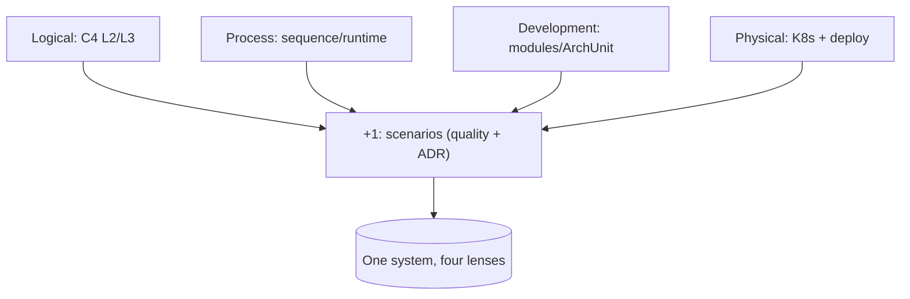

## Why it Matters

Show the system from complementary angles (logical, process, development, physical + scenarios) so no single diagram lies by omission.

## Diagram



## Code

```text
Why C4 maps to 4+1: Context/Container ≈ logical+physical,
Component ≈ development, runtime sequence ≈ process, ADR scenarios tie them
```
```mermaidgraph LR
 User --> Web[Spring MVC]
 Web --> DB[(Postgres)]
 Web --> K[Kafka]
```
## When to use / not

- **Use:** any design review, architecture doc, or stakeholder walkthrough where a single picture cannot carry the whole story; whenever a reviewer asks a question your diagrams don't answer.
- **Use:** onboarding, a new engineer can read the view that matches their question (runtime behaviour, deployment, module layout) instead of all of them.
- **Use:** ADR work, the "+1" scenarios are what bind the other four views to real quality requirements.

**When NOT:** do not draw all five views for a one-line bugfix or a small refactor, pick the view that answers the decision at hand (usually two: context + the view tied to the top risk). Do not maintain hand-drawn static diagrams for a system that changes weekly without generating them (Structurizr/ArchUnit as code); those go stale the day after the review.

## Trade-offs

- Pros: separation of concerns; each stakeholder gets their lens.
- Cons: view sprawl; stale diagrams.

## Vs

| View | Answers | Tool |
|------|---------|------|
| Logical | Domain structure | C4 L2/L3 |
| Process | Runtime/concurrency | Sequence |
| Development | Build/modules | ArchUnit |
| Physical | Deploy | K8s manifest |

## Pitfalls

- Only static diagrams; missing runtime and deployment.
- Level-mixing (DB tables on a context diagram).

## Interview q&a

**Q: A reviewer says your architecture document has a container diagram but nothing about runtime behaviour or deployment. Which viewpoints are missing and why does it matter?**
A: Process (runtime/concurrency) and physical (deployment). A container diagram answers "what runs", not "how many of them run, where they fail over, or which calls are synchronous under load". Without them, availability and capacity claims are untestable, I would add a sequence/communication view for the two critical flows plus a deployment view showing replicas, zones, and failover before signing off.

**Q: What is the "+1" in 4+1, and can you drop it?**
A: The scenarios, use cases and, in practice, the quality-attribute scenarios that drive the design. They are the only view that validates the other four: a logical view looks identical whether the system meets p99 or not. Dropping it is why architecture decks drift from the qualities stakeholders actually pay for.

**Q: How do you keep 4+1 views from becoming shelfware?**
A: Generate, don't draw: Structurizr/C4-DSL or PlantUML from the repo for context/container, ArchUnit tests for the development view, sequence diagrams from trace replay where possible, and K8s manifests/Helm as the physical view. Review the views inside the ADR/RFC that changes them, not on a quarterly doc cycle.

**Q: 4+1 versus C4, are they competing?**
A: No, 4+1 is a *viewpoint framework* (which lenses to show), C4 is *notation* (how to draw them at zoom levels). C4 Context ≈ a stakeholder-facing slice of logical+physical, Container ≈ process+development boundaries. I use 4+1 to decide *what* to communicate and C4 to draw it.

## Related

- [[What-is-Architecture|What is Architecture]], [[Architecture-Principles|Principles]]
- Notation: [[../09_Governance-Documentation/01_C4-Modeling|C4 Modeling]]
- Scenarios that bind the views: [[../02_Requirements-Quality-Attributes/Quality-Scenarios|Quality Scenarios]]

# Views and Viewpoints (4+1)

## When / not

- Use when communicating to mixed audiences or reviewing cross-cutting risk.
- NOT all five for every change, pick views that answer the decision.

## Q&A

1. **4+1 vs C4?** 4+1 = viewpoints; C4 = notation, use together.
2. **Which view first?** Context, then the view tied to top risk (often runtime/deploy).
3. **How to keep fresh?** Generate what you can (ArchUnit, Structurizr) + review per ADR.
