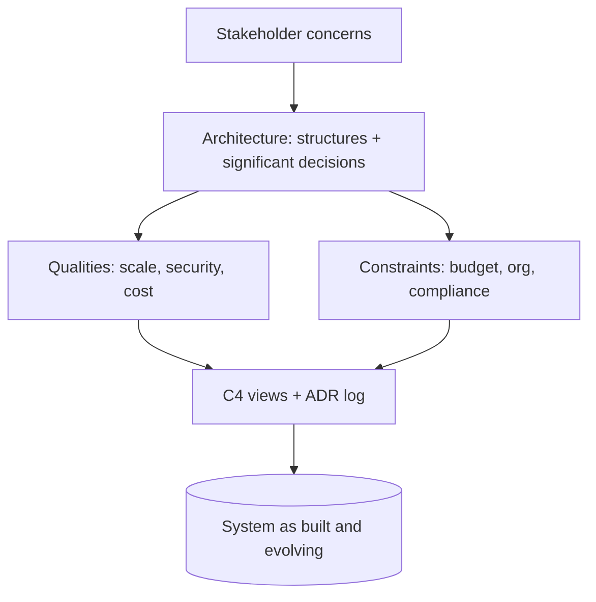

## Why it Matters

Define software architecture as the set of significant decisions + structures that shape qualities, cost, and change.

## Diagram



## Code

```java
// Why modular packages: enforce Order→Payment dependency direction
// ArchUnit test fails on cycles → architecture as executable rule, not diagram
package com.shop.order; // depends on payment API, never impl
```
```textC4
 Context: Shop monolith → Postgres, Stripe, warehouse API
Why C4-L1 first: aligns non-technical stakeholders before containers
```
## When to use / not

- **Use:** when justifying structure to stakeholders, writing an arc42 doc opening, or opening a design review, a one-line definition of what you're deciding and why it's *this* decision.
- **Use:** whenever a team debates "is this architecture or just design?", the hard-to-reverse / expensive-to-change test settles it.
- **Use:** at career and interview level, "what is software architecture?" is still asked, and a crisp answer with a decision example beats a textbook quote.

**When NOT:** do not apply architecture-weight thinking to routine class design, naming, or refactors inside a module, that's detailed design, and calling it architecture inflates ceremony and slows teams down. Do not treat architecture as a phase that finishes; the decision set is alive as long as the system is.

## Trade-offs

- Pros: shared vocabulary; defers costly rework.
- Cons: over-documentation; ivory-tower diagrams nobody reads.

## Vs

| A | B | Rule |
|---|---|------|
| Architecture | Design | Architecture = hard-to-reverse decisions |
| Architecture | Infrastructure | Infra is hosting; arch spans structure + behavior |

## Pitfalls

- Equating architecture with microservices/K8s.
- Diagrams without decisions (no ADR = no traceability).

## Interview q&a

**Q: Define software architecture in one line.**
A: The set of structures and the significant decisions, hard to reverse and expensive to change, that shape a system's qualities, cost, and rate of change. The corollary that matters in practice: if a decision is cheap to reverse, it's design, not architecture, so spend your governance budget on the irreversible few.

**Q: How much architecture should be done up front?**
A: Risk-driven, not completeness-driven: model and decide the three riskiest, most irreversible things (usually data ownership, integration boundaries, and the deploy/scale unit), then slice everything else thin enough to reverse with an ADR. The failure mode is either extreme, a 60-page doc nobody reads, or a Slack decision that becomes load-bearing without a record.

**Q: Is a monolith "architecture"?**
A: Yes. Module boundaries, data ownership, dependency direction, and the deploy unit are all architectural decisions, a monolith just makes them enforceable with a compiler and ArchUnit instead of a network. Service count is an implementation of one decision (independent deploy/scalability), not the definition of having architecture.

**Q: What separates architecture from infrastructure?**
A: Infrastructure is the hosting substrate (EKS, Kafka clusters, VPCs); architecture spans *structures and behaviour*, component responsibilities, boundaries, quality tactics, and the decisions that make the qualities real. You can lift a system to new infrastructure and still have the same architecture; you cannot swap the boundaries without changing it.

## Related

- [[Architect-Roles|Architect Roles]], [[Views-and-Viewpoints-4-plus-1|Views 4+1]], [[Architecture-Principles|Principles]]

# What is Architecture

## When / not

- Use when justifying structure to stakeholders or reviewing a design.
- NOT for low-level class design, that's detailed design, not architecture.

## Q&A

1. **One-line definition for interviews?** "Structures + significant decisions that enable qualities and constrain change."
2. **How much upfront?** Risk-driven: model the 3 riskiest decisions, slice the rest.
3. **Monolith still architecture?** Yes, modularity and boundaries matter more than service count.
