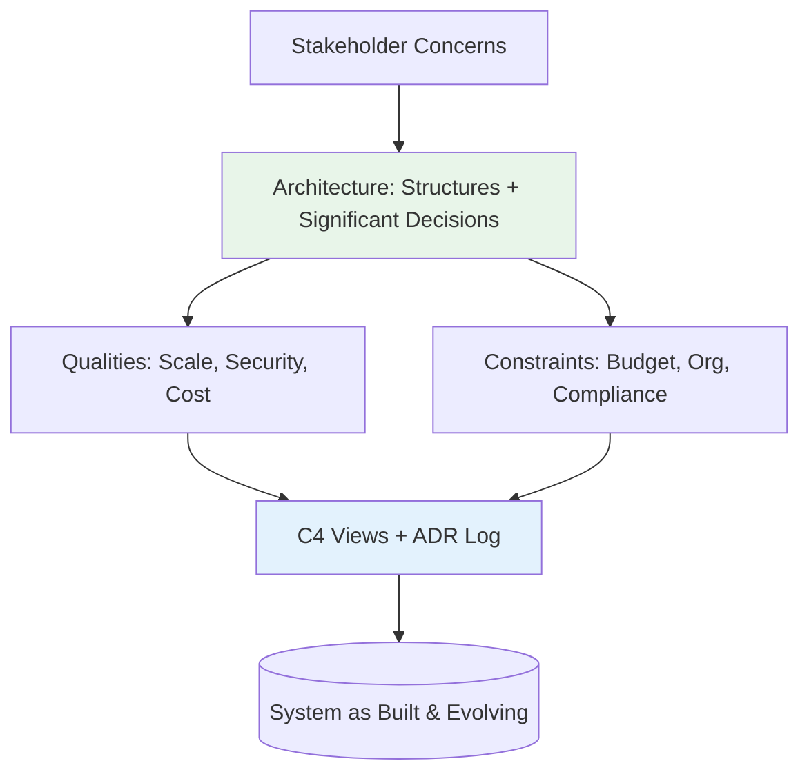

## 🎯 Intent
Define software architecture precisely — the set of significant, hard-to-reverse decisions that shape system qualities, cost, and rate of change — so you can distinguish architecture from design, justify governance, and answer the interview classic in one line.

## 💡 Why It Matters
- **Interview signal**: "Define software architecture in one line" is a top screening question; a crisp answer with a decision example beats a textbook quote
- **Governance budget**: Spend review/approval cycles on irreversible decisions (data ownership, integration boundaries, deploy unit), not routine class design
- **Communication**: Shared vocabulary ("architecture" vs "design") prevents ivory-tower diagrams nobody reads

## 🧩 Diagram: Architecture Decision Flow


## 💻 Code: Architecture as Executable Rule (Java 25 + ArchUnit)
```java
// Why modular packages: enforce Order → Payment dependency direction
// ArchUnit test fails on cycles → architecture as executable rule, not diagram

@ArchTest
static final ArchRule orderMustNotDependOnPaymentImpl = noClasses()
    .that().resideInAPackage("com.shop.order..")
    .should().dependOnClassesThat().resideInAPackage("com.shop.payment.impl..");

// Context: Shop monolith → Postgres, Stripe, warehouse API
// Why C4-L1 first: aligns non-technical stakeholders before containers
```

## ✅ When to Use / ❌ When NOT to Use
| Scenario | Use? | Reason |
|---|---|---|
| Justifying structure to stakeholders, opening design review | ✅ | Crisp definition anchors discussion |
| Team debates "is this architecture or design?" | ✅ | Hard-to-reverse / expensive-to-change test settles it |
| Interview: "What is software architecture?" | ✅ | One-line definition + decision example beats quote |
| Routine class design, naming, refactors inside module | ❌ | That's detailed design; inflates ceremony, slows teams |
| Treating architecture as a phase that finishes | ❌ | Decision set is alive as long as system is |

## ⚖️ Trade-offs
| Dimension | Architecture Focus | Design Focus |
|---|---|---|
| **Reversibility** | Hard/expensive to reverse | Cheap to reverse |
| **Scope** | Cross-cutting: boundaries, data ownership, deploy unit | Local: class, method, module internals |
| **Governance** | ADR + fitness functions (CI gates) | Code review, linters |
| **Tooling** | ArchUnit, C4, ADR log | IDE refactor, static analysis |

**Decision rule**: If a decision is cheap to reverse, it's design, not architecture — spend governance budget on the irreversible few.

## 🆚 Vs. Alternatives
| A | B | Decision Rule |
|---|---|---|
| **Architecture** | Design | Architecture = hard-to-reverse decisions shaping qualities |
| **Architecture** | Infrastructure | Infra = hosting substrate; arch spans structure + behaviour |
| **Architecture** | Implementation | Implementation = how; architecture = what + why |

## ⚠️ Pitfalls
1. **Equating architecture with microservices/K8s** — service count is an implementation of one decision (independent deploy), not the definition of having architecture
2. **Diagrams without decisions (no ADR = no traceability)** — C4 without ADR is decoration
3. **60-page doc nobody reads** — risk-driven: model the 3 riskiest irreversible things, slice rest thin
4. **Slack decision becoming load-bearing without record** — capture in ADR at decision time

## 🎤 Interview Q&A (Senior Depth)

**Q1: "Define software architecture in one line."**
> **Answer**: The set of structures and the significant decisions, hard to reverse and expensive to change, that shape a system's qualities, cost, and rate of change. **Corollary**: If a decision is cheap to reverse, it's design, not architecture — spend governance budget on the irreversible few. **Rejected**: "High-level structure" — too vague, includes design.

**Q2: "How much architecture should be done up front?"**
> **Answer**: Risk-driven, not completeness-driven: model and decide the three riskiest, most irreversible things (usually data ownership, integration boundaries, deploy/scale unit), then slice everything else thin enough to reverse with an ADR. **Failure mode**: 60-page doc nobody reads OR Slack decision that becomes load-bearing without record. **Rejected**: "Complete upfront" (waterfall) or "None" (cowboy).

**Q3: "Is a monolith 'architecture'?"**
> **Answer**: Yes. Module boundaries, data ownership, dependency direction, and the deploy unit are all architectural decisions. A monolith just makes them enforceable with a compiler and ArchUnit instead of a network. Service count is an implementation of one decision (independent deploy/scalability), not the definition of having architecture. **Rejected**: "Monolith = no architecture" — confuses style with substance.

**Q4: "What separates architecture from infrastructure?"**
> **Answer**: Infrastructure is the hosting substrate (EKS, Kafka clusters, VPCs); architecture spans structures and behaviour, component responsibilities, boundaries, quality tactics, and the decisions that make qualities real. You can lift a system to new infrastructure and keep the same architecture; you cannot swap boundaries without changing it. **Rejected**: "Infrastructure as code = architecture" — IaC is tooling, not the decision set.

**Q5: "How do you enforce architectural boundaries in a monolith?"**
> **Answer**: ArchUnit tests in CI: `noClasses().that().resideInAPackage("..order..").should().dependOnClassesThat().resideInAPackage("..payment.impl..")`. Package structure + ArchUnit = compiler-enforced architecture. **Metric**: CI fails on boundary violation before merge. **Rejected**: "Code review" — humans miss cycles; tooling catches them.

## 🔗 Related
- [[Architect-Roles|Architect Roles]] • [[Views-and-Viewpoints-4-plus-1|Views 4+1]] • [[Architecture-Principles|Principles]] • [[../02_Requirements-Quality-Attributes/Fitness-Functions|Fitness Functions]]