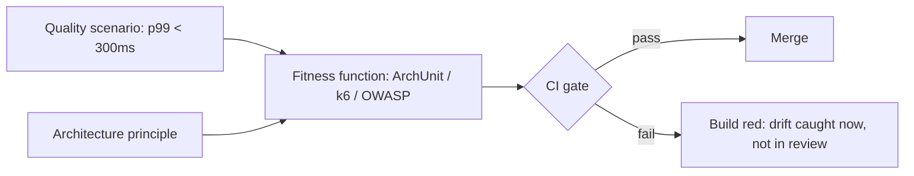

## Why it Matters

Automate architectural guardrails (coupling, latency, security) so drift fails the build, not a quarterly review.

## Diagram



## Code

```java
// Why ArchUnit: modular monolith boundary "order may not depend on web"
// Fails PR on violation → principle enforced in CI, not wiki
// @ArchTest: noClasses().that().resideIn("..order..").should().dependOn("..web..")
```
```textWhy
 Gatling budget: scenario "p99 < 300ms" → CI gate on staging deploy
Why dependency check: OWASP scan → security fitness for PCI path
```
## When to use / not

- **Use:** for every architecture principle and every top-3 quality scenario, if it matters, something automated should be protecting it.
- **Use:** as the definition of "done" for governance: a principle without a fitness function is an opinion, a scenario without a test is an aspiration.
- **Use:** onboarding and review prep, the fitness suite is the fastest way for a new architect or reviewer to learn what the system actually guarantees.

**When NOT:** do not gate merges on style nits or flaky load runs, a gate that fires randomly gets quarantine-merged into irrelevance, which is worse than having no gate because it also destroys trust in the real ones. Fitness functions protect a quality or a constraint; everything else is a linter.

## Trade-offs

- Pros: continuous governance; fast feedback.
- Cons: brittle/flaky gates; maintenance cost.

## Vs

| Type | Guards | Tool |
|------|--------|------|
| Structural | Coupling/cycles | ArchUnit |
| Behavioral | Latency/throughput | Gatling/k6 |
| Security | Vulns/secrets | OWASP, gitleaks |

## Pitfalls

- Flaky perf gates blocking all merges; quarantine + trend first.
- Fitness without linked scenario (untraceable).

## Interview q&a

**Q: Your CTO asks you to "make the architecture self-enforcing". What do you actually build?**
A: Three gates, one per failure mode: structural, ArchUnit/Spring Modulith tests asserting module boundaries and dependency direction (catches coupling before it becomes a distributed monolith); behavioural, a k6/Gatling run on staging asserting the top scenarios, e.g. p99 checkout < 300 ms at 500 rps; security/supply chain, OWASP dependency-check, gitleaks, and image CVE scans on the PCI path. Each one traces to a scenario and a principle, runs in PR for fast feedback plus nightly for full load, and only the fast, stable ones block merge.

**Q: A performance fitness test is flaky and now blocks every other PR. What do you do?**
A: Never let noise wear the authority of a gate. Quarantine it from the merge path, keep it reporting as a trend, and fix the cause, shared staging environment variance, cold-start jitter, or a threshold set without a baseline (measure first, then set the budget). Restore it to blocking only when it's stable; meanwhile the nightly full-load run keeps the real signal.

**Q: How many fitness functions should a team start with?**
A: Three: one ArchUnit boundary test, one performance scenario, one security scan. That's enough to prove the loop (principle → test → CI gate) without the team spending a quarter building test infrastructure. Add a gate only when a new quality attribute is named in a scenario.

**Q: Who owns fitness functions, the architect or the team?**
A: The architect defines and the team maintains, reviewed quarterly. If the team can't maintain it, the gate is too brittle or the principle behind it is dead, either way it's a finding, not a deadline.

## Related

- [[Quality-Scenarios|Quality Scenarios]], [[../01_Architecture-Foundations/Architecture-Principles|Principles]], [[../00_Overview/Tech Stack|Tech Stack]]

# Fitness Functions

## When / not

- Use for every principle and top scenario.
- NOT for style nits, fitness = protects a quality or constraint.

## Q&A

1. **How many to start?** 3: one ArchUnit + one perf + one security.
2. **Where run?** PR + nightly (full load); block merge only on fast ones.
3. **Who owns?** Architect defines, team maintains, review quarterly.
