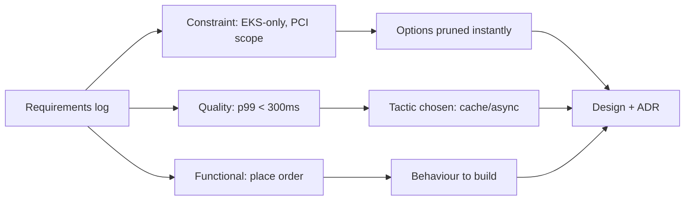

Why it Matters

Separate what the system does (functions) from what limits how (constraints) so estimates and style choices rest on facts.

## Diagram



## Code

```text
Why split: "Checkout with UPI" (functional) vs "PCI-DSS, deploy on EKS,
Java 21 only" (constraints) — second kills half the options instantly
```

## When to use / not

- **Use:** during requirements elicitation, before any style or platform choice, constraints prune the option space instantly, so separate them from functions early.
- **Use:** when a debate won't end, most "technical" arguments are really unstated constraints or qualities; naming the type ends them.
- **Use:** when sizing estimates and ADRs: functions drive build effort, constraints drive risk and rework.

**When NOT:** do not let preferences disguise themselves as constraints, "we've always used Postgres" is a preference; "all payment data stays in the PCI-scoped VPC" is a constraint, and treating the former as the latter burns optionality and trust. Do not bury qualities inside a vague "non-functional requirements" bucket, promote each to a named, measured scenario.

## Trade-offs

- Pros: clears hidden assumptions; speeds ADR.
- Cons: constraint creep (every preference becomes "mandatory").

## Vs

| Type | Example | Source |
|------|---------|--------|
| Functional | Place order, refund | Product/users |
| Quality | p99 < 300ms | SLO/SLA |
| Constraint | EKS-only, no new DB | Org/policy |

## Pitfalls

- Treating preferences as constraints.
- Functions without qualities (untestable "fast").

## Interview q&a

**Q: What's the difference between a functional requirement, a quality attribute, and a constraint, and why does the split change your design?**
A: A functional requirement is behaviour the system must perform (place an order); a quality attribute is a measurable property of that behaviour under conditions (p99 checkout < 300 ms at 500 rps); a constraint is a fixed, non-negotiable boundary (EKS-only, PCI-DSS scope, Java 21). The split changes the design because constraints eliminate options immediately, qualities select tactics, and only functions get built, confusing them means either over-building or optimising the wrong axis.

**Q: "We need the checkout to be fast", what's missing?**
A: A scenario: fast for whom, under what load, measured where, with what threshold. Turn it into stimulus → environment → response → measure, "checkout POST from mobile clients at 500 rps in prod EKS returns p99 < 300 ms". If you can't attach a number and an environment, it's not a requirement yet, and "non-functional" is the word that let it stay vague.

**Q: How do you stop constraint creep, every stakeholder preference becoming "mandatory"?**
A: Test each claim against "what breaks if we don't" and "who imposed it and can they be challenged". A real constraint has an owner and a consequence; a preference has neither. Log both, but mark preferences as reversible decisions so an ADR can supersede them when the cost of the constraint exceeds the benefit.

**Q: Where do you record all three so they don't rot?**
A: One requirements log where every row links forward: functional → test case, quality → scenario → fitness function, constraint → ADR or compliance control. Traceability both directions is what an auditor and a new architect both need.

## Related

- [[ISO-25010-Qualities|ISO 25010]], [[Quality-Scenarios|Quality Scenarios]]

# Functional vs Constraints

## When / not

- Use during elicitation, before picking styles.
- NOT to bury qualities inside "non-functional" vagueness, promote them to scenarios.

## Q&A

1. **"Non-functional" term?** Avoid, say quality attribute + scenario.
2. **Constraint or quality?** Fixed = constraint; measurable target = quality.
3. **Where record?** Requirements log → link each to scenario/ADR.
