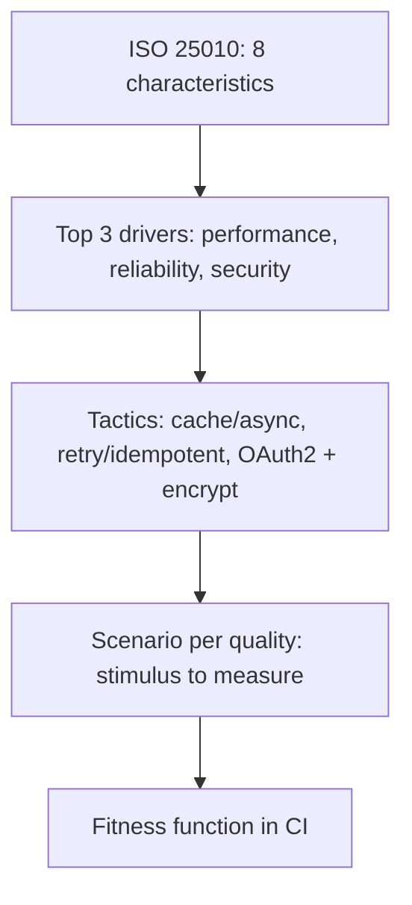

## Why it Matters

Use the standard quality vocabulary (performance, reliability, security, maintainability…) to stop "scalable/secure" hand-waving.

## Diagram



## Code

```text
Why map: "Black Friday 10x" → Performance (throughput) + Reliability (fault tolerance);
"PCI audit" → Security (confidentiality) — naming picks the tactic
```

## When to use / not

- **Use:** whenever a stakeholder says "scalable", "secure", or "robust", that's the cue to name the ISO 25010 characteristic and attach a scenario.
- **Use:** in design reviews and ADRs to justify tactics: a tactic without a named quality is a resume-line choice.
- **Use:** for iSAQB and interview vocabulary, the eight top-level characteristics are the shared language reviewers expect.

**When NOT:** do not try to optimise all eight characteristics at once, every architecture is a trade-off, and a design with no explicit sacrifice is one where the trade-offs were made accidentally. Do not stop at the label: "we value security" selects nothing until it becomes a scenario with a measure.

## Trade-offs

- Pros: shared checklist; iSAQB-expected language.
- Cons: abstract without scenarios; checkbox compliance.

## Vs

| Quality | Tactic family | Spring example |
|---------|---------------|----------------|
| Performance | Cache/async/scale-out | Redis + virtual threads |
| Reliability | Retry/idempotency | Kafka + outbox |
| Security | AuthN/Z, encrypt | OAuth2/OIDC, KMS |

## Pitfalls

- Listing qualities without owners or measures.
- Optimizing all qualities at once.

## Interview q&a

**Q: Name the ISO 25010 quality characteristics and tell me which two you'd prioritise for a payments system, and which one you'd sacrifice.**
A: Functional suitability, performance efficiency, compatibility, reliability, security, maintainability, portability, usability. For payments: reliability and security first, a wrong or lost transaction is a regulatory and financial event. I'd consciously sacrifice some performance efficiency (throughput) and portability, serialisable isolation and an append-only ledger cost throughput, and staying on one cloud is acceptable given the compliance perimeter. State the sacrifice explicitly; that's what makes it an architecture instead of a checklist.

**Q: How does ISO 25010 differ from the older ISO 9126?**
A: 9126 had six characteristics; 25010 reorganised them into eight, splitting security out as a first-class characteristic (it used to be subsumed under functionality) and adding compatibility and reliability refinements. The practical signal: security is not a sub-item of functionality, and treating it as one is how it gets cut from scope.

**Q: A requirement says "the system must be highly available". What do you do?**
A: Reject the adjective and ask for the scenario: available for which operations, at what level (99.9% vs 99.99% is roughly a 10× cost difference), measured over what window, and with what tolerated degradation. The answer becomes a reliability scenario plus a tactic, redundancy, failover, bulkheads, and a fitness function that validates it. "Highly" is untestable; "99.9% monthly for checkout, degrade to read-only catalogue during an outage" is architecture.

**Q: Two quality attributes conflict, performance vs maintainability, say. How do you decide?**
A: Decide by stakeholder priority and cost of being wrong, then record it: which quality is the business driver for this system (the top-3), and which one can be sacrificed within tolerance. Quantify both sides with scenario measures and cost notes in the ADR, "we accept a 15% latency cost in exchange for module boundaries that let four teams ship independently" is a defensible trade; "we balanced both" is not.

## Related

- [[Quality-Scenarios|Quality Scenarios]], [[Tradeoffs-Tensions|Tradeoffs]]

# ISO 25010 Qualities

## When / not

- Use to name and prioritize qualities with stakeholders.
- NOT to implement all eight, pick top 3 drivers.

## Q&A

1. **Must memorize all sub-characteristics?** No, know the 8 + 1 example each.
2. **Top 3 for capstone?** Performance, reliability, security (+ maintainability).
3. **How to prioritize?** Stakeholder impact × risk; timebox the rest.
