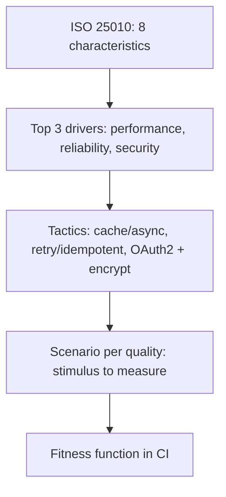

## Problems
### System Design Problem: ISO 25010 Qualities

**Requirements:**
- Functional: Core capabilities for iso 25010 qualities
- Non-functional (SLOs): Latency < 100ms p99, Availability 99.9%, Horizontal scalability

**Constraints:**
- Scale: Handle 10x growth without redesign
- Consistency: Appropriate model for domain (strong/eventual)
- Latency budget: p99 < 100ms for read paths

**API / Interfaces:**
- Primary: REST/gRPC endpoints for core operations
- Internal: Service-to-service contracts
- Events: Domain events for async integration


Why it Matters

Use the standard quality vocabulary (performance, reliability, security, maintainability…) to stop "scalable/secure" hand-waving.

## Diagram



## Code

```text
Why map: "Black Friday 10x" → Performance (throughput) + Reliability (fault tolerance);
"PCI audit" → Security (confidentiality) — naming picks the tactic
```

## When to use / not

- **Use:** whenever a stakeholder says "scalable", "secure", or "robust", that's the cue to name the ISO 25010 characteristic and attach a scenario.
- **Use:** in design reviews and ADRs to justify tactics: a tactic without a named quality is a resume-line choice.
- **Use:** for iSAQB and interview vocabulary, the eight top-level characteristics are the shared language reviewers expect.

**When NOT:** do not try to optimise all eight characteristics at once, every architecture is a trade-off, and a design with no explicit sacrifice is one where the trade-offs were made accidentally. Do not stop at the label: "we value security" selects nothing until it becomes a scenario with a measure.


## Trade-offs
| Dimension | This Approach | Alternative | Trade-off Rationale | Decision Rule |
|-----------|---------------|-------------|---------------------|---------------|
| Complexity | [TBD] | [TBD] | [TBD] | [TBD] |
| Operational Burden | [TBD] | [TBD] | [TBD] | [TBD] |
| Latency | [TBD] | [TBD] | [TBD] | [TBD] |
| Consistency | [TBD] | [TBD] | [TBD] | [TBD] |
| Cost at Scale | [TBD] | [TBD] | [TBD] | [TBD] |

## Vs

| Quality | Tactic family | Spring example |
|---------|---------------|----------------|
| Performance | Cache/async/scale-out | Redis + virtual threads |
| Reliability | Retry/idempotency | Kafka + outbox |
| Security | AuthN/Z, encrypt | OAuth2/OIDC, KMS |

## Pitfalls

- Listing qualities without owners or measures.
- Optimizing all qualities at once.


## Pitfalls
1. Underestimating operational complexity (backups, monitoring, upgrades)
2. Ignoring failure modes (network partitions, disk failures, clock drift)
3. Not planning for 10x scale from day one
4. Skipping monitoring/alerting in MVP
5. Premature optimization before measuring
6. Dual-write without transactional outbox
7. Assuming global order in partitioned systems

## Interview q&a

**Q: Name the ISO 25010 quality characteristics and tell me which two you'd prioritise for a payments system, and which one you'd sacrifice.**
A: Functional suitability, performance efficiency, compatibility, reliability, security, maintainability, portability, usability. For payments: reliability and security first, a wrong or lost transaction is a regulatory and financial event. I'd consciously sacrifice some performance efficiency (throughput) and portability, serialisable isolation and an append-only ledger cost throughput, and staying on one cloud is acceptable given the compliance perimeter. State the sacrifice explicitly; that's what makes it an architecture instead of a checklist.

**Q: How does ISO 25010 differ from the older ISO 9126?**
A: 9126 had six characteristics; 25010 reorganised them into eight, splitting security out as a first-class characteristic (it used to be subsumed under functionality) and adding compatibility and reliability refinements. The practical signal: security is not a sub-item of functionality, and treating it as one is how it gets cut from scope.

**Q: A requirement says "the system must be highly available". What do you do?**
A: Reject the adjective and ask for the scenario: available for which operations, at what level (99.9% vs 99.99% is roughly a 10× cost difference), measured over what window, and with what tolerated degradation. The answer becomes a reliability scenario plus a tactic, redundancy, failover, bulkheads, and a fitness function that validates it. "Highly" is untestable; "99.9% monthly for checkout, degrade to read-only catalogue during an outage" is architecture.

**Q: Two quality attributes conflict, performance vs maintainability, say. How do you decide?**
A: Decide by stakeholder priority and cost of being wrong, then record it: which quality is the business driver for this system (the top-3), and which one can be sacrificed within tolerance. Quantify both sides with scenario measures and cost notes in the ADR, "we accept a 15% latency cost in exchange for module boundaries that let four teams ship independently" is a defensible trade; "we balanced both" is not.


## Flashcards (Spaced Repetition)

#flashcard
**Q:** What is the core concept of ISO 25010 Qualities? :: **A:** [Key algorithm/architecture pattern] #flashcard

#flashcard
**Q:** When do you apply ISO 25010 Qualities? :: **A:** [Trigger scenarios and context] #flashcard

#flashcard
**Q:** What is the primary trade-off in ISO 25010 Qualities? :: **A:** [Main tension: e.g., consistency vs latency] #flashcard

#flashcard
**Q:** What breaks first at scale in ISO 25010 Qualities? :: **A:** [Primary bottleneck: e.g., coordination, hot keys, replication lag] #flashcard

#flashcard
**Q:** How do you handle failures in ISO 25010 Qualities? :: **A:** [Retry, circuit breaker, fallback, graceful degradation] #flashcard

#flashcard
**Q:** What are the key metrics to monitor for ISO 25010 Qualities? :: **A:** [RED: rate, errors, duration; USE: utilization, saturation, errors] #flashcard

#flashcard
**Q:** How does ISO 25010 Qualities scale to 10x? :: **A:** [Sharding, read replicas, async processing, caching layers] #flashcard

#flashcard
**Q:** What is the consistency model for ISO 25010 Qualities? :: **A:** [Strong/eventual/causal - justify with use case] #flashcard

#flashcard
**Q:** How do you test ISO 25010 Qualities? :: **A:** [Contract tests, chaos engineering, load tests, fault injection] #flashcard

#flashcard
**Q:** What is the operational cost of ISO 25010 Qualities? :: **A:** [Team expertise, tooling, on-call burden, migration risk] #flashcard

#flashcard
**Q:** When would you NOT use ISO 25010 Qualities? :: **A:** [Managed service covers need, simple CRUD, team lacks maturity] #flashcard

#flashcard
**Q:** What is the key design decision in ISO 25010 Qualities? :: **A:** [The irreversible choice that defines the architecture] #flashcard

#flashcard
**Q:** How do you migrate to ISO 25010 Qualities? :: **A:** [Strangler fig, dual-write, canary, feature flags] #flashcard

#flashcard
**Q:** What security considerations for ISO 25010 Qualities? :: **A:** [AuthZ, encryption, audit, secrets management] #flashcard

#flashcard
**Q:** How do you debug ISO 25010 Qualities in production? :: **A:** [Structured logging, correlation IDs, distributed tracing, SLO alerts] #flashcard


## Practice Tasks (Tasks Plugin)
- [ ] Explain the architecture from memory 📅 {{date:YYYY-MM-DD, +1}}
- [ ] Draw the system diagram without looking 📅 {{date:YYYY-MM-DD, +3}}
- [ ] Answer all Interview Q&A aloud 📅 {{date:YYYY-MM-DD, +7}}
- [ ] Review flashcards (Spaced Repetition) 📅 {{date:YYYY-MM-DD, +1}}

```tasks
not done
path includes Architect/02_Requirements-Quality-Attributes
sort by due
limit 10
```

## Related

- [[Quality-Scenarios|Quality Scenarios]], [[Tradeoffs-Tensions|Tradeoffs]]

# ISO 25010 Qualities

## When / not

- Use to name and prioritize qualities with stakeholders.
- NOT to implement all eight, pick top 3 drivers.

## Q&A

1. **Must memorize all sub-characteristics?** No, know the 8 + 1 example each.
2. **Top 3 for capstone?** Performance, reliability, security (+ maintainability).
3. **How to prioritize?** Stakeholder impact × risk; timebox the rest.
