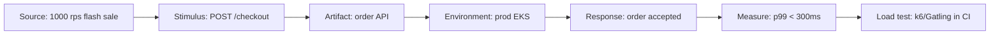

## Problems
### System Design Problem: Quality Scenarios

**Requirements:**
- Functional: Core capabilities for quality scenarios
- Non-functional (SLOs): Latency < 100ms p99, Availability 99.9%, Horizontal scalability

**Constraints:**
- Scale: Handle 10x growth without redesign
- Consistency: Appropriate model for domain (strong/eventual)
- Latency budget: p99 < 100ms for read paths

**API / Interfaces:**
- Primary: REST/gRPC endpoints for core operations
- Internal: Service-to-service contracts
- Events: Domain events for async integration


Why it Matters

Make qualities testable: stimulus → environment → response + measure (e.g. "p99 checkout < 300ms at 500 rps").

## Diagram



## Code

```text
Why six-part form: Source "1000 rps flash sale" → Stimulus "checkout POST" →
Artifact "order API" → Env "prod EKS" → Response "served" → Measure "p99 < 300ms"
```

## When to use / not

- **Use:** before design starts, every top-3 quality attribute gets at least one scenario; the scenario is what converts an adjective into a tactic selection.
- **Use:** when writing load tests and SLOs, the scenario *is* the test contract, so a k6/Gatling script can be written straight from it.
- **Use:** in design reviews to end "is it fast enough?" debates, the answer is a comparison against a number, not an opinion.

**When NOT:** do not write scenarios whose numbers are guesses presented as requirements, mark assumptions explicitly, or the scenario becomes false precision that misdirects capacity spend. Do not write prose adjectives: if a quality has no number and no environment, it is not a scenario and it will not be validated.


## Trade-offs
| Dimension | This Approach | Alternative | Trade-off Rationale | Decision Rule |
|-----------|---------------|-------------|---------------------|---------------|
| Complexity | Not specified | Not specified | Not specified | Not specified |
| Operational Burden | Not specified | Not specified | Not specified | Not specified |
| Latency | Not specified | Not specified | Not specified | Not specified |
| Consistency | Not specified | Not specified | Not specified | Not specified |
| Cost at Scale | Not specified | Not specified | Not specified | Not specified |

## Vs

| Bad | Good (scenario) |
|-----|-----------------|
| "Fast" | p99 < 300ms @ 500 rps |
| "Highly available" | 99.9% monthly, RTO 15m |

## Pitfalls

- No environment (prod vs staging numbers differ 10x).
- Unowned scenarios nobody validates.


## Pitfalls
1. Underestimating operational complexity (backups, monitoring, upgrades)
2. Ignoring failure modes (network partitions, disk failures, clock drift)
3. Not planning for 10x scale from day one
4. Skipping monitoring/alerting in MVP
5. Premature optimization before measuring
6. Dual-write without transactional outbox
7. Assuming global order in partitioned systems

## Interview q&a

**Q: Write a quality scenario for checkout latency.**
A: **Source**, mobile clients during a flash sale; **stimulus**, POST /checkout arriving at 500 rps sustained for 10 minutes; **artifact**, order API on prod EKS; **environment**, 3 AZs, primary Postgres + read replicas, Redis cache; **response**, order accepted and persisted; **response measure**, p99 < 300 ms, zero dropped requests below the rate limit. That's the contract; a k6 script implements it and the SLO dashboard monitors it in prod.

**Q: How do you know the numbers aren't invented?**
A: Distinguish targets from measurements: baseline the current system first, then set the threshold from business impact (conversion drop per 100 ms), and label any unmeasured assumption as such, "p99 < 300 ms is a hypothesis until staging load data exists". A scenario with a marked assumption is honest and improvable; one with false precision misallocates capacity budget.

**Q: How many scenarios should a system have?**
A: Five to eight total, one or two per top quality attribute, enough to cover the top-3 drivers (for us: performance, reliability, security) without becoming a test-suite that nobody owns. Each must have an owner or it silently dies at validation time.

**Q: How do scenarios connect to the rest of the architecture?**
A: They're the pivot point of traceability: the scenario selects the tactic (cache, async, retry, OAuth2), the scenario becomes the fitness function in CI, and the scenario justifies the ADR. Downstream, the same numbers reappear as SLO dashboards and error budgets, the scenario is the one artifact that stakeholders, developers, and SRE agree on because it's the same number in all three places.


## Flashcards (Spaced Repetition)

#flashcard
**Q:** What is the core concept of Quality Scenarios? :: **A:** [Key algorithm/architecture pattern] #flashcard

#flashcard
**Q:** When do you apply Quality Scenarios? :: **A:** [Trigger scenarios and context] #flashcard

#flashcard
**Q:** What is the primary trade-off in Quality Scenarios? :: **A:** [Main tension: e.g., consistency vs latency] #flashcard

#flashcard
**Q:** What breaks first at scale in Quality Scenarios? :: **A:** [Primary bottleneck: e.g., coordination, hot keys, replication lag] #flashcard

#flashcard
**Q:** How do you handle failures in Quality Scenarios? :: **A:** [Retry, circuit breaker, fallback, graceful degradation] #flashcard

#flashcard
**Q:** What are the key metrics to monitor for Quality Scenarios? :: **A:** [RED: rate, errors, duration; USE: utilization, saturation, errors] #flashcard

#flashcard
**Q:** How does Quality Scenarios scale to 10x? :: **A:** [Sharding, read replicas, async processing, caching layers] #flashcard

#flashcard
**Q:** What is the consistency model for Quality Scenarios? :: **A:** [Strong/eventual/causal - justify with use case] #flashcard

#flashcard
**Q:** How do you test Quality Scenarios? :: **A:** [Contract tests, chaos engineering, load tests, fault injection] #flashcard

#flashcard
**Q:** What is the operational cost of Quality Scenarios? :: **A:** [Team expertise, tooling, on-call burden, migration risk] #flashcard

#flashcard
**Q:** When would you NOT use Quality Scenarios? :: **A:** [Managed service covers need, simple CRUD, team lacks maturity] #flashcard

#flashcard
**Q:** What is the key design decision in Quality Scenarios? :: **A:** [The irreversible choice that defines the architecture] #flashcard

#flashcard
**Q:** How do you migrate to Quality Scenarios? :: **A:** [Strangler fig, dual-write, canary, feature flags] #flashcard

#flashcard
**Q:** What security considerations for Quality Scenarios? :: **A:** [AuthZ, encryption, audit, secrets management] #flashcard

#flashcard
**Q:** How do you debug Quality Scenarios in production? :: **A:** [Structured logging, correlation IDs, distributed tracing, SLO alerts] #flashcard


## Practice Tasks (Tasks Plugin)
- [ ] Explain the architecture from memory 📅 {{date:YYYY-MM-DD, +1}}
- [ ] Draw the system diagram without looking 📅 {{date:YYYY-MM-DD, +3}}
- [ ] Answer all Interview Q&A aloud 📅 {{date:YYYY-MM-DD, +7}}
- [ ] Review flashcards (Spaced Repetition) 📅 {{date:YYYY-MM-DD, +1}}

```tasks
not done
path includes Architect/02_Requirements-Quality-Attributes
sort by due
limit 10
```

## Related

- Functional vs Constraints, Fitness Functions

# Quality Scenarios

## When / not

- Use before design; each top quality gets ≥1 scenario.
- NOT prose adjectives, if no number, it's not a scenario.

## Q&A

1. **How many?** 5–8 total; 1–2 per top quality.
2. **Format?** Stimulus–source–artifact–environment–response–measure.
3. **Link to code?** Each scenario → Gatling/k6 or ArchUnit test.
