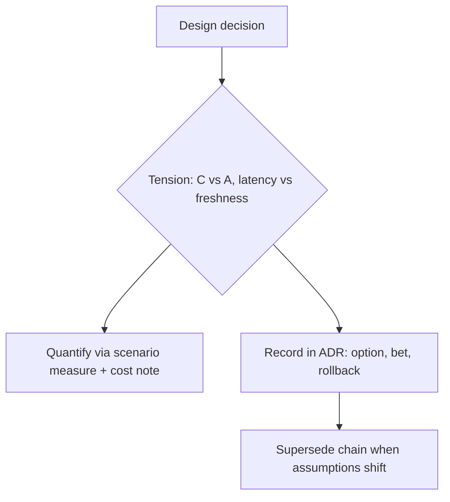

## Problems
### System Design Problem: Tradeoffs and Tensions

**Requirements:**
- Functional: Core capabilities for tradeoffs and tensions
- Non-functional (SLOs): Latency < 100ms p99, Availability 99.9%, Horizontal scalability

**Constraints:**
- Scale: Handle 10x growth without redesign
- Consistency: Appropriate model for domain (strong/eventual)
- Latency budget: p99 < 100ms for read paths

**API / Interfaces:**
- Primary: REST/gRPC endpoints for core operations
- Internal: Service-to-service contracts
- Events: Domain events for async integration


Why it Matters

Name what you sacrifice (CAP, consistency vs availability, speed vs safety) so decisions are explicit and reversible.

## Diagram



## Code

```java
// Why async saga over 2PC: availability + throughput beat immediate consistency
// Cost: eventual consistency → compensate + idempotent consumers
// outbox → Kafka → payment consumer (at-least-once + dedupe key)
```

## When to use / not

- **Use:** in every ADR's "considered options" and "consequences" sections, a decision without a stated sacrifice is an incomplete decision.
- **Use:** when choosing a consistency model, a caching stance, or a release-safety posture; the tension is the real decision, the pattern is just its resolution.
- **Use:** when a stakeholder asks for everything ("fast, cheap, perfect, and consistent"), naming the tension is how you make the request decidable.

**When NOT:** do not let trade-off talk substitute for deciding, listing tensions without quantifying them and picking a side is trade-off theatre, and it still leaves you without an architecture. Timebox the analysis, record the bet, and move; the ADR can be superseded when the assumption breaks.


## Trade-offs
| Dimension | This Approach | Alternative | Trade-off Rationale | Decision Rule |
|-----------|---------------|-------------|---------------------|---------------|
| Complexity | Not specified | Not specified | Not specified | Not specified |
| Operational Burden | Not specified | Not specified | Not specified | Not specified |
| Latency | Not specified | Not specified | Not specified | Not specified |
| Consistency | Not specified | Not specified | Not specified | Not specified |
| Cost at Scale | Not specified | Not specified | Not specified | Not specified |

## Vs

| Tension | Pick A when | Pick B when |
|---------|-------------|-------------|
| Consistency vs availability | Payments ledger | Flash-sale cart |
| Cache vs freshness | Catalog reads | Inventory counts |
| Speed vs safety | Prototype | PCI path |

## Pitfalls

- Silent tradeoffs discovered in prod.
- Optimizing the easy quality, ignoring the driver.


## Pitfalls
1. Underestimating operational complexity (backups, monitoring, upgrades)
2. Ignoring failure modes (network partitions, disk failures, clock drift)
3. Not planning for 10x scale from day one
4. Skipping monitoring/alerting in MVP
5. Premature optimization before measuring
6. Dual-write without transactional outbox
7. Assuming global order in partitioned systems

## Interview q&a

**Q: Walk me through the trade-offs of choosing eventual consistency for inventory during a flash sale.**
A: The bet: availability and throughput win over exact stock counts. We gain, the catalogue and cart stay servable when the primary is saturated or a partition isolates a replica; we lose, the number shown can be stale, so we risk overselling. Mitigations make the loss bounded: reserve-then-confirm with a TTL hold, an idempotency key on every reserve, an oversell guard that rejects at confirmation rather than at cart time, and a reconciliation job that corrects counts out-of-band. The trade is only defensible because the cost of being wrong (a reconciliation job, an apology email) is far cheaper than the cost of the system being down during the peak.

**Q: How do you quantify a trade-off instead of just asserting it?**
A: Attach a scenario measure and a cost note to each side: latency in ms, throughput in rps, cost per request, and the business cost of the failure mode (downtime revenue per minute vs oversell rate). Then write both into the ADR consequences. "We lose consistency" is an assertion; "we accept up to N stale reads per hour, auto-corrected within 5 minutes, costing roughly X in reconciliation" is a trade-off someone can approve or reject.

**Q: Who decides when two stakeholders' qualities conflict?**
A: The stakeholder who owns the commercial or regulatory risk, not the loudest engineer, see [[Architect/01_Architecture-Foundations/Stakeholders-Concerns|Stakeholders]]. The architect's job is to make the conflict visible and quantified, present the options with their costs, and record the resolution in an ADR with a named decider and a supersede condition.

**Q: How do you know when a trade-off you made is no longer right?**
A: Watch the assumptions, not the metrics: the ADR's context section is the bet's expiry date. When an assumption breaks, a new compliance regime, a 10× traffic shift, an SLO breach that the chosen tactic can't fix, it's time to supersede, not patch. Chain the ADRs so the reasoning history survives.


## Flashcards (Spaced Repetition)

#flashcard
**Q:** What is the core concept of Tradeoffs and Tensions? :: **A:** Not specified #flashcard

#flashcard
**Q:** When do you apply Tradeoffs and Tensions? :: **A:** Not specified #flashcard

#flashcard
**Q:** What is the primary trade-off in Tradeoffs and Tensions? :: **A:** Not specified #flashcard

#flashcard
**Q:** What breaks first at scale in Tradeoffs and Tensions? :: **A:** Not specified #flashcard

#flashcard
**Q:** How do you handle failures in Tradeoffs and Tensions? :: **A:** Not specified #flashcard

#flashcard
**Q:** What are the key metrics to monitor for Tradeoffs and Tensions? :: **A:** Not specified #flashcard

#flashcard
**Q:** How does Tradeoffs and Tensions scale to 10x? :: **A:** Not specified #flashcard

#flashcard
**Q:** What is the consistency model for Tradeoffs and Tensions? :: **A:** Not specified #flashcard

#flashcard
**Q:** How do you test Tradeoffs and Tensions? :: **A:** Not specified #flashcard

#flashcard
**Q:** What is the operational cost of Tradeoffs and Tensions? :: **A:** Not specified #flashcard

#flashcard
**Q:** When would you NOT use Tradeoffs and Tensions? :: **A:** Not specified #flashcard

#flashcard
**Q:** What is the key design decision in Tradeoffs and Tensions? :: **A:** Not specified #flashcard

#flashcard
**Q:** How do you migrate to Tradeoffs and Tensions? :: **A:** Not specified #flashcard

#flashcard
**Q:** What security considerations for Tradeoffs and Tensions? :: **A:** Not specified #flashcard

#flashcard
**Q:** How do you debug Tradeoffs and Tensions in production? :: **A:** Not specified #flashcard


## Practice Tasks (Tasks Plugin)
- [ ] Explain the architecture from memory 📅 {{date:YYYY-MM-DD, +1}}
- [ ] Draw the system diagram without looking 📅 {{date:YYYY-MM-DD, +3}}
- [ ] Answer all Interview Q&A aloud 📅 {{date:YYYY-MM-DD, +7}}
- [ ] Review flashcards (Spaced Repetition) 📅 {{date:YYYY-MM-DD, +1}}

```tasks
not done
path includes Architect/02_Requirements-Quality-Attributes
sort by due
limit 10
```

## Related

- Quality Scenarios, ISO 25010

# Tradeoffs and Tensions

## When / not

- Use in every ADR's "Considered options / Consequences" section.
- NOT to avoid deciding, timebox and record the bet.

## Q&A

1. **How to quantify?** Scenario measures + cost/latency notes in ADR.
2. **Who breaks ties?** Stakeholder with the top concern (see [[Architect/01_Architecture-Foundations/Stakeholders-Concerns|Stakeholders]]).
3. **Revisit when?** Assumption change or SLO breach, link ADR supersede chain.
