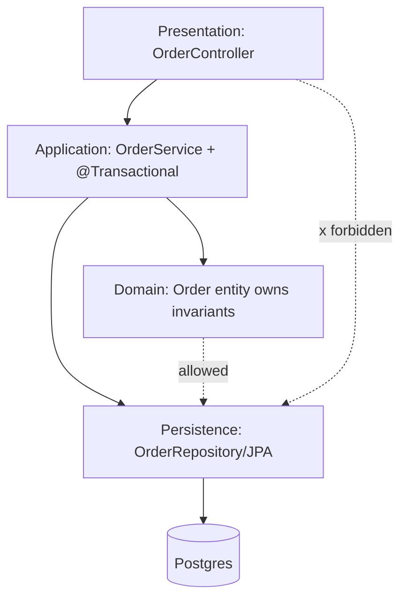

## Why it Matters

The default most teams actually ship: a familiar horizontal split that keeps concerns separated and onboarding fast. It earns its keep when it is *enforced*, layering that is only convention drifts into a tangled anemic domain, and the cost of that drift shows up as slow feature changes and service classes nothing owns.

## Problems
### System Design Problem: Layered Architecture

**Requirements:**
- Functional: Core capabilities for layered architecture
- Non-functional (SLOs): Latency < 100ms p99, Availability 99.9%, Horizontal scalability

**Constraints:**
- Scale: Handle 10x growth without redesign
- Consistency: Appropriate model for domain (strong/eventual)
- Latency budget: p99 < 100ms for read paths

**API / Interfaces:**
- Primary: REST/gRPC endpoints for core operations
- Internal: Service-to-service contracts
- Events: Domain events for async integration

## Diagram



## Code

```java
// Presentation
@RestController @RequestMapping("/orders")
class OrderController {
 private final OrderService orders; // constructor injection
 @PostMapping public OrderDto create(@RequestBody CreateOrderCmd cmd) {
 return orders.place(cmd); // controller does NO business logic
 }
}
// Application / domain service
@Service @Transactional
class OrderService {
 private final OrderRepository repo;
 public OrderDto place(CreateOrderCmd cmd) {
 Order o = Order.place(cmd.items()); // domain logic in entity
 return OrderDto.from(repo.save(o));
 }
}
// Persistence
interface OrderRepository extends JpaRepository<Order, Long> {}
```
> Rule of thumb: controllers map HTTP↔DTO, services orchestrate + own transactions, entities own invariants.

## When to use / not

- Standard CRUD / line-of-business Spring Boot apps with modest domain complexity.
- Small teams where simplicity beats strict decoupling.
- When you need fast onboarding, every Spring dev knows `controller → service → repository`.

**When NOT:** rich domains with tangled business rules (layers leak), or systems needing independent deployability (→ [[03_Microservices]]).


## Trade-offs
| Dimension | This Approach | Alternative | Trade-off Rationale | Decision Rule |
|-----------|---------------|-------------|---------------------|---------------|
| Complexity | [TBD] | [TBD] | [TBD] | [TBD] |
| Operational Burden | [TBD] | [TBD] | [TBD] | [TBD] |
| Latency | [TBD] | [TBD] | [TBD] | [TBD] |
| Consistency | [TBD] | [TBD] | [TBD] | [TBD] |
| Cost at Scale | [TBD] | [TBD] | [TBD] | [TBD] |

## Vs

- **Vs [[02_Hexagonal-Ports-Adapters|Hexagonal]]:** layered depends inward-down toward frameworks (JPA entities leak into API); hexagonal inverts that, domain is centre, frameworks are adapters.
- **Vs [[06_Monolith-vs-Modular-Choice-Guide|Modular Monolith]]:** layered is *technical* layering; modular monolith adds *vertical* module boundaries.

## Pitfalls

- Anemic entities + 2000-line `*ServiceImpl` ("transaction script" trap).
- Leaking JPA entities through REST (LazyInitializationException, API coupling), map to DTOs.
- Circular layer deps via `@Lazy`, a smell that boundaries are wrong.


## Pitfalls
1. Equating architecture with microservices/K8s — service count ≠ architecture
2. Diagrams without decisions (no ADR = no traceability)
3. 60-page doc nobody reads — risk-driven beats completeness-driven
4. Slack decisions becoming load-bearing without record
5. Underestimating operational complexity (backups, monitoring, upgrades)
6. Ignoring failure modes (network partitions, disk failures, clock drift)
7. Not planning for 10x scale from day one

## Interview q&a

**Q: How do you stop it becoming a "lasagna" of pass-through layers?**
A: Enforce dependency direction (ArchUnit test: `noClasses().that().resideIn("..controller..").should().dependOn("..repository..")`), keep DTOs at edges, push rules into domain objects.

**Q: Where do transactions live?**
A: Service/application layer with `@Transactional`; never in controllers, never spanning remote calls.


## Flashcards (Spaced Repetition)

#flashcard
**Q:** What is the core concept of Layered Architecture? :: **A:** [Key algorithm/architecture pattern] #flashcard

#flashcard
**Q:** When do you apply Layered Architecture? :: **A:** [Trigger scenarios and context] #flashcard

#flashcard
**Q:** What is the primary trade-off in Layered Architecture? :: **A:** [Main tension: e.g., consistency vs latency] #flashcard

#flashcard
**Q:** What breaks first at scale in Layered Architecture? :: **A:** [Primary bottleneck: e.g., coordination, hot keys, replication lag] #flashcard

#flashcard
**Q:** How do you handle failures in Layered Architecture? :: **A:** [Retry, circuit breaker, fallback, graceful degradation] #flashcard

#flashcard
**Q:** What are the key metrics to monitor for Layered Architecture? :: **A:** [RED: rate, errors, duration; USE: utilization, saturation, errors] #flashcard

#flashcard
**Q:** How does Layered Architecture scale to 10x? :: **A:** [Sharding, read replicas, async processing, caching layers] #flashcard

#flashcard
**Q:** What is the consistency model for Layered Architecture? :: **A:** [Strong/eventual/causal - justify with use case] #flashcard

#flashcard
**Q:** How do you test Layered Architecture? :: **A:** [Contract tests, chaos engineering, load tests, fault injection] #flashcard

#flashcard
**Q:** What is the operational cost of Layered Architecture? :: **A:** [Team expertise, tooling, on-call burden, migration risk] #flashcard

#flashcard
**Q:** When would you NOT use Layered Architecture? :: **A:** [Managed service covers need, simple CRUD, team lacks maturity] #flashcard

#flashcard
**Q:** What is the key design decision in Layered Architecture? :: **A:** [The irreversible choice that defines the architecture] #flashcard

#flashcard
**Q:** How do you migrate to Layered Architecture? :: **A:** [Strangler fig, dual-write, canary, feature flags] #flashcard

#flashcard
**Q:** What security considerations for Layered Architecture? :: **A:** [AuthZ, encryption, audit, secrets management] #flashcard

#flashcard
**Q:** How do you debug Layered Architecture in production? :: **A:** [Structured logging, correlation IDs, distributed tracing, SLO alerts] #flashcard


## Practice Tasks (Tasks Plugin)
- [ ] Explain the architecture from memory 📅 {{date:YYYY-MM-DD, +1}}
- [ ] Draw the system diagram without looking 📅 {{date:YYYY-MM-DD, +3}}
- [ ] Answer all Interview Q&A aloud 📅 {{date:YYYY-MM-DD, +7}}
- [ ] Review flashcards (Spaced Repetition) 📅 {{date:YYYY-MM-DD, +1}}

```tasks
not done
path includes Architect/03_Architecture-Styles
sort by due
limit 10
```

## Related

- [[02_Hexagonal-Ports-Adapters]] · [[06_Monolith-vs-Modular-Choice-Guide]] · [[03_Microservices]]
- Tactical modelling: [[05_DDD-Modeling/04_Tactical-Aggregates-Entities-VO|Aggregates & Entities]]

# Layered Architecture

> **Intent:** Organise a system into horizontal layers (Presentation → Application/Service → Domain → Persistence), each depending only on the layer below, so concerns stay separated and the app is easy to reason about.
