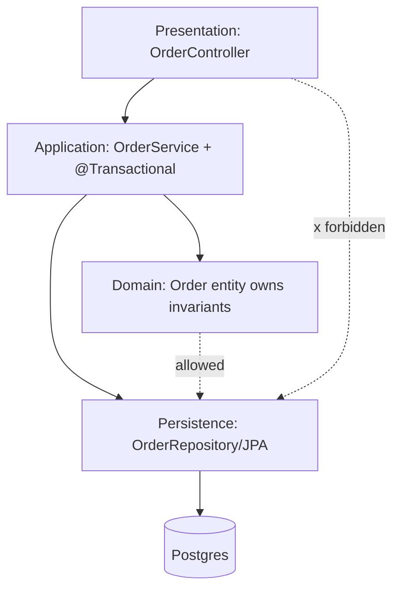

## Why it Matters

The default most teams actually ship: a familiar horizontal split that keeps concerns separated and onboarding fast. It earns its keep when it is *enforced*, layering that is only convention drifts into a tangled anemic domain, and the cost of that drift shows up as slow feature changes and service classes nothing owns.

## Diagram



## Code

```java
// Presentation
@RestController @RequestMapping("/orders")
class OrderController {
 private final OrderService orders; // constructor injection
 @PostMapping public OrderDto create(@RequestBody CreateOrderCmd cmd) {
 return orders.place(cmd); // controller does NO business logic
 }
}
// Application / domain service
@Service @Transactional
class OrderService {
 private final OrderRepository repo;
 public OrderDto place(CreateOrderCmd cmd) {
 Order o = Order.place(cmd.items()); // domain logic in entity
 return OrderDto.from(repo.save(o));
 }
}
// Persistence
interface OrderRepository extends JpaRepository<Order, Long> {}
```
> Rule of thumb: controllers map HTTP↔DTO, services orchestrate + own transactions, entities own invariants.

## When to use / not

- Standard CRUD / line-of-business Spring Boot apps with modest domain complexity.
- Small teams where simplicity beats strict decoupling.
- When you need fast onboarding, every Spring dev knows `controller → service → repository`.

**When NOT:** rich domains with tangled business rules (layers leak), or systems needing independent deployability (→ [[03_Microservices]]).

## Trade-offs

| Pros | Cons |
|---|---|
| Simple, familiar, fast to build | Business logic drifts into services (anemic domain) |
| Easy testing per layer (MockMvc / @DataJpaTest) | Strict layering slows cross-cutting changes |
| Fits Spring Data + JPA naturally | Temptation to skip layers (`controller → repo`) |
| Clear transaction boundary at service layer | Shared DB schema couples "layers" at runtime |

## Vs

- **Vs [[02_Hexagonal-Ports-Adapters|Hexagonal]]:** layered depends inward-down toward frameworks (JPA entities leak into API); hexagonal inverts that, domain is centre, frameworks are adapters.
- **Vs [[06_Monolith-vs-Modular-Choice-Guide|Modular Monolith]]:** layered is *technical* layering; modular monolith adds *vertical* module boundaries.

## Pitfalls

- Anemic entities + 2000-line `*ServiceImpl` ("transaction script" trap).
- Leaking JPA entities through REST (LazyInitializationException, API coupling), map to DTOs.
- Circular layer deps via `@Lazy`, a smell that boundaries are wrong.

## Interview q&a

**Q: How do you stop it becoming a "lasagna" of pass-through layers?**
A: Enforce dependency direction (ArchUnit test: `noClasses().that().resideIn("..controller..").should().dependOn("..repository..")`), keep DTOs at edges, push rules into domain objects.

**Q: Where do transactions live?**
A: Service/application layer with `@Transactional`; never in controllers, never spanning remote calls.

## Related

- [[02_Hexagonal-Ports-Adapters]] · [[06_Monolith-vs-Modular-Choice-Guide]] · [[03_Microservices]]
- Tactical modelling: [[05_DDD-Modeling/04_Tactical-Aggregates-Entities-VO|Aggregates & Entities]]

# Layered Architecture

> **Intent:** Organise a system into horizontal layers (Presentation → Application/Service → Domain → Persistence), each depending only on the layer below, so concerns stay separated and the app is easy to reason about.
