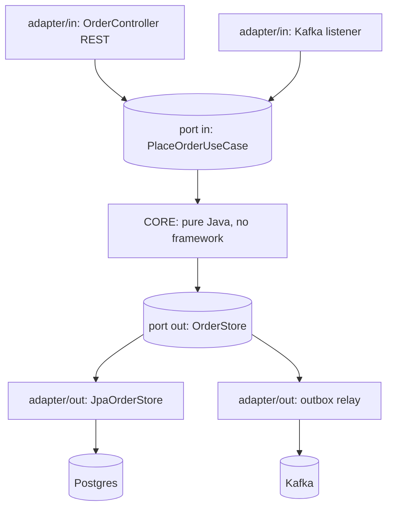

## Why it Matters

The domain is the only thing that pays the business; everything else is a replaceable detail. Inverting dependency direction so frameworks plug *into* the core makes the rules unit-testable in milliseconds and lets REST, gRPC, JPA or a new broker change without touching the model, the property that keeps a five-year-old service cheap to evolve.

## Diagram



## Code

```java
// PORT (in) — driven by core, defined by core
public interface PlaceOrderUseCase { Order place(CreateOrderCmd cmd); }
// PORT (out)
public interface OrderStore { Order save(Order o); }

// CORE — pure Java, zero Spring imports
class PlaceOrderService implements PlaceOrderUseCase {
 private final OrderStore store;
 public Order place(CreateOrderCmd cmd) {
 return store.save(Order.place(cmd.items()));
 }
}
// ADAPTER (in) — web
@RestController class OrderController {
 private final PlaceOrderUseCase useCase; // depends on port only
 @PostMapping("/orders") OrderDto create(@RequestBody CreateOrderCmd c) {
 return OrderDto.from(useCase.place(c));
 }
}
// ADAPTER (out) — persistence
@Repository class JpaOrderStore implements OrderStore {
 private final SpringOrderRepo repo;
 public Order save(Order o) { return repo.save(OrderEntity.toJpa(o)).toDomain(); }
}

// Wiring — explicit @Configuration, not component-scan magic
@Configuration class OrderConfig {
 @Bean PlaceOrderUseCase useCase(OrderStore s) { return new PlaceOrderService(s); }
}
```
Package layout: `core/` (no Spring) · `adapter/in/web/` · `adapter/out/persistence/`.

## When to use / not

- Domains with real business rules you must unit-test without Spring/DB.
- Codebases where framework churn (JPA → jOOQ, REST → gRPC) shouldn't touch the core.
- Long-lived services that will gain new inbound/outbound channels.

**When NOT:** trivial CRUD (overhead), prototypes, or teams unwilling to enforce the boundary.

## Trade-offs

| Pros | Cons |
|---|---|
| Domain unit-tests run in ms, no context | More interfaces + mapping code |
| Swap adapters freely (H2 for tests, Postgres prod) | Over-engineering for CRUD |
| Framework upgrades don't ripple inward | Needs discipline, one `@Autowired` JPA repo in core breaks it |
| Clearest expression of DIP | Newcomers find indirection confusing |

## Vs

- **Vs [[01_Layered-Architecture|Layered]]:** layered points dependencies *down* to infra; hexagonal points them *inward* to the domain.
- **Vs Clean/Onion:** same idea, different vocabulary (use-cases/interactors vs ports). Pick one naming scheme per repo.

## Pitfalls

- Anemic ports (`GenericRepository<T>` everywhere), ports should be use-case-shaped.
- Mapping explosion: keep mappers dumb and co-located with adapters.
- Letting DTOs/entities cross the core, core owns its own model.

## Interview q&a

**Q: Where does `@Transactional` go?**
A: On the inbound adapter or an application-service orchestrator, transactions are infrastructure, not domain logic.

**Q: How do you verify the boundary?**
A: ArchUnit: `noClasses().that().resideIn("..core..").should().dependOn("org.springframework..")` (except maybe `spring-core` annotations you explicitly allow).

## Related

- [[01_Layered-Architecture]] · [[06_Monolith-vs-Modular-Choice-Guide]] · [[05_DDD-Modeling/02_Bounded-Contexts|Bounded Contexts]]

# Hexagonal Architecture (Ports & Adapters)

> **Intent:** Put the domain model at the centre; all outside concerns (REST, JPA, messaging, clocks) talk to it only through **ports** (interfaces) with **adapters** (implementations), so business logic is framework-independent and testable.
> Watch: [Hexagonal Architecture, Simple Explanation](https://www.youtube.com/watch?v=bDWApqAUjEI)
