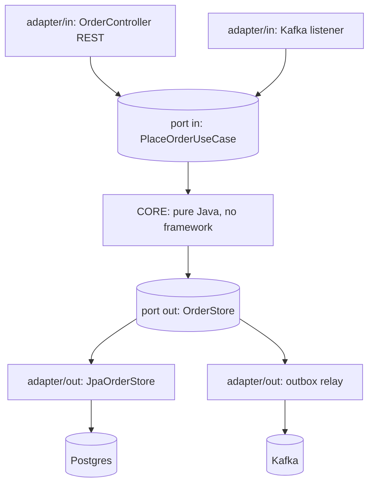

## Why it Matters

The domain is the only thing that pays the business; everything else is a replaceable detail. Inverting dependency direction so frameworks plug *into* the core makes the rules unit-testable in milliseconds and lets REST, gRPC, JPA or a new broker change without touching the model, the property that keeps a five-year-old service cheap to evolve.

## Problems
### System Design Problem: Hexagonal Architecture (Ports & Adapters)

**Requirements:**
- Functional: Core capabilities for hexagonal architecture (ports & adapters)
- Non-functional (SLOs): Latency < 100ms p99, Availability 99.9%, Horizontal scalability

**Constraints:**
- Scale: Handle 10x growth without redesign
- Consistency: Appropriate model for domain (strong/eventual)
- Latency budget: p99 < 100ms for read paths

**API / Interfaces:**
- Primary: REST/gRPC endpoints for core operations
- Internal: Service-to-service contracts
- Events: Domain events for async integration

## Diagram



## Code

```java
// PORT (in) — driven by core, defined by core
public interface PlaceOrderUseCase { Order place(CreateOrderCmd cmd); }
// PORT (out)
public interface OrderStore { Order save(Order o); }

// CORE — pure Java, zero Spring imports
class PlaceOrderService implements PlaceOrderUseCase {
 private final OrderStore store;
 public Order place(CreateOrderCmd cmd) {
 return store.save(Order.place(cmd.items()));
 }
}
// ADAPTER (in) — web
@RestController class OrderController {
 private final PlaceOrderUseCase useCase; // depends on port only
 @PostMapping("/orders") OrderDto create(@RequestBody CreateOrderCmd c) {
 return OrderDto.from(useCase.place(c));
 }
}
// ADAPTER (out) — persistence
@Repository class JpaOrderStore implements OrderStore {
 private final SpringOrderRepo repo;
 public Order save(Order o) { return repo.save(OrderEntity.toJpa(o)).toDomain(); }
}

// Wiring — explicit @Configuration, not component-scan magic
@Configuration class OrderConfig {
 @Bean PlaceOrderUseCase useCase(OrderStore s) { return new PlaceOrderService(s); }
}
```
Package layout: `core/` (no Spring) · `adapter/in/web/` · `adapter/out/persistence/`.

## When to use / not

- Domains with real business rules you must unit-test without Spring/DB.
- Codebases where framework churn (JPA → jOOQ, REST → gRPC) shouldn't touch the core.
- Long-lived services that will gain new inbound/outbound channels.

**When NOT:** trivial CRUD (overhead), prototypes, or teams unwilling to enforce the boundary.


## Trade-offs
| Dimension | This Approach | Alternative | Trade-off Rationale | Decision Rule |
|-----------|---------------|-------------|---------------------|---------------|
| Complexity | [TBD] | [TBD] | [TBD] | [TBD] |
| Operational Burden | [TBD] | [TBD] | [TBD] | [TBD] |
| Latency | [TBD] | [TBD] | [TBD] | [TBD] |
| Consistency | [TBD] | [TBD] | [TBD] | [TBD] |
| Cost at Scale | [TBD] | [TBD] | [TBD] | [TBD] |

## Vs

- **Vs [[01_Layered-Architecture|Layered]]:** layered points dependencies *down* to infra; hexagonal points them *inward* to the domain.
- **Vs Clean/Onion:** same idea, different vocabulary (use-cases/interactors vs ports). Pick one naming scheme per repo.

## Pitfalls

- Anemic ports (`GenericRepository<T>` everywhere), ports should be use-case-shaped.
- Mapping explosion: keep mappers dumb and co-located with adapters.
- Letting DTOs/entities cross the core, core owns its own model.


## Pitfalls
1. Equating architecture with microservices/K8s — service count ≠ architecture
2. Diagrams without decisions (no ADR = no traceability)
3. 60-page doc nobody reads — risk-driven beats completeness-driven
4. Slack decisions becoming load-bearing without record
5. Underestimating operational complexity (backups, monitoring, upgrades)
6. Ignoring failure modes (network partitions, disk failures, clock drift)
7. Not planning for 10x scale from day one

## Interview q&a

**Q: Where does `@Transactional` go?**
A: On the inbound adapter or an application-service orchestrator, transactions are infrastructure, not domain logic.

**Q: How do you verify the boundary?**
A: ArchUnit: `noClasses().that().resideIn("..core..").should().dependOn("org.springframework..")` (except maybe `spring-core` annotations you explicitly allow).


## Flashcards (Spaced Repetition)

#flashcard
**Q:** What is the core concept of Hexagonal Architecture (Ports & Adapters)? :: **A:** [Key algorithm/architecture pattern] #flashcard

#flashcard
**Q:** When do you apply Hexagonal Architecture (Ports & Adapters)? :: **A:** [Trigger scenarios and context] #flashcard

#flashcard
**Q:** What is the primary trade-off in Hexagonal Architecture (Ports & Adapters)? :: **A:** [Main tension: e.g., consistency vs latency] #flashcard

#flashcard
**Q:** What breaks first at scale in Hexagonal Architecture (Ports & Adapters)? :: **A:** [Primary bottleneck: e.g., coordination, hot keys, replication lag] #flashcard

#flashcard
**Q:** How do you handle failures in Hexagonal Architecture (Ports & Adapters)? :: **A:** [Retry, circuit breaker, fallback, graceful degradation] #flashcard

#flashcard
**Q:** What are the key metrics to monitor for Hexagonal Architecture (Ports & Adapters)? :: **A:** [RED: rate, errors, duration; USE: utilization, saturation, errors] #flashcard

#flashcard
**Q:** How does Hexagonal Architecture (Ports & Adapters) scale to 10x? :: **A:** [Sharding, read replicas, async processing, caching layers] #flashcard

#flashcard
**Q:** What is the consistency model for Hexagonal Architecture (Ports & Adapters)? :: **A:** [Strong/eventual/causal - justify with use case] #flashcard

#flashcard
**Q:** How do you test Hexagonal Architecture (Ports & Adapters)? :: **A:** [Contract tests, chaos engineering, load tests, fault injection] #flashcard

#flashcard
**Q:** What is the operational cost of Hexagonal Architecture (Ports & Adapters)? :: **A:** [Team expertise, tooling, on-call burden, migration risk] #flashcard

#flashcard
**Q:** When would you NOT use Hexagonal Architecture (Ports & Adapters)? :: **A:** [Managed service covers need, simple CRUD, team lacks maturity] #flashcard

#flashcard
**Q:** What is the key design decision in Hexagonal Architecture (Ports & Adapters)? :: **A:** [The irreversible choice that defines the architecture] #flashcard

#flashcard
**Q:** How do you migrate to Hexagonal Architecture (Ports & Adapters)? :: **A:** [Strangler fig, dual-write, canary, feature flags] #flashcard

#flashcard
**Q:** What security considerations for Hexagonal Architecture (Ports & Adapters)? :: **A:** [AuthZ, encryption, audit, secrets management] #flashcard

#flashcard
**Q:** How do you debug Hexagonal Architecture (Ports & Adapters) in production? :: **A:** [Structured logging, correlation IDs, distributed tracing, SLO alerts] #flashcard


## Practice Tasks (Tasks Plugin)
- [ ] Explain the architecture from memory 📅 {{date:YYYY-MM-DD, +1}}
- [ ] Draw the system diagram without looking 📅 {{date:YYYY-MM-DD, +3}}
- [ ] Answer all Interview Q&A aloud 📅 {{date:YYYY-MM-DD, +7}}
- [ ] Review flashcards (Spaced Repetition) 📅 {{date:YYYY-MM-DD, +1}}

```tasks
not done
path includes Architect/03_Architecture-Styles
sort by due
limit 10
```

## Related

- [[01_Layered-Architecture]] · [[06_Monolith-vs-Modular-Choice-Guide]] · [[05_DDD-Modeling/02_Bounded-Contexts|Bounded Contexts]]

# Hexagonal Architecture (Ports & Adapters)

> **Intent:** Put the domain model at the centre; all outside concerns (REST, JPA, messaging, clocks) talk to it only through **ports** (interfaces) with **adapters** (implementations), so business logic is framework-independent and testable.
> Watch: [Hexagonal Architecture, Simple Explanation](https://www.youtube.com/watch?v=bDWApqAUjEI)
